Arduino_C教程
=============

Arduino资料下载
---------------

\ **⚠️特别提示:**
请先下载本教程需要用到的Arduino_C_资料(包含：Arduino代码、取模软件和库文件）和Android_APP等，保存至您方便使用的路径下。

**下载：** :download:`Arduino_C_资料 <./Arduino_C_资料.7z>` 和 :download:`Android_APP <./Android_APP.7z>`__

Arduino IDE开发环境设置
-----------------------

⚠️ **特别提醒：本教程使用的是Arduino IDE 1.89
版本，其他的版本有可能会导致示例代码编译不通过。**

下载安装Arduino IDE
~~~~~~~~~~~~~~~~~~~

我们先到arduino官方的网站\ https://www.arduino.cc/\ 下载最新版本的arduino开发软件,进入网站之后点击界面上的SOFTWARE,，选择DOWNLOADS进入下载页面，如下图：

|image1|

Arduino 软件有很多版本，有wodows,mac
linux系统的（如下图），而且还有过去老的版本，你只需要下载一个适合系统的版本。

这里我们以WINDOWS系统的为例给大家介绍一下下载和安装的步骤。

|image2|

WINDOWS系统的也有两个版本，一个版本是安装版的，一个是下载版的不用安装，直接下载文件到电脑，解压缩就可以用了。

|image3|

两个版本都可以正常使用，看你自己的喜好了。选择一个版本，然后将Arduino开发软件下载到我们的电脑。

|image4|

一般情况下，我们点击JUST DOWNLOAD就可以下载了。

安装开发板驱动文件
~~~~~~~~~~~~~~~~~~

接下来，我们将介绍UNO
R3开发板的驱动程序安装。在不同的计算机系统中，驱动程序的安装可能略有不同。在WIN
10系统计算机上自带驱动文件，UNO R3
开发板通过USB线连接到计算机上，驱动自动安装，可以自动看到串口端口。

但是，WIN 7系统计算机需要手动安装，因此，下面我们继续在WIN
7系统中安装驱动程序。Arduino文件夹包含Arduino程序本身和驱动程序，这些驱动程序允许Arduino通过USB电缆连接到您的计算机。在我们启动Arduino软件之前，您将需要安装USB驱动程序。

|image5|

将USB线的一端插入Arduino UNO R3开发板，另一端插入计算机上的USB插座。

第一次将UNO板连接到计算机时，右键单击“计算机”图标->“属性”->单击“设备管理器”，在“其他设备”下，您应看到“未知设备”旁边带有一个黄色警告三角形。
这是您的Arduino。

|image6|

然后右键单击设备，然后选择顶部菜单选项（更新驱动程序软件...），如下图所示。

|image7|

然后将提示您“自动搜索更新的驱动程序软件”或“浏览我的计算机以获取驱动程序软件”。如下图所示。
在此页面中，选择“浏览我的计算机以获取驱动程序软件”。

|image8|

之后，选择浏览器选项并导航到Arduino安装的“ drivers”文件夹。

|image9|

单击“下一步”，您可能会收到安全警告，如果这样，则允许安装该软件。
如下图所示。

|image10|

安装软件后，您将收到确认消息。 安装完成后，单击“关闭”。

|image11|

现在驱动程序已经安装好。然后您可以右键单击“计算机”->“属性”->“设备管理器”，您将看到如下图所示的设备。

|image12|

（4）Arduino IDE设置和工具栏介绍

装好了开发板的驱动，我们下面要了解Arduino开发软件的使用了，首先我们点击电脑桌面上的\ |image13|\ 图标，打开Arduino
IDE。

|image14|

为了避免在将程序上载到板上时出现任何错误，必须选择正确的Arduino板名称，该名称与连接到计算机的电路板相匹配。转到Tools→Board，然后选择你的板。

|image15|

然后再选择正确的COM口（安装驱动成功后可看到对应COM口）。

|image16|

|image17|

我们的程序上传到板之前，我们必须演示Arduino
IDE工具栏中出现的每个符号的功能。

|image18|

A - 用于检查是否存在任何编译错误。

B - 用于将程序上传到Arduino板。

C - 用于创建新草图的快捷方式。

D - 用于直接打开示例草图之一。

E - 用于保存草图。

F - 用于从板接收串行数据并将串行数据发送到板的串行监视器。

（5）启动你的第一个程序

上面我们学习了怎么下载软件和安装开发板的驱动，那下面我们就开始正式开始第一个程序，打开文件选择例子，选择第一个文件BASIC里面的BLINK程序

|image19|

|image20|

按照前面方法设置板和COM口，IDE右下角显示对应板和COM口。

|image21|

点击\ |image22|\ 图标开始编译程序，检查错误，检查无误。

|image23|

点击点击\ |image24|\ 图标开始上传程序，上传成功。

|image25|

程序上传成功，板载的LED灯亮一秒钟，灭一秒钟，恭喜你的第一个程序完成了！

添加Arduino库文件
-----------------

我们提供的Arduino 库文件是放在资料的(路径：)
..\\Arduino_C_资料\\ke0170库文件的文件夹中，如下图

|Img|

Windows系统添加库文件的方法
~~~~~~~~~~~~~~~~~~~~~~~~~~~

我们以添加IRremote库文件为例，在这里，我们将为您介绍最简单的添加库的方法。

1. 首先，依次点击右上角的 “\ **项目” > “导入库” > “添加 .Zip 库...”**

|image26|

2.
再选择库文件(这里是以IRremote库文件为例，其他库文件一样)，找到自己需要的库压缩包
(.zip) 格式，点击 **打开**
即可添加成功，添加成功后消息栏会显示“\ **库已经加入**\ ”。

|image27|

|image28|

3. 重复相同的过程以添加 Servo 库文件。

MAC系统添加库文件的方法
~~~~~~~~~~~~~~~~~~~~~~~

**MAC 系统 和 Windows 系统添加方法类似，可以参照，就不一一讲述了。**

项目教程
--------

好了，所有的东西都已经准备完毕，我们正式开始迷你坦克机器人的编程项目。前面我们从简单的传感器和模块开始，循序渐进完成模块传感器的测试项目，现在再来完成几个不同类型的机器人，最后我们把所有学到的知识结合到一起，完成一个综合的项目：多功能桌面小车。

**注意：**
本项目中的各传感器/模块上标有（G）表示负极，是连接到控制板或传感器扩展板上的G或-或GND；标有（V）表示正极，是连接到控制板或扩展板上的V或VCC或+或5V。

第1课 LED灯闪烁
~~~~~~~~~~~~~~~

**项目介绍：**

|image29|

前面我们安装了keyes UNO
R3开发板的驱动。接下来的项目我们就要由简单到复杂，一步一步探索Arduino的世界了。首先我们要来完成经典的“Arduino点亮LED”，也就是Blink项目。Blink对于学习Arduino的爱好者而言，是最基础的项目是新手必须经历的一个练习。

LED，发光二极管的简称。由含镓（Ga）、砷（As）、磷（P）、氮（N）等的化合物制成。当电子与空穴复合时能辐射出可见光，因而可以用来制成发光二极管。在电路及仪器中作为指示灯，或者组成文字或数字显示。

为了实验的方便，我们将LED发光二极管做成了一个模块，在第一个项目中，我们用一个最基本的测试代码来控制LED，亮一秒钟，灭一秒钟，来实现闪烁的效果。你可以改变代码中LED灯亮灭的时间，实现不同的闪烁效果。LED模块信号端S为高电平时LED亮起，S为低电平时LED熄灭。

|image30|

|image31|

**LED模块参数：**

控制接口: 数字口

工作电压: DC 3.3-5V

排针间距: 2.54mm

LED显示颜色：红色

**项目组件：**

+-----------------+------------------------+------------------------+
| UNO R3 开发板*1 | L298P 电机驱动扩展板   | LED白发红模块*1        |
|                 | V1*1                   |                        |
+=================+========================+========================+
| |image44|       | |image45|              | |image46|              |
+-----------------+------------------------+------------------------+
| USB线*1         | 3Pin 双母头杜邦线*1    | 18650双节电池盒        |
|                 |                        | (18                    |
|                 |                        | 650电池*2(电池自配))*1 |
+-----------------+------------------------+------------------------+
| |image47|       | |image48|              | |image49|              |
+-----------------+------------------------+------------------------+

**接线图：**

**⚠️特别注意：坦克智能车已经组装好了，这里不需要把传感器模块和其他的都拆下来又重新组装和接线，这里再次提供接线图，是为了方便您编写代码。但是，LED灯是需要另外连接上去的！**

|image50|

由上图我们可以看到，扩展板是堆叠在开发板上的，LED模块的-接到了扩展板的G,LED模块的+接到了扩展板的5V，LED模块的S已经接到了扩展板上的D9接口，接好线之后我们开始编写代码：

**项目代码：**

（\ **特别提醒：在上传程序代码前，需要把蓝牙模块取下，否则代码会上传失败。需要上传代码成功后，再连接蓝牙模块。**\ ）

.. code:: c

   /*
     迷你履带坦克机器人
     课程 1.1
     LED闪烁
     http://www.keyes-robot.com
   */
   void setup()
   {
     pinMode(9, OUTPUT);// 初始化数字口9为输出模式
   }
   void loop() // 无限循环
   {
     digitalWrite(9, HIGH); // 设置数字口输出高电平，打开LED
     delay(1000); // 等待1秒
     digitalWrite(9, LOW); // 设置数字口输出低电平，关闭LED
     delay(1000); // 等待1秒
   }

**项目结果：**

点击上传程序，你应该看到D9脚接着的LED打开和关闭，而且间隔的时间是一秒钟。

**代码说明:**

pinMode(9，OUTPUT) -在使用Arduino的引脚之前，你需要告诉开发板它是INPUT还是OUTPUT。我们使用一个内置的“函数”pinMode()来做到这一点。

digitalWrite(9，HIGH) -当使用引脚作为OUTPUT时，可以将其命令为HIGH（输出5伏）或LOW（输出0伏）。

**项目拓展：**

前面我们控制了LED模块亮1秒钟,灭一秒钟，现在我们来拓展一下思路，通过改变delay的时间来改变LED
灯闪烁的频率。

代码如下:

（\ **特别提醒：在上传程序代码前，需要把蓝牙模块取下，否则代码会上传失败。需要上传代码成功后，再连接蓝牙模块。**\ ）

.. code:: c

   /*
     迷你履带坦克机器人
     课程 1.2
     LED闪烁
     http://www.keyes-robot.com
   */
   void setup()
   {
     pinMode(9, OUTPUT);// 初始化数字口9为输出模式
   }
   void loop() // 无限循环
   {
     digitalWrite(9, HIGH); // 设置数字口输出高电平，打开LED
     delay(100); // 等待0.1秒
     digitalWrite(9, LOW); // 设置数字口输出低电平，关闭LED
     delay(100); // 等待0.1秒
   }

怎么样是不是很好理解，就是通过改变delay这个代码的时间，来改变LED亮和灭的频率，不多说，我们上传代码。看看这个LED灯闪烁的频率是不是比之前快了？

第2课 LED 亮度的调节
~~~~~~~~~~~~~~~~~~~~

**项目介绍：**

前面课程中，我们详细的介绍了通过代码控制LED亮灭，实现闪烁的效果。这节课我们使用PWM来控制LED亮度不断地变化，模拟我们呼吸的效果。

PWM是使用数字手段来控制模拟输出的一种手段。使用数字控制产生占空比不同的方波（一个不停在高电平与低电平之间切换的信号)来控制模拟输出。一般来说端口的输入电压只有两个0V与5V。如果想要改变灯的亮度怎么办呢个？有同学说串联电阻，对，这个方法是正确的。但是，如果想要得到不同的亮度，且在不同亮度之间来回变动怎么办呢？不可能不停地切换电阻吧。这种情况下就需要使用PWM了，那它是怎么控制的呢？

|image51|

对于Arduino的数字端口电压输出只有LOW与HIGH两个，对应的就是0V与5V的电压输出，可以把LOW定义为0，HIGH定义为1，1秒内让Arduino输出500个0或者1的信号。如果这500个全部为1，那就是完整的5V，如果全部为0，那就是0V。如果010101010101这样输出，刚好一半，端口输出的平均电压就为2.5V了。这个和放映电影是一个道理，咱们所看的电影并不是完全连续的，它其实是每秒输出25张图片。在这种情况下，人的肉眼是分辨不出来的，看上去就是连续的了。PWM也是同样的道理，如果想要不同的电压，就控制0与1的输出比例控制就可以了。当然这和真实的连续输出还是有差别的，单位时间内输出的0,1信号越多，控制的就越精确。

**项目组件：**

+---------------------+----------------------+----------------------+
| UNO R3 for 开发板*1 | L298P 电机驱动扩展板 | LED白发红模块*1      |
|                     | V1*1                 |                      |
+=====================+======================+======================+
| |image64|           | |image65|            | |image66|            |
+---------------------+----------------------+----------------------+
| USB线*1             | 3Pin 双母头杜邦线*1  | 18650双节电池盒      |
|                     |                      | (1865                |
|                     |                      | 0电池*2(电池自配))*1 |
+---------------------+----------------------+----------------------+
| |image67|           | |image68|            | |image69|            |
+---------------------+----------------------+----------------------+

**接线图：**

**⚠️特别注意：坦克智能车已经组装好了，这里不需要把传感器模块和其他的都拆下来又重新组装和接线，这里再次提供接线图，是为了方便您编写代码。但是，LED灯是需要另外连接上去的！**

Arduino的PWM引脚在3，5，6，9，10，11,上一小节的接线刚刚好在9脚，所以我们这个接线不用变

|image70|

**项目代码：**

（\ **特别提醒：在上传程序代码前，需要把蓝牙模块取下，否则代码会上传失败。需要上传代码成功后，再连接蓝牙模块。**\ ）

我们来看Arduino代码:

.. code:: c

   /*
     迷你履带坦克机器人
     课程 2.1
     呼吸灯
     http://www.keyes-robot.com
   */

   int ledPin = 9;    // 定义LED为数字口9
   int value;

   void setup() {
       pinMode(ledPin, OUTPUT);    // 初始化LED为输出模式
   }

   void loop() {
     for (value = 0; value < 255; value = value + 1) {
       analogWrite(ledPin, value);    // led变亮
       delay(5);                      // 延迟5ms
     }

     for (value = 255; value > 0; value = value - 1) {
       analogWrite(ledPin, value);    // led变暗
       delay(5);                      // 延迟5ms
     }
   }

**项目结果：**

代码下载完成后，我们可以看到LED会有个逐渐由亮到灭的一个缓慢过程，而不是直接的亮灭，如同呼吸一般，均匀变化。

**代码说明:**

当我们需要重复执行某句话时，我们可以使用for语句。

for语句格式如下：

|image71|

for循环顺序如下：

第一轮：1 → 2 → 3 → 4

第二轮：2 → 3 → 4

…

直到2不成立，for循环结束。

知道了这么个顺序之后，回到代码中：

for (int value = 0; value < 255; value=value+1){

...}

for (int value = 255; value >0; value=value-1){

...}

这两个for语句实现了value的值不断由0增加到255，随之在从255减到0，在增加到255……,无限循环下去。

再看下for里面，涉及一个新函数analogWrite()。

我们知道数字口只有0和1两个状态，那如何发送一个模拟值到一个数字引脚呢？就要用到该函数。观察一下Arduino板，查看数字引脚，你会发现其中6个引脚旁标有“~”，这些引脚不同于其他引脚，它们可以输出PWM信号。

函数格式如下：

analogWrite(pin,value)

analogWrite()函数用于给PWM口写入一个0~255的模拟值。所以，value是在0~255之间的值。特别注意的是，analogWrite()函数只能写入具有PWM功能的数字引脚，也就是3，5，6，9，10，11引脚。

PWM是一项通过数字方法来获得模拟量的技术。数字控制来形成一个方波，方波信号只有开关两种状态（也就是我们数字引脚的高低）。通过控制开与关所持续时间的比值就能模拟到一个0到5V之间变化的电压。开（学术上称为高电平）所占用的时间就叫做脉冲宽度，所以PWM也叫做脉冲宽度调制。

通过下面五个方波来更形象的了解一下PWM。

|image72|

**PWM示意图**

上图绿色竖线代表方波的一个周期。每个analogWrite(value)中写入的value都能对应一个百分比，这个百分比也称为占空比(Duty
Cycle)，指的是高电平在周期内占的时间比值，也就是：占空比=高电平时间
/周期时间。图中，从上往下，第一个方波，占空比为0%，对应的value为0。LED亮度最低，也就是灭的状态。高电平持续时间越长，也就越亮。所以，最后一个占空比为100%的对应value是255，LED最亮。50%就是最亮的一半了，25%则相对更暗。

PWM比较多的用于调节LED灯的亮度。或者是电机的转动速度，电机带动的车轮速度也就能很容易控制了，在玩一些Arduino机器人时，更能体现PWM的好处。

**项目拓展：**

（\ **特别提醒：在上传程序代码前，需要把蓝牙模块取下，否则代码会上传失败。需要上传代码成功后，再连接蓝牙模块。**\ ）

我们不改变灯的脚位，只是改变程序里面delay的值，看看它如何改变渐变效果。

.. code:: c

   /*
     迷你履带坦克机器人
     课程 2.2
     呼吸灯
     http://www.keyes-robot.com
   */

   int ledPin = 9;    // 定义LED为数字口9

   void setup() {
     pinMode(ledPin, OUTPUT);    // 初始化LED为输出模式
   }

   void loop() {
     for (int value = 0; value < 255; value = value + 1) {
       analogWrite(ledPin, value);    // led变亮
       delay(30);                     // 延迟30ms
     }

     for (int value = 255; value > 0; value = value - 1) {
       analogWrite(ledPin, value);    // led变暗
       delay(30);                     // 延迟30ms
     }
   }

上传代码到开发板，看LED渐变的效果是不是慢了一些。

第3课 光敏电阻传感器
~~~~~~~~~~~~~~~~~~~~

**项目介绍**\ ：

|image73|

在套件中，包含两个光敏电阻模块，我们可以利用这两个模块和小车搭配做一个追光智能车。在这一课程中，我们先学习了解下光敏电阻模块和使用方法。

光敏电阻环境光线最敏感，不同的光照强度，光敏电阻的阻值不一样。我们利用光敏电阻该特性，设计电路，生成光敏电阻模块。模块信号端连接单片机模拟口，当光照强度越强时，模拟口电压越大，即单片机的模拟值也大；反之，光照强度越弱时，模拟口电压越小，即单片机的模拟值也小。这样，我们就可以利用光敏电阻模块读取对应模拟值，感应环境中光照强度了。

**参数：**

工作电压：3.3V-5V（DC）

接口：3PIN接口

输出信号：模拟信号

**项目组件：**

+----------------+----------------+----------------+----------------+
| UNO R3         | L298P          | L              | 光             |
| 开发板*1       | 电机驱动扩展板 | ED白发红模块*1 | 敏电阻传感器*2 |
|                | V1*1           |                |                |
+================+================+================+================+
| |image90|      | |image91|      | |image92|      | |image93|      |
+----------------+----------------+----------------+----------------+
| HX-2.54 3P     | 3Pin           | USB线*1        | 1              |
| 双头 26AWG*2   | 双母头杜邦线*1 |                | 8650双节电池盒 |
|                |                |                | (18650电池*    |
|                |                |                | 2(电池自配))*1 |
+----------------+----------------+----------------+----------------+
| |image94|      | |image95|      | |image96|      | |image97|      |
+----------------+----------------+----------------+----------------+

**接线图:**

**⚠️特别注意：坦克智能车已经组装好了，这里不需要把传感器模块和其他的都拆下来又重新组装和接线，这里再次提供接线图，是为了方便您编写代码。但是，LED灯是需要另外连接上去的！**

接线注意：左边的光敏电阻模块的“-”、“+”和S引脚分别接在keyes传感器扩展板G（GND）、V（VCC）、A1；同样地，右边的光敏电阻模块接在G（GND）、V（VCC）A2。我们这里先在左边接一个测试。

|image98|

**项目代码：**

（\ **特别提醒：在上传程序代码前，需要把蓝牙模块取下，否则代码会上传失败。需要上传代码成功后，再连接蓝牙模块。**\ ）

.. code:: c

   /*
     迷你履带坦克机器人
     课程 3.1
     光敏电阻
     http://www.keyes-robot.com
   */

   int light;  //定义变量light
   void setup() 
   {
     Serial.begin(9600);//设置波特率为9600
   }

   void loop() 
   {
     light = analogRead(A1); //读取到的模拟值赋给light变量
     Serial.print("light:");   //打印光线模拟值
     Serial.println(light);
     delay(100);  //延时100ms
   }

**项目结果：**

上传代码带开发板，打开串口监视，设置波特率为9600。可以看到打印出的光敏传感器检测的值，如果我们用手给它遮挡光线，我们发现值变小了。

|image99|

**代码说明：**

Serial.begin(9600)-初始化串口,串口通信波特率为9600  ，

pinMode- 定义单片机PIN脚模式是输入还是输出，input是输入，output是输出，

analogRead-读取引脚模拟状态，范围为0~1023。

**项目拓展：**

上面我们了解了光敏传感器的工作原理，接下来我们用到两个光敏传感器，分别接在A1（左）和A2（右）。在第9脚接上一个LED
灯，然后通过读取左右两个光敏传感器的状态，来控制LED的亮和灭。如下图接线：

|image100|

我们开始来编写代码：

（\ **特别提醒：在上传程序代码前，需要把蓝牙模块取下，否则代码会上传失败。需要上传代码成功后，再连接蓝牙模块。**\ ）

.. code:: c

   /*
     迷你履带坦克机器人
     课程 3.2
     光敏电阻
     http://www.keyes-robot.com
   */

   int ledPin = 9; //定义LED管脚为数字口9
   int left_light = 0; //定义左边传感器的变量
   int right_light = 0; //定义右边传感器的变量
   void setup() 
   {
     Serial.begin(9600);//设置波特率为9600
     pinMode(ledPin, OUTPUT); //设置LED管脚为输出模式
   }

   void loop() 
   {
     left_light = analogRead(A1); //左边光敏传感器接A1
     right_light = analogRead(A2); //右边光敏传感器接A2
     Serial.print("left_light:");   //打印左边光线模拟值
     Serial.print(left_light);
     Serial.print("  right_light:");   //打印右边光线模拟值
     Serial.println(right_light);
     if (left_light < 300 || right_light < 300)
     { //其中一个模拟值低于300
       digitalWrite(ledPin, HIGH); //点亮LED
     }
     else 
     {
       digitalWrite(ledPin, LOW); //LED熄灭
     }
   }

上传代码到开发板，用我们的手去一个个的遮掩光敏传感器，我们看看LED灯的状态发生了改变没有？当我们用手去遮挡任一光敏传感器的时候，我们可以看到LED灯亮起来了。串口显示对应光敏传感器的检测也变小了。

|image101|

第4课 舵机控制
~~~~~~~~~~~~~~

|image102|

**项目介绍：**

舵机是一种位置伺服的驱动器，主要是由外壳、电路板、无核心马达、齿轮与位置检测器所构成。其工作原理是由接收机或者单片机发出信号给舵机，其内部有一个基准电路，产生周期为20ms，宽度为1.5ms
的基准信号，将获得的直流偏置电压与电位器的电压比较，获得电压差输出。

|image103|
舵机有很多规格，但所有的舵机都有外接三根线，分别用棕、红、橙三种颜色进行区分，由于舵机品牌不同，颜色也会有所差异，棕色为接地线，红色为电源正极线，橙色为信号线。

舵机的转动的角度是通过调节PWM（脉冲宽度调制）信号的占空比来实现的，标准PWM（脉冲宽度调制）信号的周期固定为20ms（50Hz），理论上脉宽分布应在1ms到2ms
之间，但是，事实上脉宽可由0.5ms 到2.5ms
之间，脉宽和舵机的转角0°～180°相对应。

|image104|

对应的舵机角度值如下:

|image105|

**舵机参数：**

工作电压：DC 4.8V〜6V

可操作角度范围：大约 About 180°(在 500→2500 μsec)

脉波宽度范围：500→2500 μsec

空载转速：0.12±0.01 sec/60（DC 4.8V） 0.1±0.01 sec/60（DC 6V）

空载电流：200±20mA（DC 4.8V） 220±20mA（DC 6V）

停止扭力：1.3±0.01kg·cm（DC 4.8V） 1.5±0.1kg·cm（DC 6V）

停止电流：≦850mA（DC 4.8V） ≦1000mA（DC 6V）

待机电流：3±1mA（DC 4.8V） 4±1mA（DC 6V）

**项目组件：**

=============== ========================================= =============
UNO R3 开发板*1 L298P 电机驱动扩展板 V1*1                 SG90 9G舵机*1
=============== ========================================= =============
|image106|      |image107|                                |image108|
USB线*1         18650双节电池盒 (18650电池*2(电池自配))*1 
|image109|      |image110|                                
=============== ========================================= =============

**接线图**\ ：

**⚠️特别注意：坦克智能车已经组装好了，这里不需要把传感器模块和其他的都拆下来又重新组装和接线，这里再次提供接线图，是为了方便您编写代码！**

|image111|

**接线注意**\ ：舵机连接到G（GND）、V（VCC）、10，舵机的棕色线是与Gnd(G)相连，红色线与5v(V)相连，橙色线是与数字10相连的。接舵机的时候必须要外接供电，因为驱动舵机的电流要求比较大，一般峰值的情况下接近1A，开发板的电流远远不够。如果不接外接电源，很有可能烧坏开发板。

**项目代码1：**

（\ **特别提醒：在上传程序代码前，需要把蓝牙模块取下，否则代码会上传失败。需要上传代码成功后，再连接蓝牙模块。**\ ）

.. code:: c

   /*
     迷你履带坦克机器人
     课程 4.1
     伺服舵机
     http://www.keyes-robot.com
   */

   #define servoPin 10  //舵机引脚接D10
   int pos; //舵机的角度变量
   int pulsewidth; //舵机的脉宽变量
   void setup()
   {
     pinMode(servoPin, OUTPUT);  //舵机引脚设置为输出
     procedure(0); //设置舵机的角度为0度
   }
   void loop()
   {
     for (pos = 0; pos <= 180; pos += 1)
     { // 从0到180度，以1°为一步
       procedure(pos);              // 转动到pos角度位置
       delay(15);                   //控制舵机转动的速度
     }
     for (pos = 180; pos >= 0; pos -= 1)
     { // 从180到0度，以1°为一步
       procedure(pos);              // 转动到pos角度位置
       delay(15);
     }
   }
   //控制舵机的函数
   void procedure(int myangle) 
   {
     pulsewidth = myangle * 11 + 500;  //计算出脉宽值
     digitalWrite(servoPin, HIGH);
     delayMicroseconds(pulsewidth);   //高电平持续的时间，就是脉宽
     digitalWrite(servoPin, LOW);
     delay((20 - pulsewidth / 1000));  //周期是20ms，所以低电平持续剩下的时间
   }

在上传代码成功，我们可以看到舵机在0°到180°角度范围来回摆动。

其实我们还可以有一种更简单的方法控制舵机，就是使用Arduino的舵机库文件，可以参考Arduino官方的使用说明：\ https://www.arduino.cc/en/Reference/Servo
.

以下是使用了舵机库文件的程序,接线图不变

项目代码2:

（\ **特别提醒：在上传程序代码前，需要把蓝牙模块取下，否则代码会上传失败。需要上传代码成功后，再连接蓝牙模块。**\ ）

.. code:: c

   /*
     迷你履带坦克机器人
     课程 4.2
     伺服舵机
     http://www.keyes-robot.com
   */

   #include <Servo.h>
   Servo myservo;  // 创建舵机类实例

   int pos = 0;    //角度变量
   void setup()
   {
     myservo.attach(10);  //舵机接数字口10
   }
   void loop()
   {
     for (pos = 0; pos <= 180; pos += 1)
     { // 从0到180
       // in steps of 1 degree
       myservo.write(pos);              // 转动到pos角度
       delay(15);                       // 等待15ms  以控制舵机转动速度
     }
     for (pos = 180; pos >= 0; pos -= 1)
     { // 从180到0
       myservo.write(pos);              // 转动到pos角度
       delay(15);                       // 等待15ms  以控制舵机转动速度
     }
   }

**项目结果：**

上传代码成功，上电后，舵机也是在0°到180°角度范围来回摆动。这两个项目的效果是一样的，通常我们使用库文件来控制的比较多。

**代码说明:**

#include<Servo.h>是Arduino自带的Servo函数及其语句，下面是舵机函数的几个常用语句：

1、attach（接口）——设定舵机的接口，只有9或10接口可用。

2、write（角度）——用于设定舵机旋转角度的语句，可设定的角度范围是0°到180°。

3、read（）——用于读取舵机角度的语句，可理解为读取最后一条write()命令中的值。

4、attached（）——判断舵机参数是否已发送到舵机所在接口。

注：以上语句的书写格式均为
“舵机变量名.具体语句（）”例如：myservo.attach(10)。

第5课 超声波模块项目
~~~~~~~~~~~~~~~~~~~~

**项目介绍：**

|image112|

HC-SR04
超声波传感器利用声呐原理来测量物体的距离，就像蝙蝠那样。它具有出色的非接触式距离检测功能，精度高且读数稳定，使用方便。它配备有超声波发射器和接收器模块。

HC-SR04
或超声波传感器在众多电子项目中被广泛使用，用于创建障碍物检测和距离测量应用以及其他各种应用。在这里，我们带来了使用
Arduino 和超声波传感器测量距离的简单方法，以及如何将超声波传感器与
Arduino 配合使用。

**超声波参数：**

|image113|

工作电压：+5 伏

直流静态电流：<2 毫安

工作电流：15 毫安

有效角度：< 15°

测距范围：2 厘米 - 400 厘米

分辨率：0.3 厘米

测量角度：30 度

触发输入脉冲宽度：10 微秒

**项目组件：**

+----------------+----------------+----------------+----------------+
| UNO R3         | L298P          | L              | HC-SR04        |
| 开发板*1       | 电机驱动扩展板 | ED白发红模块*1 | 超声波传感器*1 |
|                | V1*1           |                |                |
+================+================+================+================+
| |image130|     | |image131|     | |image132|     | |image133|     |
+----------------+----------------+----------------+----------------+
| HX-2.54 4P     | 3Pin           | USB线*1        | 1              |
| 双头 连接线*1  | 双母头杜邦线*1 |                | 8650双节电池盒 |
|                |                |                | (18650电池*2   |
|                |                |                | (电池自配))    |
|                |                |                | \*1            |
+----------------+----------------+----------------+----------------+
| |image134|     | |image135|     | |image136|     | |image137|     |
+----------------+----------------+----------------+----------------+

**超声波模块知识：**

原理：看超声波的图可知，像是有两个眼睛，其一边是发射超声的，一边是接收超声波的，然后检测从发射遇到障碍物返回被接收到所需的时间t，再根据声音在空气中的传播速度大概是343m/s,

距离 = 速度 \* 时间 ，

由于超声波发射返回是两段路程了，所以需要除以2，故超声波测到的
距离=（速度 \* 时间）/2

超声波模块的使用方法及时序图：

1、使用GPIO引脚给SR04的Trig引脚至少10μs的高电平信号，触发SR04模块测距功能；

2、触发后，模块会自动发送8个40KHz的超声波脉冲，并自动检测是否有信号返回。这步会由模块内部自动完成。

3、如有信号返回，Echo引脚会输出高电平，高电平持续的时间就是超声波从发射到返回的时间。

|image138|

超声波模块的电路图

|image139|

**接线图：**

**⚠️特别注意：坦克智能车已经组装好了，这里不需要把传感器模块和其他的都拆下来又重新组装和接线，这里再次提供接线图，是为了方便您编写代码。但是，LED灯是需要另外连接上去的！**

接线注意：超声波传感器模块的VCC引脚连接至传感器扩展板的5v(V)，Trig引脚至数字12(S)，Echo引脚至数字13(S)，Gnd引脚至Gnd(G)。

|image140|

**项目代码：**

（\ **特别提醒：在上传程序代码前，需要把蓝牙模块取下，否则代码会上传失败。需要上传代码成功后，再连接蓝牙模块。**\ ）

.. code:: c

   /*
     迷你履带坦克机器人
     课程 5.1
     超声波传感器
     http://www.keyes-robot.com
   */
   int trigPin = 12;    // Trig引脚接D12
   int echoPin = 13;    // Echo引脚接D13
   long duration, cm, inches;
   void setup()
   {
     //启动串口监视器
     Serial.begin (9600);
     //定义引脚输入输出模式
     pinMode(trigPin, OUTPUT);//trigPin设置为输出
     pinMode(echoPin, INPUT);//echoPin设置为输入
   }
   void loop() 
   {
     // 拉低2us
     digitalWrite(trigPin, LOW);
     delayMicroseconds(2);
     digitalWrite(trigPin, HIGH);  //给trigPin至少10us以触发
     delayMicroseconds(10);
     digitalWrite(trigPin, LOW);
     // 计算echopin高电平时间
     duration = pulseIn(echoPin, HIGH);
     // 转换为距离
     cm = (duration / 2) / 29.1;   
     inches = (duration / 2) / 74; 
     Serial.print(inches);
     Serial.print("in, ");
     Serial.print(cm);
     Serial.print("cm");
     Serial.println();
     delay(200);
   }

**项目结果：**

上传好测试代码到开发板，打开串口监视器，设置波特率为9600，我们可以看到超声波模块显示的距离，单位是厘米和英寸。用手阻挡超声波模块，我们看到显示距离的数值变小了。

|image141|

**代码说明:**

int trigPin- 这个是定义发射超声波的脚位，通常是输出，

int echoPin - 这个是定义接收超声波的脚位，通常是输入。

cm = (duration/2) / 29.1-

inches = (duration/2) / 74-

我们可以使用以下公式来计算距离：

distance = (traveltime/2) x speed of sound

声音的传播速度是： 343m/s = 0.0343 cm/uS = 1/29.1 cm/uS

或者以英寸为单位: 13503.9in/s = 0.0135in/uS = 1/74in/uS

我们需要将时间除以
2，因为我们需要考虑到波发出后，会先撞击物体，然后返回到传感器这一过程。

**项目拓展：**

我们刚刚测出了超声波显示的距离，那我们动动脑筋，能不能用测出的距离来做一些控制呢，如果控制一个LED灯的亮和灭。我们来试一下，在D9脚接上一个LED灯模块。

|image142|

（\ **特别提醒：在上传程序代码前，需要把蓝牙模块取下，否则代码会上传失败。需要上传代码成功后，再连接蓝牙模块。**\ ）

.. code:: c

   /*
     迷你履带坦克机器人
     课程 5.2
     超声波传感器控制LED
     http://www.keyes-robot.com
   */

   int trigPin = 12;    // Trig引脚接D12
   int echoPin = 13;    // Echo引脚接D13
   long duration, cm, inches;
   void setup()
   {
     //启动串口监视器
     Serial.begin (9600);
     //定义引脚输入输出模式
     pinMode(trigPin, OUTPUT);//trigPin设置为输出
     pinMode(echoPin, INPUT);//echoPin设置为输入
     pinMode(9, OUTPUT);
   }
   void loop()
   {
     // 拉低2us
     digitalWrite(trigPin, LOW);
     delayMicroseconds(2);
     digitalWrite(trigPin, HIGH);  //给trigPin至少10us以触发
     delayMicroseconds(10);
     digitalWrite(trigPin, LOW);
     // 计算echopin高电平时间
     duration = pulseIn(echoPin, HIGH);
     // 转换为距离
     cm = (duration / 2) / 29.1;   
     inches = (duration / 2) / 74; 
     Serial.print(inches);
     Serial.print("in, ");
     Serial.print(cm);
     Serial.print("cm");
     Serial.println();
     if (cm >= 2 && cm <= 10)
     {
       digitalWrite(9, HIGH);
     }
     else 
     {
       digitalWrite(9, LOW);
     }
     delay(50);
   }

上传好测试代码到开发板，我们用手去靠近超声波传感器，看LED灯亮起来了没有。

第6课 红外接收原理及应用
~~~~~~~~~~~~~~~~~~~~~~~~

**项目介绍：**

|image143|

红外遥控在日常生活中随处可见，它被用来控制各种家电，如电视、音响、录影机和卫星信号接收器。红外遥控是由红外发射和红外接收系统组成的，也就是一个红外遥控器和红外接收模块和一个能解码的单片机组成的。 

|image144|

红外发射的遥控器发射的38K红外载波信号是由遥控器里的编码芯片对其进行编码。它是以一段引导码，用户码，数据码，数据反码组成，利用脉冲的时间间隔来区别是0还是1信号(高电平低电平之比约为1:1时被认为是信号0)，而编码就是由这些0、1信号组成。同一个遥控器的用户码是不变的，用数据吗不同来分辨遥控器按的键不同。当按下遥控器按键时，遥控器发送出红外载波信号，红外接收器接收到信号时程序对载波信号进行解码，通过数据码的不同来判断按下的是哪个键。单片机由接收到的01信号进行解码，由此判断遥控器按下的是什么键。

红外接收我们用的是一个红外接收模块，主要由红外接收头组成，它是集接收、放大、解调一体的器件，它内部IC就已经完成了解调，能够完成从红外线接收到输出与TTL电平信号兼容的所有工作，输出的就是数字信号。他适用于红外线遥控和红外线数据传输。接收器做成的红外接收模块只有三个引脚，信号线，VCC，GND。与arduino和其他单片机连接通信非常方便。

**红外接收的参数：**

下图为红外接收模块的实物图和电路图

|image145|

|image146|

工作电压：3.3-5V（DC）

接口：3PIN接口

输出信号：数字信号

接收角度：90度

频率：38khz

接收距离：10米

**项目组件：**

+-------------+-------------+-------------+-------------+-------------+
| UNO         | L298P       | LED白       | 红外接      | JMP-1       |
| R3开发板*1  | 电机        | 发红模块*1  | 收传感器*1  | 17键        |
|             | 驱动扩展板  |             |             | 红外遥控*1  |
|             | V1*1        |             |             |             |
+=============+=============+=============+=============+=============+
| |image165|  | |image166|  | |image167|  | |image168|  | |image169|  |
+-------------+-------------+-------------+-------------+-------------+
| USB线*1     | 3Pin        | XH2.54-3Pin | 18650双     |             |
|             | 双母        | +杜邦母双*1 | 节电池盒（  |             |
|             | 头杜邦线*1  |             | 18650电池*2 |             |
|             |             |             | （电池      |             |
|             |             |             | 自配））\*1 |             |
+-------------+-------------+-------------+-------------+-------------+
| |image170|  | |image171|  | |image172|  | |image173|  |             |
+-------------+-------------+-------------+-------------+-------------+

**接线图：**

**⚠️特别注意：坦克智能车已经组装好了，这里不需要把传感器模块和其他的都拆下来又重新组装和接线，这里再次提供接线图，是为了方便您编写代码。但是，LED灯是需要另外连接上去的！**

接线注意：由于红外接收传感器输入的数字信号，将红外接收传感器模块的“-”、“+”和S引脚分别用导线连接到keyes传感器扩展板G（GND）、V（VCC）、D3，模拟口在数字口不够的情况下，模拟口也可以当数字口使用，模拟口A0相当于数字口14，A1相当于数字口15，以此类推。

|image174|

**项目代码：**

在编写代码之前，要先导入红外的库文件，具体步骤请参考
**添加arduino库文件**\ 。

（\ **特别提醒：在上传程序代码前，需要把蓝牙模块取下，否则代码会上传失败。需要上传代码成功后，再连接蓝牙模块。**\ ）

.. code:: c

   /*
     迷你履带坦克机器人
     课程 6.1
     红外接收
     http://www.keyes-robot.com
   */
   #include <IRremote.h>     // IRremote库声明  
   int RECV_PIN = 3;        //定义红外接收器的引脚为D3
   IRrecv irrecv(RECV_PIN);
   decode_results results;   //解码结果放在 decode results结构的 result中
   void setup()
   {
     Serial.begin(9600);
     irrecv.enableIRIn(); // 启动接收器
   }
   void loop() 
   {
     if (irrecv.decode(&results))//解码成功，收到一组红外讯号
     {
       Serial.println(results.value, HEX);//以16进制换行输出接收代码
       irrecv.resume(); // 接收下一个值
     }
     delay(100);
   }

**项目结果：**

上传好测试代码，打开串口监视器，设置波特率为9600，拿出遥控器，对准红外接收传感器发送信号，即可看相应按键的键值，如果按键时间过长，容易出现乱码。

|image175|

我们通过测试得出的数值，做了一个遥控器按键值表，方便以后使用。

|image176|

**代码说明：**

irrecv.enableIRIn()-启动红外解码后，这时候IRrecv对象会在后台接收红外线信号。

decode()-接着就可以利用decode()函数持续检查，看看有没有解码成功。

irrecv.decode(&results)  解码成功，这个函数会返回true，并把结果放在results里面，在解码一个红外线信号之后，要运行resume()函数，这样才会持续接收下一组信号。

**项目拓展：**

我们刚刚解码了红外遥控器的按键值，那我们能不能用测出的按键值来做一些控制呢，如果控制一个LED灯的亮和灭。我们来试一下，在9脚接上一个LED灯模块。红外接收器的脚位不变,当有遥控器的按键按下时,接在数字引脚9上的发光LED就会点亮，再按一下按键，led熄灭，接线图如下：

|image177|

（\ **特别提醒：在上传程序代码前，需要把蓝牙模块取下，否则代码会上传失败。需要上传代码成功后，再连接蓝牙模块。**\ ）

.. code:: c

   /*
     迷你履带坦克机器人
     课程 6.2
     红外遥控LED
     http://www.keyes-robot.com
   */
   #include <IRremote.h>
   int RECV_PIN = 3;//定义红外接收器的引脚为D3
   int LED_PIN = 9; //定义发光LED引脚数字9
   int a = 0;
   IRrecv irrecv(RECV_PIN);
   decode_results results;
   void setup()
   {
     Serial.begin(9600);
     irrecv.enableIRIn(); // 初始化红外接收器
     pinMode(LED_PIN, OUTPUT); //设置发光LED引脚数字9为输出模式
   }
   void loop()
   {
     if (irrecv.decode(&results))
     {
       Serial.println(results.value, HEX);
       if (results.value == 0xFF02FD & a == 0) //由上面的键值码，我们用的遥控器上的OK键，如果按下OK键
       {
         digitalWrite(LED_PIN, HIGH); //LED点亮
         a = 1;
       }
       else if (results.value == 0xFF02FD & a == 1) //再按一下
       {
         digitalWrite(LED_PIN, LOW); //LED熄灭
         a = 0;
       }
       irrecv.resume(); // 接收下一个值
     }
   }

上传代码带开发板,当遥控器按下OK按键时,LED就会亮，再按一下LED就会灭,同时电脑的串口会出现按键的命令编码.

第7课 蓝牙遥控的原理及应用
~~~~~~~~~~~~~~~~~~~~~~~~~~

**项目介绍：**

蓝牙是一种简单且便捷的无线通信模块，自过去几十年以来便广受欢迎，并且易于使用。如今，它已被广泛应用于大多数电池供电的设备中。

|image178|

多年来，蓝牙标准经历了多次升级，以满足客户的需求以及适应技术的发展变化，这些升级都是根据时代和环境的需要而进行的。

在过去几年里，许多方面都有了变化，包括数据传输速率、可穿戴设备和物联网设备的能耗以及安全系统。

接下来我们将学习如何使用 Arduino 板来连接蓝牙 模块。HM-10
是一款易于获取的蓝牙 4.0
模块。该模块用于实现无线数据通信。该模块是通过采用德州仪器的 CC2540 或
CC2541 蓝牙低功耗（BLE）系统级芯片（SoC）而设计的。

**蓝牙参数**\ ：

蓝牙协议：蓝牙规范 V4.0 BLE

串行端口传输接收中无字节限制

|image179|

在开放环境中，能够实现与 iPhone 4s 进行 100 米的超远距离通信。

工作频率：2.4GHz ISM 频段

调制方式：高斯频率调制（GFSK）

传输功率：-23 分贝毫瓦、-6 分贝毫瓦、0 分贝毫瓦、6 分贝毫瓦，可通过 AT
命令进行调整。

灵敏度：在误码率为 0.1% 的情况下，≤ -84 分贝毫瓦。

传输速率：异步模式：6K 字节；同步模式：6k 字节

安全特性：身份验证与加密

支持服务：中央及外围 UUID 分别为 FFE0、FFE1

功耗情况：自动休眠模式下，待机电流为 400 微安至 800 微安，传输时电流为
8.5 毫安。

工作电压：DC 5 V

工作温度：-5 至 +65 摄氏度

**项目组件：**

+----------------+----------------+----------------+----------------+
| UNO R3         | L298P          | L              | Bluetooth-4.0  |
| 开发板*1       | 电机驱动扩展板 | ED白发红模块*1 | 蓝牙4.0 V2*1   |
|                | V1*1           |                |                |
+================+================+================+================+
| |image194|     | |image195|     | |image196|     | |image197|     |
+----------------+----------------+----------------+----------------+
| 3Pin           | USB线*1        | 1              |                |
| 双母头杜邦线*1 |                | 8650双节电池盒 |                |
|                |                | (18650电池*2   |                |
|                |                | （电池自配）)  |                |
|                |                | \*1            |                |
+----------------+----------------+----------------+----------------+
| |image198|     | |image199|     | |image200|     |                |
+----------------+----------------+----------------+----------------+

**接线图：**

1. 状态：状态测试引脚，与内部 LED 相连，通常保持其不连接状态。

2. RXD：串行接口，接收端口。

3. TXD：串行接口，发送端。

4. GND：接地。

5. VCC：电源的正极。

6. EN/BRK：断开连接，意思是中断蓝牙连接，通常情况下，保持连接状态即可。

|image201|

**蓝牙是直接插在电机驱动扩展板上的，注意一下方向，而且在上传代码之前不要插上蓝牙。**

**项目代码：**

（\ **特别提醒：在上传程序代码前，需要把蓝牙模块取下，否则代码会上传失败。需要上传代码成功后，再连接蓝牙模块。**\ ）

.. code:: c

   /*
     迷你履带坦克机器人
     课程 7.1
     蓝牙
     http://www.keyes-robot.com
   */
   char ble_val; //字符变量，用于存放蓝牙接收到的值
   void setup() 
   {
     Serial.begin(9600);
   }
   void loop()
   {
     if (Serial.available() > 0) //判断串口缓存区是否有数据
     {
       ble_val = Serial.read();  //读取串口缓存区的数据
       Serial.println(ble_val);  //打印出来
     }
   }

（上传代码之前不要连接蓝牙模块，因为代码的上传也是用的串口通信，跟蓝牙的串口通信会有冲突，导致代码上传不成功）

上传代码到开发板，然后再插上蓝牙模块。

**下载蓝牙测试APP：**

**安卓系统手机APP**

1.
扫码下载\ |image202|\ 或者进入APP下载链接：\ http://8.210.52.206/Tank_Car.apk

**注意：当我们扫码下载的时候需要使用手机浏览器的扫码功能扫码打开，使用微信扫码可能无效。**

2. 下载后安装，安装成功，显示图标如下。

|image203|

3.
**一定要先打开手机上的蓝牙开关，再点击上图图标**\ ，进入APP，显示如下图。

|image204|

4.
上传代码成功后，连接蓝牙，上电后，蓝牙模块上LED闪烁。点击APP\ |image205|\ 图标，搜索到蓝牙，显示如下图。

|image206|

5. 点击连接，蓝牙连接成功，显示如下图，蓝牙模块上LED变为常亮。

|image207|

**苹果系统手机APP**

1. 打开App Store。

|image208|

2. 点击搜索，搜索keyes，下载搜索到的keyes BT car。

|image209|

3. 打开keyes BT car。

|image210|

4. 一定要先开启手机蓝牙，再点击左上角的 **CONNECT**
按钮，进行蓝牙搜索和连接。

|image211|

5. 点击坦克车的图片\ |image212|\ 按钮，进入控制坦克车的界面

|image213|

在APP上点击各个按钮，等待手机发出的指令。指令如下：

|image214|

**代码说明：**

Serial.available()的意思是：返回串口缓冲区中当前剩余的字符个数。一般用这个函数来判断串口的缓冲区有无数据，当Serial.available()>0时，说明串口接收到了数据，可以读取；

Serial.read()指从串口的缓冲区取出并读取一个Byte的数据，比如有设备通过串口向Arduino发送数据了，我们就可以用Serial.read()来读取发送的数据。

**项目拓展：**

上面的项目，我们讲解了蓝牙接收到手机发送的信号并且在开发板的串口显示出来，比如我们按下\ |image215|\ ，然后我们就会接收到‘B’，当我们松开的时候又接收到‘S’。那接下来我们就要想一下了，我们可以利用接收到的信号去做一些事情吗，答案是肯定的，我们这里就利用手机发送的命令去打开或者关闭一个LED灯。看接线图，在D9脚接了一个LED。

|image216|

（\ **特别提醒：在上传程序代码前，需要把蓝牙模块取下，否则代码会上传失败。需要上传代码成功后，再连接蓝牙模块。**\ ）

.. code:: c

   /*
     迷你履带坦克机器人
     课程 7.2
     蓝牙控制LED
     http://www.keyes-robot.com
   */
   int ledpin = 9;
   void setup()
   {
     Serial.begin(9600);
     pinMode(ledpin, OUTPUT);
   }
   void loop()
   {
     int i;
     if (Serial.available())
     {
       i = Serial.read();
       Serial.println("DATA RECEIVED:");
       if (i == 'B')
       {
         digitalWrite(ledpin, HIGH);
         Serial.println("led on");
       }
       if (i == 'S')
       {
         digitalWrite(ledpin, LOW);
         Serial.println("led off");
       }
     }
   }

上传代码完成后，插上蓝牙模块，打开App，单击 **CONNECT**
连接上蓝牙，点击手机APP上\ |image217|\ 以控制LED。当您按住发送``B''时，LED将打开，而当您松开发送``S''时，LED将关闭。

|image218|

第8课 电机的驱动和调速
~~~~~~~~~~~~~~~~~~~~~~

**项目介绍：**

驱动电机的方法有很多，我们这个智能车用到的是最常用的L298P这个方案，
L298P是ST意法半导体公司出品的优秀大功率电机专用驱动芯片，可直接驱动直流电机、二相、四相步进电机，驱动电流达2A，电机输出端采用8只高速肖特基二极管作为保护。

我们根据L298P的电路设计了一款扩展板，叠层的设计可直接插接到开发板上使用，降低了用户使用和驱动电机的技术难度。我们来看一下这个板子的电路图和示意图：

|image219|

|image220|

|image221|

为了调节小车上的4个电机，使得电机电机的驱动方向与后续的课程代码描述一致。驱动板上自带8个跳线帽，也可用于控制电机转向，例如当MA电机接口前方2个跳线帽由横向连接改为纵向连接时，MA电机的转动方向就和原来的转动方向相反。

**规格参数：**

逻辑部分输入电压：DC 5V

驱动部分输入电压：DC 7-12V

逻辑部分工作电流：<36mA

驱动部分工作电流：<2A

最大耗散功率：25W（T=75℃）

控制信号输入电平：高电平2.3V<Vin<5V  ，低电平-0.3V<Vin<1.5V

工作温度：-25＋130℃

**驱动小车运行原理：**

根据上面电机驱动板的电路图和示意图，我们让左边电机（MA电机）的方向引脚在D2，调速引脚在D6，右边电机（MB电机）的方向引脚在D4，调速引脚在D5，按照以下表格的运动逻辑，我们就可以知道如何通过控制数字口和PWM口来控制2个电机转动，从而实现智能小车的行走。其中PWM值范围为0-255，设置数值越大，电机转动越快。（电机扩展板上的A1、A2接口是接左边电机、B1、B2接口是接右边电机）

==== ==== ========= ======== ==== ========= ========
\    D2   D6（PWM） 电机MA   D4   D5（PWM） 电机MB
==== ==== ========= ======== ==== ========= ========
前进 HIGH 200       逆时针转 HIGH 200       顺时针转
后退 LOW  200       顺时针转 LOW  200       逆时针转
左转 LOW  200       顺时针转 HIGH 200       顺时针转
右转 HIGH 200       逆时针转 LOW  200       逆时针转
停止 /    0         停止     /    0         停止
==== ==== ========= ======== ==== ========= ========

**项目组件：**

+-----------------+-----------------------------------+--------------+
| UNO R3 开发板*1 | L298P 电机驱动扩展板 V1*1         | 金属电机 \*2 |
+=================+===================================+==============+
| |image232|      | |image233|                        | |image234|   |
+-----------------+-----------------------------------+--------------+
| USB线           | 18650双节电池盒（18650电池*2      |              |
|                 | （电池自配））\*1                 |              |
+-----------------+-----------------------------------+--------------+
| |image235|      | |image236|                        |              |
+-----------------+-----------------------------------+--------------+

**接线图：**

**⚠️特别注意：坦克智能车已经组装好了，这里不需要把传感器模块和其他的都拆下来又重新组装和接线，这里再次提供接线图，是为了方便您编写代码！**

|image237|

**项目代码：**

（\ **特别提醒：在上传程序代码前，需要把蓝牙模块取下，否则代码会上传失败。需要上传代码成功后，再连接蓝牙模块。**\ ）

.. code:: c

   /*
     迷你履带坦克机器人
     课程 8.1
     电机驱动
     http://www.keyes-robot.com
   */
   int MA = 2; //定义电机M1,M2方向控制引脚为D2
   int PWMA = 6; //定义电机M1,M2速度控制引脚为D6
   int MB = 4; //定义电机M3,M4方向控制引脚为D4
   int PWMB = 5; //定义电机M3,M4速度控制引脚为D5
   void setup() {
     pinMode(MA, OUTPUT); //配置电机引脚为输出模式
     pinMode(PWMA, OUTPUT);
     pinMode(MB, OUTPUT);
     pinMode(PWMB, OUTPUT);

   }
   void loop() {
     //前进1秒
     digitalWrite(MA, HIGH); //电机A逆时针转
     analogWrite(PWMA, 200); //电机A速度为200
     digitalWrite(MB, HIGH); //电机B顺时针转
     analogWrite(PWMB, 200); //电机B速度为200
     delay(1000);

     //后退1秒
     digitalWrite(MA, LOW); //电机A顺时针转
     analogWrite(PWMA, 200); //电机A速度为200
     digitalWrite(MB, LOW); //电机B逆时针转
     analogWrite(PWMB, 200); //电机B速度为200
     delay(1000);

     //左转1秒
     digitalWrite(MA, LOW); //电机A顺时针转
     analogWrite(PWMA, 200); //电机A速度为200
     digitalWrite(MB, HIGH); //电机B顺时针转
     analogWrite(PWMB, 200); //电机B速度为200
     delay(1000);

     //右转1秒
     digitalWrite(MA, HIGH); //电机A逆时针转
     analogWrite(PWMA, 200); //电机A速度为200
     digitalWrite(MB, LOW); //电机B逆时针转
     analogWrite(PWMB, 200); //电机B速度为200
     delay(1000);

     //停止1秒
     analogWrite(PWMA, 0);
     analogWrite(PWMB, 0);
     delay(1000);
   }

**项目结果：**

上传代码成功，上电后，智能车前进1秒，后退1秒，左转1秒，右转1秒，停止1秒，循环。

**代码说明**\ ：

digitalWrite(MB,LOW); :
电机的正反转是靠高低电平的转换来实现的，控制电机正反转的脚位用一般的数字脚位就可以了。

analogWrite(PWMB,200); :
电机的速度调节是靠PWM来实现的，控制电机调速的脚位必须是Arduino的PWM
脚位。

**项目拓展**\ ：

（\ **特别提醒：在上传程序代码前，需要把蓝牙模块取下，否则代码会上传失败。需要上传代码成功后，再连接蓝牙模块。**\ ）

我们来通过调整PWM控制电机的速度，为后面我们控制车速做一个铺垫，接线不变

.. code:: c

   /*
     迷你履带坦克机器人
     课程 8.2
     电机驱动
     http://www.keyes-robot.com
   */
   int MA = 2; //定义电机M1,M2方向控制引脚为D2
   int PWMA = 6; //定义电机M1,M2速度控制引脚为D6
   int MB = 4; //定义电机M3,M4方向控制引脚为D4
   int PWMB = 5; //定义电机M3,M4速度控制引脚为D5
   void setup() {
     pinMode(MA, OUTPUT); //配置电机引脚为输出模式
     pinMode(PWMA, OUTPUT);
     pinMode(MB, OUTPUT);
     pinMode(PWMB, OUTPUT);

   }
   void loop() {
     //前进1秒
     digitalWrite(MA, HIGH); //电机A逆时针转
     analogWrite(PWMA, 100); //电机A速度为100
     digitalWrite(MB, HIGH); //电机B顺时针转
     analogWrite(PWMB, 100); //电机B速度为100
     delay(1000);

     //后退1秒
     digitalWrite(MA, LOW); //电机A顺时针转
     analogWrite(PWMA, 100); //电机A速度为100
     digitalWrite(MB, LOW); //电机B逆时针转
     analogWrite(PWMB, 100); //电机B速度为100
     delay(1000);

     //左转1秒
     digitalWrite(MA, LOW); //电机A顺时针转
     analogWrite(PWMA, 100); //电机A速度为100
     digitalWrite(MB, HIGH); //电机B顺时针转
     analogWrite(PWMB, 100); //电机B速度为100
     delay(1000);

     //右转1秒
     digitalWrite(MA, HIGH); //电机A逆时针转
     analogWrite(PWMA, 100); //电机A速度为100
     digitalWrite(MB, LOW); //电机B逆时针转
     analogWrite(PWMB, 100); //电机B速度为100
     delay(1000);

     //停止1秒
     analogWrite(PWMA, 0);
     analogWrite(PWMB, 0);
     delay(1000);
   }

上传代码成功，怎么样，电机转动的速度是不是慢了很多？

第9课 LED表情灯板
~~~~~~~~~~~~~~~~~

**项目介绍：**

如果在我们的机器人上加一块表情面板，这将是多么好玩的一件事情，keyes的8\ *16点阵就可以满足你的要求。你可以自己创建面部表情，动画，图案或者是其他有趣的显示。8*\ 16
LED灯板自带128个LED。微处理器（arduino）的数据通过两线总线接口与AiP1640通讯，从而控制模块上128个LED的亮灭，从而让模块上点阵显示你需要的图案。为方便接线，我们还配送一根HX-2.54
4Pin接线。

**规格参数**

|image238|

工作电压: DC 3.3-5V

功率损耗：400mW

震荡频率：450KHz

驱动电流：200mA

工作温度：-40~80℃

**项目组件：**

+-----------------+------------------------------+-------------------+
| UNO R3 开发板*1 | L298P 电机驱动扩展板 V1*1    | 8x16 LED灯板*1    |
+=================+==============================+===================+
| |image251|      | |image252|                   | |image253|        |
+-----------------+------------------------------+-------------------+
| USB线*1         | 18650双节电池盒 (18650电池*2 | 4P 转杜邦线母单*1 |
|                 | （电池自配）) \*1            |                   |
+-----------------+------------------------------+-------------------+
| |image254|      | |image255|                   | |image256|        |
+-----------------+------------------------------+-------------------+

**8*16点阵模块详细介绍：**

1. 8*16点阵的电路图：

|image257|

2. 控制8*16点阵的原理：

是怎么控制8\ *16点阵的每个led灯的呢？要知道一个字节有8位，每一位是0或1，0时关闭led，1时打开led灯，那么一个字节就可以控制点阵一列的led灯开关了，自然16个字节就可以控制16列led灯，即控制了8*\ 16点阵。

3. 接口说明及通讯协议：

微处理器（arduino）的数据通过两线总线接口与AiP1640通讯。

通讯协议图如下(SCLK)就是SCL，(DIN)就是SDA ：

|image258|

① 数据输入的开始条件是，SCL为高电平，SDA由高变低。

② 数据命令设置，有下图所示方法可选

我们的示例程序中选择 地址自动加1的方式，其二进制是0100
0000对应的十六进制为0x40

|image259|

③ 地址命令设置，有如下图地址可以选

我们示例程序中选了第一个00H，其二进制1100 0000对应的十六进制是0xc0

|image260|

④
数据输入的要求是，在输入数据时当SCL是高电平时，SDA上的信号必须保持不变，只有SCL上的时钟信号为低电平时，SDA上的信号才可以改变。数据的输入是
低位在前，高位在后 传输。

⑤
数据传输结束的条件是，SCL为低时，SDA为低，SCL为高时，SDA电平也变为高电平。

⑥ 显示控制，设置不同脉宽，脉宽有如下图可选

我们示例中选了脉宽为4/16，1000 1010对应的十六进制是0x8A

|image261|

对应我们的示例程序来学习会理解的更好。

4. 取模工具的使用说明

|image262|

设置时，我们需要把一个图案转换成1组16个的16位数据，这里就需要用到一个取模软件,这个软件已放入资料文件夹中。使用时打开\ |image263|\ 图标，显示如下图。

|image264|

点击\ |image265|\ 这个图标新建图案，根据显示屏规格，设置宽度为16，高度为8，如下图。

|image266|

初始时发现格点不大，不方便设置，我们可以通过设置模拟动画，设置格点大小，点击如下图。

|image267|

一直鼠标左键点击\ |image268|\ ，就可以一直放大格点了。

放大后，我们就可以通过用鼠标点击白色区域，设置显示图案了。

|image269|

设置时，鼠标点击（左右键都可以）白色格点，变为黑色；再点击黑色格点，变为白色。黑色代表该格点显示亮起，白色代表格点不显示。显示屏最多能设置16*8个点显示。设置笑脸显示如下图。

|image270|

设置参数设置，选择其他选项，设置如下图。设置完成点击\ |image271|\ 。

|image272|

|image273|

设置取模方式，选择C51格式选择如下图。

|image274|

设置成功后，在以下区域就可以看到对应的16个数据了，只需要将数据复制粘贴在数组中，就可以用直接调用了。（0x00,0x00,0x1C,0x02,0x02,0x02,0x5C,0x40,0x40,0x5C,0x02,0x02,0x02,0x1C,0x00,0x00）

|image275|

**接线图：**

**⚠️特别注意：坦克智能车已经组装好了，这里不需要把传感器模块和其他的都拆下来又重新组装和接线，这里再次提供接线图，是为了方便您编写代码！**

|image276|

**接线注意：** 8x16
LED灯板的GND、VCC、SDA、SCL分别对应的接到keyes传感器扩展板-（GND）、+（VCC）、A4、A5进行两线串行通信。（注意：这里是接了arduino
IIC的引脚，但是这个模块并不是IIC通讯的，是可以接任意两个引脚的。）

**项目代码**

（\ **特别提醒：在上传程序代码前，需要把蓝牙模块取下，否则代码会上传失败。需要上传代码成功后，再连接蓝牙模块。**\ ）

点阵显示上面画的微笑表情的代码

.. code:: c

   /*
     迷你履带坦克机器人
     课程 9.1
     8*16点阵
     http://www.keyes-robot.com
   */
   unsigned char smile[] = {0x00, 0x00, 0x1c, 0x02, 0x02, 0x02, 0x5c, 0x40, 0x40, 0x5c, 0x02, 0x02, 0x02, 0x1c, 0x00, 0x00};
   #define SCL_Pin  A5  //设置时钟引脚为 A5
   #define SDA_Pin  A4  //设置数据引脚为 A4
   void setup()
   {
     //设置引脚为输出
     pinMode(SCL_Pin, OUTPUT);
     pinMode(SDA_Pin, OUTPUT);
     //清屏
     //matrix_display(clear);
   }
   void loop()
   {
     matrix_display(smile);  //显示微笑表情图案
   }
   //这个函数用于点阵屏显示
   void matrix_display(unsigned char matrix_value[])
   {
     IIC_start();  //调用数据传输开始条件的函数
     IIC_send(0xc0);  //选择地址

     for (int i = 0; i < 16; i++) //图案数据有16个字节
     {
       IIC_send(matrix_value[i]); //传输图案的数据
     }
     IIC_end();   //结束图案数据传输
     IIC_start();
     IIC_send(0x8A);  //显示控制，选择脉宽为4/16
     IIC_end();
   }
   //传输数据开始的条件
   void IIC_start()
   {
     digitalWrite(SCL_Pin, HIGH);
     delayMicroseconds(3);
     digitalWrite(SDA_Pin, HIGH);
     delayMicroseconds(3);
     digitalWrite(SDA_Pin, LOW);
     delayMicroseconds(3);
   }
   //传输数据
   void IIC_send(unsigned char send_data)
   {
     for (char i = 0; i < 8; i++) //每个字节有8位
     {
       digitalWrite(SCL_Pin, LOW); //将时钟引脚SCL_Pin拉低，才可以改变SDA的信号
       delayMicroseconds(3);
       if (send_data & 0x01) //根据字节的每一位是1还是0来设置SDA_Pin的高低电平
       {
         digitalWrite(SDA_Pin, HIGH);
       }
       else
       {
         digitalWrite(SDA_Pin, LOW);
       }
       delayMicroseconds(3);
       digitalWrite(SCL_Pin, HIGH); //将时钟引脚SCL_Pin拉高，停止数据的传输
       delayMicroseconds(3);
       send_data = send_data >> 1;  //一位一位的检测，所以将数据右移一位
     }
   }
   //数据传输结束的标志
   void IIC_end()
   {
     digitalWrite(SCL_Pin, LOW);
     delayMicroseconds(3);
     digitalWrite(SDA_Pin, LOW);
     delayMicroseconds(3);
     digitalWrite(SCL_Pin, HIGH);
     delayMicroseconds(3);
     digitalWrite(SDA_Pin, HIGH);
     delayMicroseconds(3);
   }

**项目结果：**

在 UNO R3
开发板上传代码成功，按照接线图接线，拨码开关拨打到右端上电后，看一下，我们的显示屏上是不是显示了一个笑脸。

|image277|

**项目拓展：**

我们利用刚刚学到的取模工具,让点阵循环显示开始图案，前进图案，停止图案，然后清除图案，时间间隔为2000毫秒。

|image278|\ |image279|\ |image280| |image281|

利用取模工具得到的我们要显示的图形代码

开始的代码：

0x01,0x02,0x04,0x08,0x10,0x20,0x40,0x80,0x80,0x40,0x20,0x10,0x08,0x04,0x02,0x01

前进的代码：

0x00,0x00,0x00,0x00,0x00,0x24,0x12,0x09,0x12,0x24,0x00,0x00,0x00,0x00,0x00,0x00

后退的代码：

0x00,0x00,0x00,0x00,0x00,0x24,0x48,0x90,0x48,0x24,0x00,0x00,0x00,0x00,0x00,0x00

左转的代码：

0x00,0x00,0x00,0x00,0x00,0x00,0x44,0x28,0x10,0x44,0x28,0x10,0x44,0x28,0x10,0x00

右转的代码：

0x00,0x10,0x28,0x44,0x10,0x28,0x44,0x10,0x28,0x44,0x00,0x00,0x00,0x00,0x00,0x00

停止的代码：

0x2E,0x2A,0x3A,0x00,0x02,0x3E,0x02,0x00,0x3E,0x22,0x3E,0x00,0x3E,0x0A,0x0E,0x00

清屏的代码：

0x00,0x00,0x00,0x00,0x00,0x00,0x00,0x00,0x00,0x00,0x00,0x00,0x00,0x00,0x00,0x00

接线图不变：

|image282|

下面就是多个图案切换显示的代码：

（\ **特别提醒：在上传程序代码前，需要把蓝牙模块取下，否则代码会上传失败。需要上传代码成功后，再连接蓝牙模块。**\ ）

.. code:: c

   /*
     迷你履带坦克机器人
     课程 9.2
     8*16点阵
     http://www.keyes-robot.com
   */
   //数组，用于储存图案的数据，可以自己算也可以从取摸工具中得到
   unsigned char start01[] = {0x01, 0x02, 0x04, 0x08, 0x10, 0x20, 0x40, 0x80, 0x80, 0x40, 0x20, 0x10, 0x08, 0x04, 0x02, 0x01};
   unsigned char front[] = {0x00, 0x00, 0x00, 0x00, 0x00, 0x24, 0x12, 0x09, 0x12, 0x24, 0x00, 0x00, 0x00, 0x00, 0x00, 0x00};
   unsigned char back[] = {0x00, 0x00, 0x00, 0x00, 0x00, 0x24, 0x48, 0x90, 0x48, 0x24, 0x00, 0x00, 0x00, 0x00, 0x00, 0x00};
   unsigned char left[] = {0x00, 0x00, 0x00, 0x00, 0x00, 0x00, 0x44, 0x28, 0x10, 0x44, 0x28, 0x10, 0x44, 0x28, 0x10, 0x00};
   unsigned char right[] = {0x00, 0x10, 0x28, 0x44, 0x10, 0x28, 0x44, 0x10, 0x28, 0x44, 0x00, 0x00, 0x00, 0x00, 0x00, 0x00};
   unsigned char STOP01[] = {0x2E, 0x2A, 0x3A, 0x00, 0x02, 0x3E, 0x02, 0x00, 0x3E, 0x22, 0x3E, 0x00, 0x3E, 0x0A, 0x0E, 0x00};
   unsigned char clear[] = {0x00, 0x00, 0x00, 0x00, 0x00, 0x00, 0x00, 0x00, 0x00, 0x00, 0x00, 0x00, 0x00, 0x00, 0x00, 0x00};
   #define SCL_Pin  A5  //设置时钟引脚为 A5
   #define SDA_Pin  A4  //设置数据引脚为 A4
   void setup()
   {
     //设置引脚为输出
     pinMode(SCL_Pin, OUTPUT);
     pinMode(SDA_Pin, OUTPUT);
     //清屏
     matrix_display(clear);
   }
   void loop()
   {
     matrix_display(start01);  //显示开始图案
     delay(2000);
     matrix_display(front);    //前进图案
     delay(2000);
     matrix_display(STOP01);   //停止图案
     delay(2000);
     matrix_display(clear);    //清屏
     delay(2000);
   }

   //这个函数用于点阵屏显示
   void matrix_display(unsigned char matrix_value[])
   {
     IIC_start();  //调用数据传输开始条件的函数
     IIC_send(0xc0);  //选择地址
     for (int i = 0; i < 16; i++) //图案数据有16个字节
     {
       IIC_send(matrix_value[i]); //传输图案的数据
     }
     IIC_end();   //结束图案数据传输
     IIC_start();
     IIC_send(0x8A);  //显示控制，选择脉宽为4/16
     IIC_end();
   }
   //传输数据开始的条件
   void IIC_start()
   {
     digitalWrite(SCL_Pin, HIGH);
     delayMicroseconds(3);
     digitalWrite(SDA_Pin, HIGH);
     delayMicroseconds(3);
     digitalWrite(SDA_Pin, LOW);
     delayMicroseconds(3);
   }
   //传输数据
   void IIC_send(unsigned char send_data)
   {
     for (char i = 0; i < 8; i++) //每个字节有8位
     {
       digitalWrite(SCL_Pin, LOW); //将时钟引脚SCL_Pin拉低，才可以改变SDA的信号
       delayMicroseconds(3);
       if (send_data & 0x01) //根据字节的每一位是1还是0来设置SDA_Pin的高低电平
       {
         digitalWrite(SDA_Pin, HIGH);
       }
       else
       {
         digitalWrite(SDA_Pin, LOW);
       }
       delayMicroseconds(3);
       digitalWrite(SCL_Pin, HIGH); //将时钟引脚SCL_Pin拉高，停止数据的传输
       delayMicroseconds(3);
       send_data = send_data >> 1;  //一位一位的检测，所以将数据右移一位
     }
   }
   //数据传输结束的标志
   void IIC_end()
   {
     digitalWrite(SCL_Pin, LOW);
     delayMicroseconds(3);
     digitalWrite(SDA_Pin, LOW);
     delayMicroseconds(3);
     digitalWrite(SCL_Pin, HIGH);
     delayMicroseconds(3);
     digitalWrite(SDA_Pin, HIGH);
     delayMicroseconds(3);
   } 

上传代码到开发板，我们看到表情面板（8*16点阵显示开始前进停止然后清屏的图案，循环反复）。

|image283|

|image284|

|image285|

第10课 寻光智能车
~~~~~~~~~~~~~~~~~

**项目介绍：**

前面我们详细的介绍了智能车上各个传感器、模块、扩展板的使用方法。在这里我们可以结合第3课和第8课中知识制作一个寻光智能车。实验中，我们通过2个光敏电阻模块检测智能车左右两边的光照强度，读取中对应的模拟值，然后根据这2个数据控制两个电机的转动，从而控制智能车的运动状态。

**寻光智能车具体逻辑如下表格：**

=========================== ===================================
检测 （亮度越大，数值越大） 左边光敏电阻模块(left_light)
=========================== ===================================
检测 （亮度越大，数值越大） 右边光敏电阻模块(right_light)
条件                        left_light＞650并且right_light＞650
状态                        前进（PWM设为200）
条件                        left_light＞650并且right_light≤650
状态                        左旋转（PWM设为200）
条件                        left_light≤650并且right_light＞650
状态                        右旋转（PWM设为200）
条件                        left_light≤650并且right_light≤650
状态                        停止
=========================== ===================================

**接线图：**

**⚠️特别注意：坦克智能车已经组装好了，这里不需要把传感器模块和其他的都拆下来又重新组装和接线，这里再次提供接线图，是为了方便您编写代码！**

|image286|

**测试代码：**

（\ **特别提醒：在上传程序代码前，需要把蓝牙模块取下，否则代码会上传失败。需要上传代码成功后，再连接蓝牙模块。**\ ）

.. code:: c

   /*
     迷你履带坦克机器人
     课程 10
     寻光智能车
     http://www.keyes-robot.com
   */
   int MA = 2; //定义电机M1,M2方向控制引脚为D2
   int PWMA = 6; //定义电机M1,M2速度控制引脚为D6
   int MB = 4; //定义电机M3,M4方向控制引脚为D4
   int PWMB = 5; //定义电机M3,M4速度控制引脚为D5

   //数组，用于储存图案的数据，可以自己算也可以从取摸工具中得到
   unsigned char front[] = {0x00, 0x00, 0x00, 0x00, 0x00, 0x24, 0x12, 0x09, 0x12, 0x24, 0x00, 0x00, 0x00, 0x00, 0x00, 0x00};
   unsigned char back01[] = {0x00, 0x00, 0x00, 0x00, 0x00, 0x24, 0x48, 0x90, 0x48, 0x24, 0x00, 0x00, 0x00, 0x00, 0x00, 0x00};
   unsigned char left[] = {0x00, 0x00, 0x00, 0x00, 0x00, 0x00, 0x44, 0x28, 0x10, 0x44, 0x28, 0x10, 0x44, 0x28, 0x10, 0x00};
   unsigned char right[] = {0x00, 0x10, 0x28, 0x44, 0x10, 0x28, 0x44, 0x10, 0x28, 0x44, 0x00, 0x00, 0x00, 0x00, 0x00, 0x00};
   unsigned char STOP01[] = {0x2E, 0x2A, 0x3A, 0x00, 0x02, 0x3E, 0x02, 0x00, 0x3E, 0x22, 0x3E, 0x00, 0x3E, 0x0A, 0x0E, 0x00};
   unsigned char clear[] = {0x00, 0x00, 0x00, 0x00, 0x00, 0x00, 0x00, 0x00, 0x00, 0x00, 0x00, 0x00, 0x00, 0x00, 0x00, 0x00};
   #define SCL_Pin  A5  //设置时钟引脚为 A5
   #define SDA_Pin  A4  //设置数据引脚为 A4

   int left_light = 0; //定义左边传感器的变量
   int right_light = 0; //定义右边传感器的变量

   void setup() {
     Serial.begin(9600);//设置波特率为9600
     pinMode(MA, OUTPUT); //配置电机引脚为输出模式
     pinMode(PWMA, OUTPUT);
     pinMode(MB, OUTPUT);
     pinMode(PWMB, OUTPUT);
     //设置引脚为输出
     pinMode(SCL_Pin, OUTPUT);
     pinMode(SDA_Pin, OUTPUT);
     //清屏
     matrix_display(clear);
   }

   void loop() {
     left_light = analogRead(A1); //左边光敏传感器接A1
     right_light = analogRead(A2); //右边光敏传感器接A2
     Serial.print("left_light:");   //打印左边光线模拟值
     Serial.print(left_light);
     Serial.print("  right_light:");   //打印右边光线模拟值
     Serial.println(right_light);
     if (left_light > 650 && right_light > 650) { //左右超过650
       advance();   //前进
     }
     else if (left_light > 650 && right_light <= 650) {
       turnL(); //左转
     }
     else if (left_light <= 650 && right_light > 650) {
       turnR(); //右转
     }
     else if(left_light <= 650 && right_light <= 650) {
       stopp();//停止
     }
   }

   void advance() { //小车前进
     matrix_display(front);  //显示向前的图案
     digitalWrite(MA, HIGH); //电机A逆时针转
     analogWrite(PWMA, 200); //电机A速度为200
     digitalWrite(MB, HIGH); //电机B顺时针转
     analogWrite(PWMB, 200); //电机B速度为200
   }

   void back() { //小车后退
     matrix_display(back01);  //显示后退的图案
     digitalWrite(MA, LOW); //电机A顺时针转
     analogWrite(PWMA, 200); //电机A速度为200
     digitalWrite(MB, LOW); //电机B逆时针转
     analogWrite(PWMB, 200); //电机B速度为200
   }

   void turnL() { //小车左转
     matrix_display(left);  //显示左转的图案
     digitalWrite(MA, LOW); //电机A顺时针转
     analogWrite(PWMA, 200); //电机A速度为200
     digitalWrite(MB, HIGH); //电机B顺时针转
     analogWrite(PWMB, 200); //电机B速度为200
   }

   void turnR() { //小车右转
     matrix_display(right);  //显示右转的图案
     digitalWrite(MA, HIGH); //电机A逆时针转
     analogWrite(PWMA, 200); //电机A速度为200
     digitalWrite(MB, LOW); //电机B逆时针转
     analogWrite(PWMB, 200); //电机B速度为200
   }

   void stopp() { //小车停止
     matrix_display(STOP01);  //显示停止的图案
     analogWrite(PWMA, 0); //电机A速度为0
     analogWrite(PWMB, 0); //电机B速度为0
   }

   //这个函数用于点阵屏显示
   void matrix_display(unsigned char matrix_value[])
   {
     IIC_start();  //调用数据传输开始条件的函数
     IIC_send(0xc0);  //选择地址
     for (int i = 0; i < 16; i++) //图案数据有16个字节
     {
       IIC_send(matrix_value[i]); //传输图案的数据
     }
     IIC_end();   //结束图案数据传输
     IIC_start();
     IIC_send(0x8A);  //显示控制，选择脉宽为4/16
     IIC_end();
   }
   //传输数据开始的条件
   void IIC_start()
   {
     digitalWrite(SCL_Pin, HIGH);
     delayMicroseconds(3);
     digitalWrite(SDA_Pin, HIGH);
     delayMicroseconds(3);
     digitalWrite(SDA_Pin, LOW);
     delayMicroseconds(3);
   }
   //传输数据
   void IIC_send(unsigned char send_data)
   {
     for (char i = 0; i < 8; i++) //每个字节有8位
     {
       digitalWrite(SCL_Pin, LOW); //将时钟引脚SCL_Pin拉低，才可以改变SDA的信号
       delayMicroseconds(3);
       if (send_data & 0x01) //根据字节的每一位是1还是0来设置SDA_Pin的高低电平
       {
         digitalWrite(SDA_Pin, HIGH);
       }
       else
       {
         digitalWrite(SDA_Pin, LOW);
       }
       delayMicroseconds(3);
       digitalWrite(SCL_Pin, HIGH); //将时钟引脚SCL_Pin拉高，停止数据的传输
       delayMicroseconds(3);
       send_data = send_data >> 1;  //一位一位的检测，所以将数据右移一位
     }
   }
   //数据传输结束的标志
   void IIC_end()
   {
     digitalWrite(SCL_Pin, LOW);
     delayMicroseconds(3);
     digitalWrite(SDA_Pin, LOW);
     delayMicroseconds(3);
     digitalWrite(SCL_Pin, HIGH);
     delayMicroseconds(3);
     digitalWrite(SDA_Pin, HIGH);
     delayMicroseconds(3);
   }

好了，
迷你智能车寻光功能效果的代码全部编写好了，上传程序，看看精彩的效果！

**测试结果：**

上传代码成功后，按照接线图接线，拨码开关拨打到右端上电后，智能车能够跟随着光移动。

第11课 超声波跟随智能车
~~~~~~~~~~~~~~~~~~~~~~~

**项目介绍：**

我们结合硬件知识-各种传感器，模块，电机驱动器，来制造超声波跟随机器人车！

实验中，我们通过检测智能车和前方障碍物的距离，然后根据这个数据控制两个电机的转动，从而控制智能车的运动状态。

**跟随智能车具体逻辑如下表格：**

==== ==============================================
检测 超声波测试前方物体距离（distance（单位：cm））
==== ==============================================
条件 distance<8
状态 后退（PWM设为200）
条件 8≤distance<13
状态 停止
条件 13≤distance≤35
状态 前进（PWM设为200）
条件 distance＞35
状态 停止
==== ==============================================

按照前面思路设计好智能车后，我们就需要按照设计思路开始制作智能车。我们需要设计对应的接线，测试代码，然后接线上传代码，运行，确保智能车能够实现理想中的功能。

**接线图：**

**⚠️特别注意：坦克智能车已经组装好了，这里不需要把传感器模块和其他的都拆下来又重新组装和接线，这里再次提供接线图，是为了方便您编写代码！**

超声波模块+电机

\**接线注意：\**左、右电机分别对应的连接电机驱动扩展板上的接口A和接口B；超声波传感器模块的V引脚至5V，T（Trig）引脚至数字12(S)，E（Echo）引脚至数字13(S)，G引脚至G；电源接到BAT接口。

|image287|

**测试代码：**

（\ **特别提醒：在上传程序代码前，需要把蓝牙模块取下，否则代码会上传失败。需要上传代码成功后，再连接蓝牙模块。**\ ）

|image288|

好了，
迷你智能车跟随功能效果的代码全部编写好了，上传程序，看看精彩的效果！

**测试结果：**

将驱动扩展板堆叠在UNO
R3板上，上传好代码，按照接线图接线，将拨码开关拨至ON端后，智能车能够随着前方障碍物的移动而移动。

第12课 自动避障智能车
~~~~~~~~~~~~~~~~~~~~~

**项目介绍：**

在上课程中，我们制作了一个跟随智能车。实际上，利用同样的电子元件，同样的接线方法，我们只需要更改一个测试代码就可以将跟随智能车变为避障智能车。

**避障智能车具体逻辑如下表格：**

============= ========================================= ======
检测          左边障碍物距离（distance_l（单位：cm））  
============= ========================================= ======
检测          右边障碍物距（distance_r（单位：cm））    
检测          中间障碍物距离（distance（单位：cm））    
条件1         条件2                                     状态
0<distance<20 distance_l > distance_r 如果左边大于右边  向左转
0<distance<20 distance_l<=distance_r 如果左边不大于右边 向右转
distance>=20  ——                                        前进
============= ========================================= ======

使用的电子元件，接线方法和课程四一样，更换测试代码，运行，确保智能车能够实现理想中的功能。

**接线图：**

**⚠️特别注意：坦克智能车已经组装好了，这里不需要把传感器模块和其他的都拆下来又重新组装和接线，这里再次提供接线图，是为了方便您编写代码！**

超声波模块+电机+舵机

接线注意：左、右电机分别对应的连接电机驱动扩展板上的接口A和接口B；超声波传感器模块的V引脚至5V，T（Trig）引脚至数字12(S)，E（Echo）引脚至数字13(S)，G引脚至G；舵机的黄线接数字口D10（S），红线接5V，棕线接G；电源接到BAT接口。

|image289|

**测试代码**

（\ **特别提醒：在上传程序代码前，需要把蓝牙模块取下，否则代码会上传失败。需要上传代码成功后，再连接蓝牙模块。**\ ）

|image290|

好了，
迷你智能车避障功能效果的代码全部编写好了，上传程序，看看精彩的效果！

**测试结果**

将驱动扩展板堆叠在UNO
R3板上，上传好代码，将拨码开关拨至ON端后，智能车能够自动避开障碍物行走。

第13课 红外遥控智能车
~~~~~~~~~~~~~~~~~~~~~

**项目介绍：**

前面的学习中我们详细的介绍了智能车上各个传感器、模块、扩展板的使用方法。在这里我们可以再结合前面课程中知识制作一个红外控制智能车。在传感器项目第四课中，我们已经测试出红外遥控器各个按键对应的键值。实验中，我们可以通过代码设置（键值），让对应的按键控制智能车对应的运动状态，且相应的状态模式显示在8X16
LED矩阵上。

**红外遥控智能车具体逻辑如下表格：**

================== ============ ==========
按键：\ |image291| 键值：FF629D 状态：前进
================== ============ ==========
按键：\ |image292| 键值：FFA857 状态：后退
按键：\ |image293| 键值：FF22DD 状态：左转
按键：\ |image294| 键值：FFC23D 状态：右转
按键：\ |image295| 键值：FF02FD 状态：停止
================== ============ ==========

按照前面思路设计好智能车后，我们就需要按照设计思路开始制作智能车。我们需要设计对应的接线，测试代码，然后接线上传代码，运行，确保智能车能够实现理想中的功能。

**接线图：**

**⚠️特别注意：坦克智能车已经组装好了，这里不需要把传感器模块和其他的都拆下来又重新组装和接线，这里再次提供接线图，是为了方便您编写代码！**

电机+红外接收模块

接线注意：
由于红外接收传感器输入的数字信号，将红外接收传感器模块用导线连接到电机驱动扩展板上的G、V、D3，左、右电机分别对应的连接到堆叠在UNO
R3板上的电机驱动扩展板上的接口A和接口B，电源接到BAT接口。

|image296|

**测试代码：**

（\ **特别提醒：在上传程序代码前，需要把蓝牙模块取下，否则代码会上传失败。需要上传代码成功后，再连接蓝牙模块。**\ ）

.. code:: c

   /*
     迷你履带坦克机器人
     课程 13
     红外控制智能车
     http://www.keyes-robot.com
   */
   #include <IRremote.h>
   int RECV_PIN = 3; //定义红外IO口3
   IRrecv irrecv(RECV_PIN);
   decode_results results;//声明一个IRremote库函数独有的变量类型
   int IR_val;
   //数组，用于储存图案的数据，可以自己算也可以从取摸工具中得到
   unsigned char start01[] = {0x01, 0x02, 0x04, 0x08, 0x10, 0x20, 0x40, 0x80, 0x80, 0x40, 0x20, 0x10, 0x08, 0x04, 0x02, 0x01};
   unsigned char front[] = {0x00, 0x00, 0x00, 0x00, 0x00, 0x24, 0x12, 0x09, 0x12, 0x24, 0x00, 0x00, 0x00, 0x00, 0x00, 0x00};
   unsigned char back01[] = {0x00, 0x00, 0x00, 0x00, 0x00, 0x24, 0x48, 0x90, 0x48, 0x24, 0x00, 0x00, 0x00, 0x00, 0x00, 0x00};
   unsigned char left[] = {0x00, 0x00, 0x00, 0x00, 0x00, 0x00, 0x44, 0x28, 0x10, 0x44, 0x28, 0x10, 0x44, 0x28, 0x10, 0x00};
   unsigned char right[] = {0x00, 0x10, 0x28, 0x44, 0x10, 0x28, 0x44, 0x10, 0x28, 0x44, 0x00, 0x00, 0x00, 0x00, 0x00, 0x00};
   unsigned char STOP01[] = {0x2E, 0x2A, 0x3A, 0x00, 0x02, 0x3E, 0x02, 0x00, 0x3E, 0x22, 0x3E, 0x00, 0x3E, 0x0A, 0x0E, 0x00};
   unsigned char clear[] = {0x00, 0x00, 0x00, 0x00, 0x00, 0x00, 0x00, 0x00, 0x00, 0x00, 0x00, 0x00, 0x00, 0x00, 0x00, 0x00};
   #define SCL_Pin  A5  //设置时钟引脚为 A5
   #define SDA_Pin  A4  //设置数据引脚为 A4
   int MA = 2; //定义电机A方向控制引脚为D2
   int PWMA = 6; //定义电机A速度控制引脚为D6
   int MB = 4; //定义电机B方向控制引脚为D4
   int PWMB = 5; //定义电机B速度控制引脚为D5

   void setup() {
     Serial.begin(9600);  //设置波特率为9600
     pinMode(MA, OUTPUT); //配置电机引脚为输出模式
     pinMode(PWMA, OUTPUT);
     pinMode(MB, OUTPUT);
     pinMode(PWMB, OUTPUT);
     pinMode(SCL_Pin, OUTPUT);
     pinMode(SDA_Pin, OUTPUT);
     irrecv.enableIRIn();// 使能红外接收
     matrix_display(clear);//清屏
     matrix_display(start01);
   }

   void loop() {
     if (irrecv.decode(&results)) { //是否接收到红外遥控信号
       IR_val = results.value;
       Serial.println(IR_val, HEX); //串口打印数据
       switch (IR_val) {
         case 0xFF629D:  advance();  break;
         case 0xFFA857:  back();     break;
         case 0xFF22DD:  turnL();    break;
         case 0xFFC23D:  turnR();    break;
         case 0xFF02FD:  stopp();    break;
       }
       irrecv.resume();// 接收下个数据
     }
   }

   void advance() { //小车前进
     matrix_display(front);  //显示向前的图案
     digitalWrite(MA, HIGH); //电机A逆时针转
     analogWrite(PWMA, 200); //电机A速度为200
     digitalWrite(MB, HIGH); //电机B顺时针转
     analogWrite(PWMB, 200); //电机B速度为200
   }

   void back() { //小车后退
     matrix_display(back01);  //显示后退的图案
     digitalWrite(MA, LOW); //电机A顺时针转
     analogWrite(PWMA, 200); //电机A速度为200
     digitalWrite(MB, LOW); //电机B逆时针转
     analogWrite(PWMB, 200); //电机B速度为200
   }

   void turnL() { //小车左转
     matrix_display(left);  //显示左转的图案
     digitalWrite(MA, LOW); //电机A顺时针转
     analogWrite(PWMA, 200); //电机A速度为200
     digitalWrite(MB, HIGH); //电机B顺时针转
     analogWrite(PWMB, 200); //电机B速度为200
   }

   void turnR() { //小车右转
     matrix_display(right);  //显示右转的图案
     digitalWrite(MA, HIGH); //电机A逆时针转
     analogWrite(PWMA, 200); //电机A速度为200
     digitalWrite(MB, LOW); //电机B逆时针转
     analogWrite(PWMB, 200); //电机B速度为200
   }

   void stopp() { //小车停止
     matrix_display(STOP01);  //显示停止的图案
     analogWrite(PWMA, 0); //电机A速度为0
     analogWrite(PWMB, 0); //电机B速度为0
   }

   //这个函数用于点阵屏显示
   void matrix_display(unsigned char matrix_value[])
   {
     IIC_start();  //调用数据传输开始条件的函数
     IIC_send(0xc0);  //选择地址
     for (int i = 0; i < 16; i++) //图案数据有16个字节
     {
       IIC_send(matrix_value[i]); //传输图案的数据
     }
     IIC_end();   //结束图案数据传输
     IIC_start();
     IIC_send(0x8A);  //显示控制，选择脉宽为4/16
     IIC_end();
   }
   //传输数据开始的条件
   void IIC_start()
   {
     digitalWrite(SCL_Pin, HIGH);
     delayMicroseconds(3);
     digitalWrite(SDA_Pin, HIGH);
     delayMicroseconds(3);
     digitalWrite(SDA_Pin, LOW);
     delayMicroseconds(3);
   }
   //传输数据
   void IIC_send(unsigned char send_data)
   {
     for (char i = 0; i < 8; i++) //每个字节有8位
     {
       digitalWrite(SCL_Pin, LOW); //将时钟引脚SCL_Pin拉低，才可以改变SDA的信号
       delayMicroseconds(3);
       if (send_data & 0x01) //根据字节的每一位是1还是0来设置SDA_Pin的高低电平
       {
         digitalWrite(SDA_Pin, HIGH);
       }
       else
       {
         digitalWrite(SDA_Pin, LOW);
       }
       delayMicroseconds(3);
       digitalWrite(SCL_Pin, HIGH); //将时钟引脚SCL_Pin拉高，停止数据的传输
       delayMicroseconds(3);
       send_data = send_data >> 1;  //一位一位的检测，所以将数据右移一位
     }
   }
   //数据传输结束的标志
   void IIC_end()
   {
     digitalWrite(SCL_Pin, LOW);
     delayMicroseconds(3);
     digitalWrite(SDA_Pin, LOW);
     delayMicroseconds(3);
     digitalWrite(SCL_Pin, HIGH);
     delayMicroseconds(3);
     digitalWrite(SDA_Pin, HIGH);
     delayMicroseconds(3);
   }

好了，上传程序，红外遥控器对准红外接收器，按下红外遥控器对应按键，看看效果吧！

**测试结果**\ ：

将驱动扩展板堆叠在UNO
R3板上，上传好代码，按照接线图接线，将拨码开关拨至ON端后，我们就能用红外遥控控制智能车运动了。

第14课 蓝牙遥控智能车
~~~~~~~~~~~~~~~~~~~~~

**项目介绍：**

前面课程中，我们利用红外控制智能车运动，在这课程中我们可以做一个蓝牙控制智能车。既然是控制智能车，那就有一个控制端和被控制端。课程中我们把手机当做控制端（主机），蓝牙模块（从机）连接的智能车当做被控制端。使用时，我们需要在手机上安装一个APP，然后连接蓝牙模块，然后我们利用蓝牙APP上各个按钮，控制智能车实现各种运动状态。

**蓝牙遥控智能车具体逻辑如下表格：**

经过前面 第7课 蓝牙遥控的原理及应用
的学习和了解，经过测试，我们得出了手机APP上各个按钮对应的控制字符，如下图：

|image297|

以下是APP上各个按钮对应的控制字符和对应的功能，这里我们整理了一个表格如下：

+-----------------+------------------------+------------------------+
| 按钮:|image328| |                        | 功能：                 |
|                 |                        | 配对连接HM-10蓝牙模块  |
+=================+========================+========================+
| 按钮:|image329| |                        | 功能：进入蓝牙控制界面 |
+-----------------+------------------------+------------------------+
| 按钮:|image330| |                        | 功能：断开蓝牙连接     |
+-----------------+------------------------+------------------------+
| 按钮:|image331| | 控制                   | 功能：按下             |
|                 | 字符：按下：F；松开：S | ，小车前进；松开就停止 |
+-----------------+------------------------+------------------------+
| 按钮:|image332| | 控制                   | 功能：按下             |
|                 | 字符：按下：B；松开：S | ，小车后退；松开就停止 |
+-----------------+------------------------+------------------------+
| 按钮:|image333| | 控制                   | 功能：按下，           |
|                 | 字符：按下：L；松开：S | 小车左旋转；松开就停止 |
+-----------------+------------------------+------------------------+
| 按钮:|image334| | 控制                   | 功能：按下，           |
|                 | 字符：按下：R；松开：S | 小车右旋转；松开就停止 |
+-----------------+------------------------+------------------------+
| 按钮:|image335| | 控制字符： 点击发送：S | 功能：                 |
|                 |                        | 小车停止，停止所有功能 |
+-----------------+------------------------+------------------------+
| 按钮:|image336| | 控制字符：             | 功能：点击一下开启     |
|                 |                        | 手机方向感应控制，再点 |
|                 |                        | 击一下退出方向感应控制 |
+-----------------+------------------------+------------------------+
| 按钮:|image337| | 控制字符： 点击发送：U | 功能：开启避障功能，   |
|                 |                        | 点击\ |image338|\ 退出 |
+-----------------+------------------------+------------------------+
| 按钮:|image339| | 控制字符： 点击发送：X | 功能：开启寻光功能，   |
|                 |                        | 点击\ |image340|\ 退出 |
+-----------------+------------------------+------------------------+
| 按钮:|image341| | 控制字符： 点击发送：Y | 功能                   |
|                 |                        | ：开启超声波跟随功能， |
|                 |                        | 点击\ |image342|\ 退出 |
+-----------------+------------------------+------------------------+

**接线图：**

**⚠️特别注意：坦克智能车已经组装好了，这里不需要把传感器模块和其他的都拆下来又重新组装和接线，这里再次提供接线图，是为了方便您编写代码！**

蓝牙+电机

|image343|

接线注意：蓝牙模块的RXD、TXD、GND、VCC分别对应的接到电机驱动扩展板上的TX、RX、-（GND）、+（VCC），而蓝牙模块的STATE和BRK两引脚不需要接，电源接到BAT接口。

左、右两电机分别对应的连接到电机驱动扩展板上的接口A和接口B；蓝牙模块的RXD、TXD、GND、VCC分别对应的接到电机驱动扩展板上的TX、RX、-（GND）、+（VCC），而蓝牙模块的STATE和BRK两引脚不需要接，电源接到BAT接口。

**测试代码：**

（\ **特别提醒：在上传程序代码前，需要把蓝牙模块取下，否则代码会上传失败。需要上传代码成功后，再连接蓝牙模块。**\ ）

.. code:: c

   /*
     迷你履带坦克机器人
     课程 14
     蓝牙控制智能车
     http://www.keyes-robot.com
   */
   //数组，用于储存图案的数据，可以自己算也可以从取摸工具中得到
   unsigned char start01[] = {0x01, 0x02, 0x04, 0x08, 0x10, 0x20, 0x40, 0x80, 0x80, 0x40, 0x20, 0x10, 0x08, 0x04, 0x02, 0x01};
   unsigned char front[] = {0x00, 0x00, 0x00, 0x00, 0x00, 0x24, 0x12, 0x09, 0x12, 0x24, 0x00, 0x00, 0x00, 0x00, 0x00, 0x00};
   unsigned char back01[] = {0x00, 0x00, 0x00, 0x00, 0x00, 0x24, 0x48, 0x90, 0x48, 0x24, 0x00, 0x00, 0x00, 0x00, 0x00, 0x00};
   unsigned char left[] = {0x00, 0x00, 0x00, 0x00, 0x00, 0x00, 0x44, 0x28, 0x10, 0x44, 0x28, 0x10, 0x44, 0x28, 0x10, 0x00};
   unsigned char right[] = {0x00, 0x10, 0x28, 0x44, 0x10, 0x28, 0x44, 0x10, 0x28, 0x44, 0x00, 0x00, 0x00, 0x00, 0x00, 0x00};
   unsigned char STOP01[] = {0x2E, 0x2A, 0x3A, 0x00, 0x02, 0x3E, 0x02, 0x00, 0x3E, 0x22, 0x3E, 0x00, 0x3E, 0x0A, 0x0E, 0x00};
   unsigned char clear[] = {0x00, 0x00, 0x00, 0x00, 0x00, 0x00, 0x00, 0x00, 0x00, 0x00, 0x00, 0x00, 0x00, 0x00, 0x00, 0x00};
   #define SCL_Pin  A5  //设置时钟引脚为 A5
   #define SDA_Pin  A4  //设置数据引脚为 A4
   int MA = 2; //定义电机A方向控制引脚为D2
   int PWMA = 6; //定义电机A速度控制引脚为D6
   int MB = 4; //定义电机A方向控制引脚为D4
   int PWMB = 5; //定义电机A速度控制引脚为D5
   char blue_val;

   void setup() {
     Serial.begin(9600);  //设置波特率为9600
     pinMode(MA, OUTPUT); //配置电机引脚为输出模式
     pinMode(PWMA, OUTPUT);
     pinMode(MB, OUTPUT);
     pinMode(PWMB, OUTPUT);
     //设置引脚为输出
     pinMode(SCL_Pin, OUTPUT);
     pinMode(SDA_Pin, OUTPUT);
     //清屏
     matrix_display(clear);
     matrix_display(start01);
   }
   void loop() {
     if (Serial.available() > 0) { //接收到蓝牙信号
       blue_val = Serial.read(); //接收到的信号赋给blue_val
       Serial.println(blue_val);  //串口监视器显示蓝牙信号
       switch (blue_val) {
         case  'F':  advance();  break;  //接收到‘F’前进
         case  'B':  back();     break;  //接收到‘B’后退
         case  'L':  turnL();    break;  //接收到‘L’左旋转
         case  'R':  turnR();    break;  //接收到‘R’右旋转
         case  'S':  stopp();    break;  //接收到‘S’停止
       }
     }
   }

   void advance() { //小车前进
     matrix_display(front);  //显示向前的图案
     digitalWrite(MA, HIGH); //电机A逆时针转
     analogWrite(PWMA, 200); //电机A速度为200
     digitalWrite(MB, HIGH); //电机B顺时针转
     analogWrite(PWMB, 200); //电机B速度为200
   }

   void back() { //小车后退
     matrix_display(back01);  //显示后退的图案
     digitalWrite(MA, LOW); //电机A顺时针转
     analogWrite(PWMA, 200); //电机A速度为200
     digitalWrite(MB, LOW); //电机B逆时针转
     analogWrite(PWMB, 200); //电机B速度为200
   }

   void turnL() { //小车左转
     matrix_display(left);  //显示左转的图案
     digitalWrite(MA, HIGH); //电机A逆时针转
     analogWrite(PWMA, 200); //电机A速度为200
     digitalWrite(MB, LOW); //电机B逆时针转
     analogWrite(PWMB, 200); //电机B速度为200
   }

   void turnR() { //小车右转
     matrix_display(right);  //显示右转的图案
     digitalWrite(MA, LOW); //电机A正转
     analogWrite(PWMA, 200); //电机A速度为200
     digitalWrite(MB, LOW); //电机B反转
     analogWrite(PWMB, 200); //电机B速度为200
   }

   void stopp() { //小车停止
     matrix_display(STOP01);  //显示停止的图案
     analogWrite(PWMA, 0); //电机A速度为0
     analogWrite(PWMB, 0); //电机B速度为0
   }

   //这个函数用于点阵屏显示
   void matrix_display(unsigned char matrix_value[])
   {
     IIC_start();  //调用数据传输开始条件的函数
     IIC_send(0xc0);  //选择地址
     for (int i = 0; i < 16; i++) //图案数据有16个字节
     {
       IIC_send(matrix_value[i]); //传输图案的数据
     }
     IIC_end();   //结束图案数据传输
     IIC_start();
     IIC_send(0x8A);  //显示控制，选择脉宽为4/16
     IIC_end();
   }
   //传输数据开始的条件
   void IIC_start()
   {
     digitalWrite(SCL_Pin, HIGH);
     delayMicroseconds(3);
     digitalWrite(SDA_Pin, HIGH);
     delayMicroseconds(3);
     digitalWrite(SDA_Pin, LOW);
     delayMicroseconds(3);
   }
   //传输数据
   void IIC_send(unsigned char send_data)
   {
     for (char i = 0; i < 8; i++) //每个字节有8位
     {
       digitalWrite(SCL_Pin, LOW); //将时钟引脚SCL_Pin拉低，才可以改变SDA的信号
       delayMicroseconds(3);
       if (send_data & 0x01) //根据字节的每一位是1还是0来设置SDA_Pin的高低电平
       {
         digitalWrite(SDA_Pin, HIGH);
       }
       else
       {
         digitalWrite(SDA_Pin, LOW);
       }
       delayMicroseconds(3);
       digitalWrite(SCL_Pin, HIGH); //将时钟引脚SCL_Pin拉高，停止数据的传输
       delayMicroseconds(3);
       send_data = send_data >> 1;  //一位一位的检测，所以将数据右移一位
     }
   }
   //数据传输结束的标志
   void IIC_end()
   {
     digitalWrite(SCL_Pin, LOW);
     delayMicroseconds(3);
     digitalWrite(SDA_Pin, LOW);
     delayMicroseconds(3);
     digitalWrite(SCL_Pin, HIGH);
     delayMicroseconds(3);
     digitalWrite(SDA_Pin, HIGH);
     delayMicroseconds(3);
   }

好了，按住蓝牙APP的前进、后退、左转弯、右转弯、停止、左旋转、右旋转的按钮控制桌面迷你蓝牙智能车分别前进、后退、左转弯、右转弯、停止、左旋转、右旋转的程序代码全编写完了。上传程序，看看效果。

**测试结果：**

将驱动扩展板堆叠在UNO
R3板上，上传好代码，按照接线图接线，将拨码开关拨至ON端后，手机APP连接蓝牙成功后，我们就能用手机APP控制智能车运动并在LED灯板上显示对应的图案了。

按下\ |image344|\ 按钮，小车前进；按下\ |image345|\ 按钮，小车后退；按下\ |image346|\ 按钮，小车左旋转；按下\ |image347|\ 按钮，小车右旋转；点击\ |image348|\ 按钮，小车停止；点击一下\ |image349|\ 按，开启手机重力感应控制，拿起手机从不同的方向移动手机，智能车会自动的移动，再点击一下\ |image350|\ 按钮，退出重力感应控制。

第15课 多功能桌面小车
~~~~~~~~~~~~~~~~~~~~~

**项目介绍：**

在前面课程中，我们只是让智能车实现单个功能，那我们能不能把所有功能合在一起呢？能，在这一课程中，我们利用一个代码测试智能车，智能车包含前面课程中讲到的所有功能，我们利用手机蓝牙APP上按钮自动切换各种功能,简单方便。

**编程思路：**

按照前面思路设计好智能车后，我们就需要按照设计思路开始制作智能车。我们需要设计对应的接线，测试代码，然后接线上传代码，运行，确保智能车能够实现理想中的功能。

**接线图：**

**⚠️特别注意：坦克智能车已经组装好了，这里不需要把传感器模块和其他的都拆下来又重新组装和接线，这里再次提供接线图，是为了方便您编写代码！**

接线注意：

左、右光敏传感器分别连接到电机驱动扩展板上的G、V、A1；G、V、A2；

超声波传感器模块的VCC引脚连接至连接到电机驱动扩展板上的5V，T（Trig）引脚至数字12(S)，E（Echo）引脚至数字13(S)，Gnd引脚至G；

红外接收传感器模块用导线连接到电机驱动扩展板上的G、V、D3（S）；

左、右电机分别对应的连接到电机驱动扩展板上的接口A和接口B；

舵机的黄线接数字口D10（S），红线接5V，棕线接G；

LED点阵屏接IIC管脚（G、5V、A4、A5）；

蓝牙模块的RXD、TXD、GND、VCC分别对应的接到电机驱动扩展板上的TX、RX、-（GND）、+（VCC），而蓝牙模块的STATE和BRK两引脚不需要接，电源接到BAT接口。

|image351|

**测试代码：**

（\ **特别提醒：在上传程序代码前，需要把蓝牙模块取下，否则代码会上传失败。需要上传代码成功后，再连接蓝牙模块。**\ ）

.. code:: c

   /*
     迷你履带坦克机器人
     课程 15
     蓝牙控制多功能智能坦克车
     http://www.keyes-robot.com
   */
   #include <IRremote.h>  //导入红外的库
   int RECV_PIN = 3; //定义IO口D3
   IRrecv irrecv(RECV_PIN);
   decode_results results;//声明一个IRremote库函数独有的变量类型
   #include <Servo.h>
   Servo myservo;  // create servo object to control a servo
   //数组，用于储存图案的数据，可以自己算也可以从取摸工具中得到
   unsigned char start01[] = {0x01, 0x02, 0x04, 0x08, 0x10, 0x20, 0x40, 0x80, 0x80, 0x40, 0x20, 0x10, 0x08, 0x04, 0x02, 0x01};
   unsigned char front[] = {0x00, 0x00, 0x00, 0x00, 0x00, 0x24, 0x12, 0x09, 0x12, 0x24, 0x00, 0x00, 0x00, 0x00, 0x00, 0x00};
   unsigned char back01[] = {0x00, 0x00, 0x00, 0x00, 0x00, 0x24, 0x48, 0x90, 0x48, 0x24, 0x00, 0x00, 0x00, 0x00, 0x00, 0x00};
   unsigned char left[] = {0x00, 0x00, 0x00, 0x00, 0x00, 0x00, 0x44, 0x28, 0x10, 0x44, 0x28, 0x10, 0x44, 0x28, 0x10, 0x00};
   unsigned char right[] = {0x00, 0x10, 0x28, 0x44, 0x10, 0x28, 0x44, 0x10, 0x28, 0x44, 0x00, 0x00, 0x00, 0x00, 0x00, 0x00};
   unsigned char STOP01[] = {0x2E, 0x2A, 0x3A, 0x00, 0x02, 0x3E, 0x02, 0x00, 0x3E, 0x22, 0x3E, 0x00, 0x3E, 0x0A, 0x0E, 0x00};
   unsigned char speed_a[] = {0x00, 0x40, 0x20, 0x10, 0x08, 0x04, 0x02, 0xff, 0x02, 0x04, 0x08, 0x10, 0x20, 0x40, 0x00, 0x00};
   unsigned char speed_d[] = {0x00, 0x02, 0x04, 0x08, 0x10, 0x20, 0x40, 0xff, 0x40, 0x20, 0x10, 0x08, 0x04, 0x02, 0x00, 0x00};
   unsigned char clear[] = {0x00, 0x00, 0x00, 0x00, 0x00, 0x00, 0x00, 0x00, 0x00, 0x00, 0x00, 0x00, 0x00, 0x00, 0x00, 0x00};
   #define SCL_Pin  A5  //设置时钟引脚为 A5
   #define SDA_Pin  A4  //设置数据引脚为 A4
   int MA = 2; //定义电机A方向控制引脚为D2
   int PWMA = 6; //定义电机A速度控制引脚为D6
   int MB = 4; //定义电机A方向控制引脚为D4
   int PWMB = 5; //定义电机A速度控制引脚为D5
   int speeds = 150; //初始化速度为150
   char blue_val;
   int IR_val;
   int trigPin = 12; //TRIG引脚接D12
   int echoPin = 13; //ECHO引脚接D13
   int distance, distance_l, distance_r;
   int left_light = 0; //定义左边传感器的变量
   int right_light = 0; //定义右边传感器的变量

   void setup() {
     Serial.begin(9600);  //设置波特率为9600
     myservo.attach(10);  // attaches the servo on pin 10 to the servo object
     myservo.write(90);  //舵机角度为90
     delay(500);
     pinMode(MA, OUTPUT); //配置电机引脚为输出模式
     pinMode(PWMA, OUTPUT);
     pinMode(MB, OUTPUT);
     pinMode(PWMB, OUTPUT);
     pinMode(trigPin, OUTPUT); //定义TRIG为输出模式
     pinMode(echoPin, INPUT); //定义ECHO为输入模式
     //设置引脚为输出
     pinMode(SCL_Pin, OUTPUT);
     pinMode(SDA_Pin, OUTPUT);
     irrecv.enableIRIn();// 使能红外接收
     //清屏
     matrix_display(clear);
     matrix_display(start01);
   }
   void loop() {
     if (Serial.available() > 0) { //接收到蓝牙信号
       blue_val = Serial.read(); //接收到的信号赋给blue_val
       Serial.println(blue_val);  //串口监视器显示蓝牙信号
       switch (blue_val) {
         case  'F':  advance();   break;  //接收到‘F’前进
         case  'B':  back();      break;  //接收到‘B’后退
         case  'L':  turnL();     break;  //接收到‘L’左旋
         case  'R':  turnR();     break;  //接收到‘R’右旋
         case  'S':  stopp();     break;  //接收到‘S’电机停止转动，功放停止
         case  'Y':  follow();    break;  //接收到‘U’，进入跟随模式
         case  'U':  avoid();     break;  //接收到‘Y’，进入避障模式
         case  'X':  light_follow();   break;  //接收到‘X’，寻光模式
       }
     }

     if (irrecv.decode(&results)) { //是否接收到红外遥控信号
       IR_val = results.value;
       Serial.println(IR_val, HEX); //串口打印数据
       switch (IR_val) {
         case 0xFF629D:  advance();  break;  //前进
         case 0xFFA857:  back();     break;  //后退
         case 0xFF22DD:  turnL();    break;  //左转
         case 0xFFC23D:  turnR();    break;  //右转
         case 0xFF02FD:  stopp();    break;  //停止
       }
       irrecv.resume();// 接收下个数据
     }

   }

   void advance() { //小车前进
     matrix_display(front);  //显示向前的图案
     digitalWrite(MA, HIGH); //电机A逆时针转
     analogWrite(PWMA, speeds); //电机A速度为speeds
     digitalWrite(MB, HIGH); //电机B顺时针转
     analogWrite(PWMB, speeds); //电机B速度为speeds
   }

   void back() { //小车后退
     matrix_display(back01);  //显示后退的图案
     digitalWrite(MA, LOW); //电机A顺时针转
     analogWrite(PWMA, speeds); //电机A速度为speeds
     digitalWrite(MB, LOW); //电机B逆时针转
     analogWrite(PWMB, speeds); //电机B速度为speeds
   }

   void turnL() { //小车左转
     matrix_display(left);  //显示左转的图案
     digitalWrite(MA, LOW); //电机A顺时针转
     analogWrite(PWMA, speeds); //电机A速度为speeds
     digitalWrite(MB, HIGH); //电机B顺时针转
     analogWrite(PWMB, speeds); //电机B速度为speeds
   }

   void turnR() { //小车右转
     matrix_display(right);  //显示右转的图案
     digitalWrite(MA, HIGH); //电机A逆时针转
     analogWrite(PWMA, speeds); //电机A速度为speeds
     digitalWrite(MB, LOW); //电机B逆时针转
     analogWrite(PWMB, speeds); //电机B速度为speeds
   }

   void stopp() { //小车停止
     matrix_display(STOP01);  //显示停止的图案
     analogWrite(PWMA, 0); //电机A速度为0
     analogWrite(PWMB, 0); //电机B速度为0
   }

   int get_distance() {
     int distance = 0;
     digitalWrite(trigPin, LOW);     // 通过Trig/Pin 发送脉冲，触发 HC-SR04 测距，使发出发出超声波信号接口低电平2μs
     delayMicroseconds(2);
     digitalWrite(trigPin, HIGH);    // 使发出发出超声波信号接口高电平10μs，这里是至少10μs
     delayMicroseconds(10);
     digitalWrite(trigPin, LOW);     // 保持发出超声波信号接口低电平
     distance = pulseIn(echoPin, HIGH) / 58; // 读出脉冲时间,将脉冲时间转化为距离（单位：厘米）
     delay(20);
     //  Serial.println(distance);        //输出距离值
     return distance;
   }

   void follow() {
     int follow_flag = 1;
     while (follow_flag) {
       distance = get_distance(); //调用测距函数
       if (distance < 8 ) {//如果距离小于8
         back();//后退
       }
       else if (distance >= 8 && distance < 13) { //如果距离大于等于8，小于13
         stopp();//停止
       }
       else if (distance >= 13 && distance <= 35 ) { //如果距离大于等于13，小于35
         advance();//跟随
       }
       else {//如果以上都不是
         stopp();//停止
       }
       blue_val = Serial.read();
       if (blue_val == 'S') { //接收到‘S’退出循环，小车停止
         follow_flag = 0;
         stopp();
       }
     }
   }

   void avoid() {
     int avoid_flag = 1;
     while (avoid_flag) {
       distance = get_distance(); //调用测距函数

       if (distance > 0 && distance < 20) { //如果距离小于20且大于0
         stopp();//停止
         delay(100);
         myservo.write(180); //舵机转到180度
         delay(500);
         distance_l = get_distance(); //获取左边的距离
         delay(100);
         myservo.write(0); //舵机转到0度
         delay(500);
         distance_r = get_distance(); //获取右边的距离
         delay(100);
         if (distance_l > distance_r) { //比较距离，如果左边大于右边
           turnL();  //向左转
           delay(500);
           myservo.write(90);//舵机回到90度
           delay(100);
           matrix_display(front);   //点阵显示前进图案

         }
         else { //否则如果右边大于左边
           turnR();//向右转
           delay(500);
           myservo.write(90);//舵机回到90度
           delay(100);
           matrix_display(front);   //显示前进图案
         }

       }
       else { //前方距离小于等于10cm时
         advance();//前进

       }
       blue_val = Serial.read();
       if (blue_val == 'S') { //接收到‘S’退出循环，小车停止
         avoid_flag = 0;
         stopp();
       }
     }
   }

   void light_follow() {
     int light_flag = 1;
     while (light_flag) {
       left_light = analogRead(A1); //左边光敏传感器接A1
       right_light = analogRead(A2); //右边光敏传感器接A2
       if (left_light > 650 && right_light > 650) { //左右超过650
         advance();   //前进
       }
       else if (left_light > 650 && right_light <= 650) {
         turnL(); //左转
       }
       else if (left_light <= 650 && right_light > 650) {
         turnR(); //右转
       }
       else if (left_light <= 650 && right_light <= 650) {
         stopp();//停止
       }
       blue_val = Serial.read();
       if (blue_val == 'S') { //接收到‘S’退出循环，小车停止
         light_flag = 0;
         stopp();
       }
     }
   }

   //这个函数用于点阵屏显示
   void matrix_display(unsigned char matrix_value[])
   {
     IIC_start();  //调用数据传输开始条件的函数
     IIC_send(0xc0);  //选择地址
     for (int i = 0; i < 16; i++) //图案数据有16个字节
     {
       IIC_send(matrix_value[i]); //传输图案的数据
     }
     IIC_end();   //结束图案数据传输
     IIC_start();
     IIC_send(0x8A);  //显示控制，选择脉宽为4/16
     IIC_end();
   }
   //传输数据开始的条件
   void IIC_start()
   {
     digitalWrite(SCL_Pin, HIGH);
     delayMicroseconds(3);
     digitalWrite(SDA_Pin, HIGH);
     delayMicroseconds(3);
     digitalWrite(SDA_Pin, LOW);
     delayMicroseconds(3);
   }
   //传输数据
   void IIC_send(unsigned char send_data)
   {
     for (char i = 0; i < 8; i++) //每个字节有8位
     {
       digitalWrite(SCL_Pin, LOW); //将时钟引脚SCL_Pin拉低，才可以改变SDA的信号
       delayMicroseconds(3);
       if (send_data & 0x01) //根据字节的每一位是1还是0来设置SDA_Pin的高低电平
       {
         digitalWrite(SDA_Pin, HIGH);
       }
       else
       {
         digitalWrite(SDA_Pin, LOW);
       }
       delayMicroseconds(3);
       digitalWrite(SCL_Pin, HIGH); //将时钟引脚SCL_Pin拉高，停止数据的传输
       delayMicroseconds(3);
       send_data = send_data >> 1;  //一位一位的检测，所以将数据右移一位
     }
   }
   //数据传输结束的标志
   void IIC_end()
   {
     digitalWrite(SCL_Pin, LOW);
     delayMicroseconds(3);
     digitalWrite(SDA_Pin, LOW);
     delayMicroseconds(3);
     digitalWrite(SCL_Pin, HIGH);
     delayMicroseconds(3);
     digitalWrite(SDA_Pin, HIGH);
     delayMicroseconds(3);
   }

好了，蓝牙多功能控制智能车的程序都已经编写好了，上传程序，实际操作下看看效果。

**测试结果：**

将驱动扩展板堆叠在UNO
R3板上，上传好代码，按照接线图接线，将拨码开关拨至ON端后，手机APP连接蓝牙成功后，我们就能用手机APP控制智能车运动了。我们可以通过按下对应按钮实现对应功能，通过停止钮来停止功能。点击一下\ |image352|\ 按，开启手机重力感应控制，拿起手机从不同的方向移动手机，智能车会自动的移动，再点击一下\ |image353|\ 按钮，退出重力感应控制。

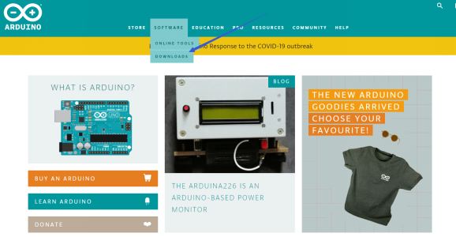
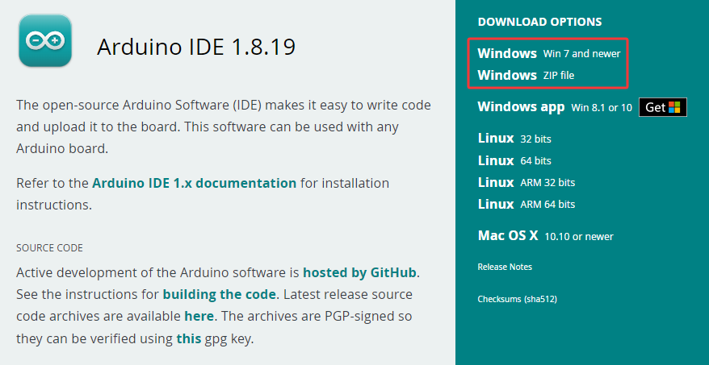
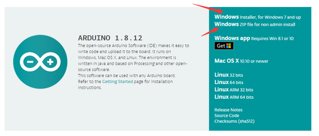
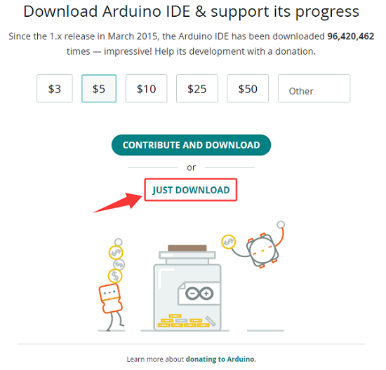
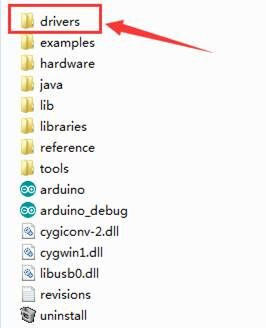
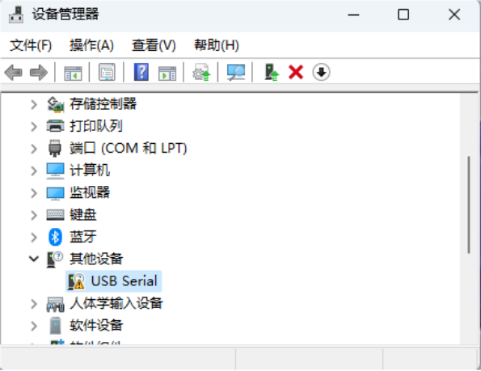
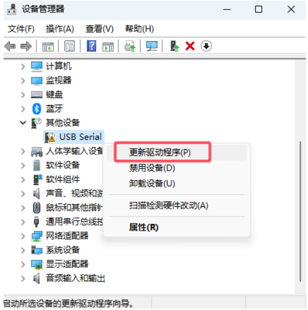
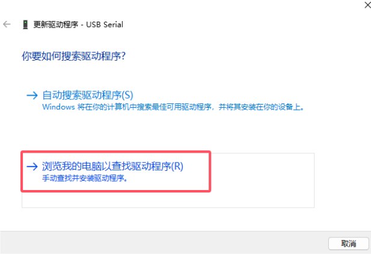
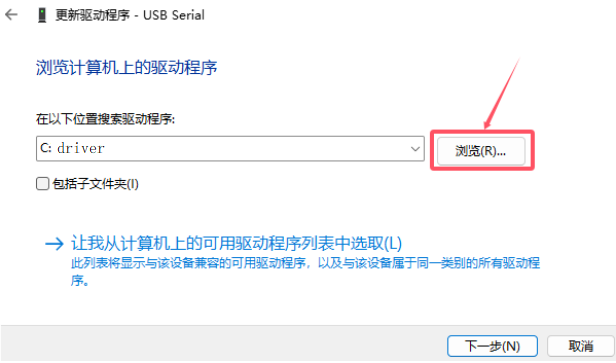
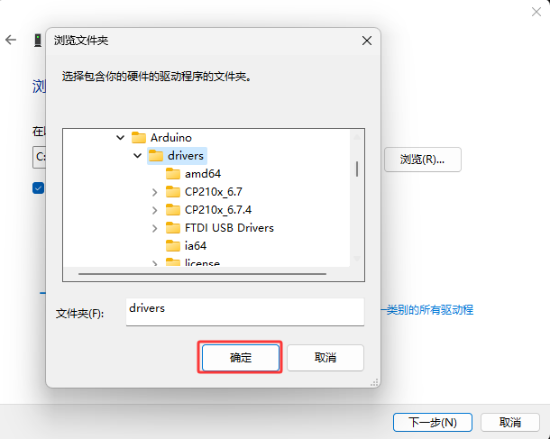
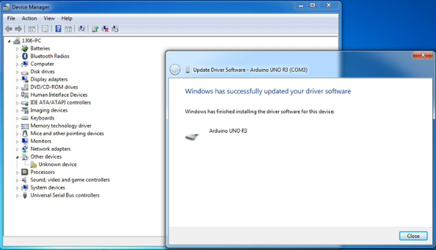
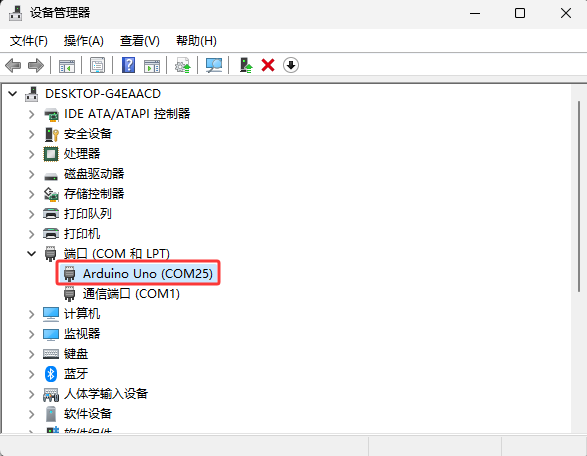

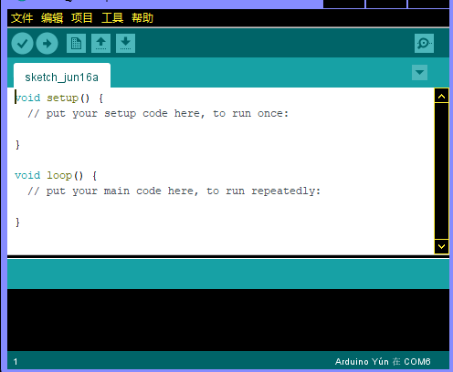
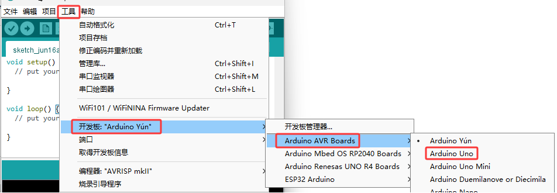

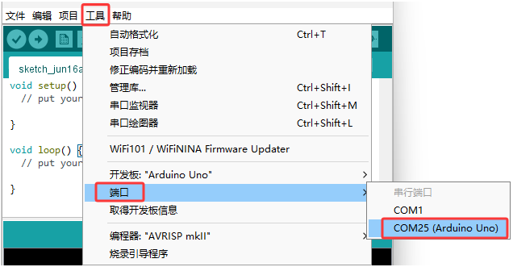
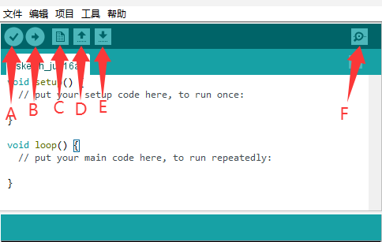
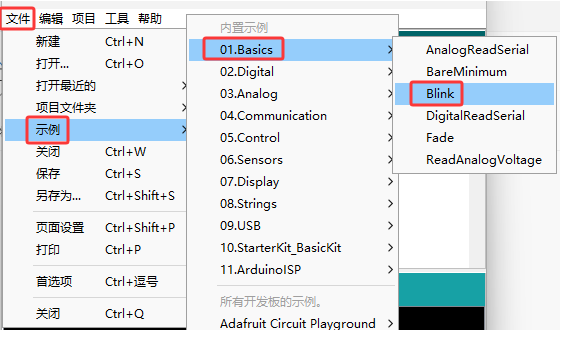
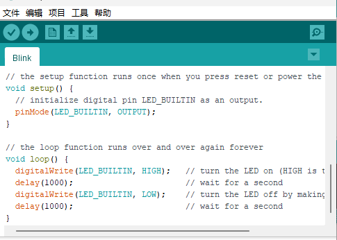
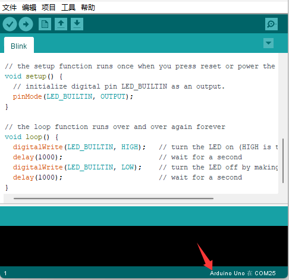

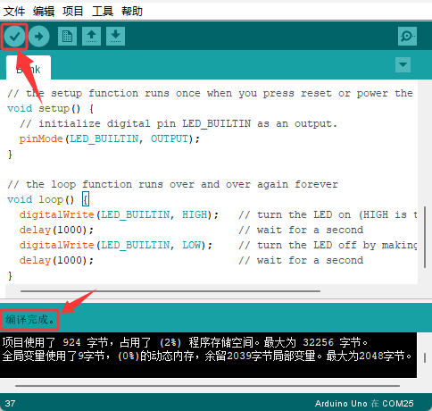

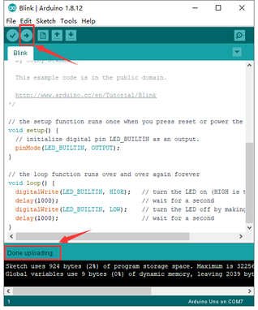
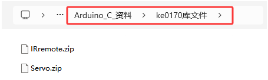
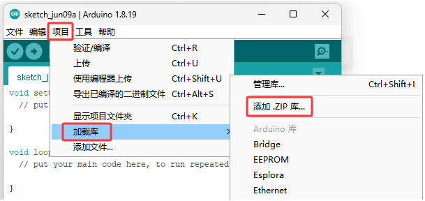
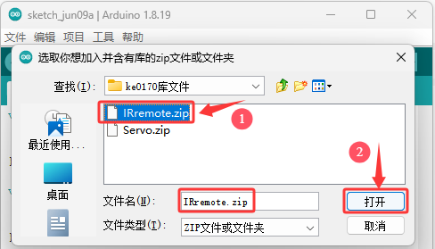

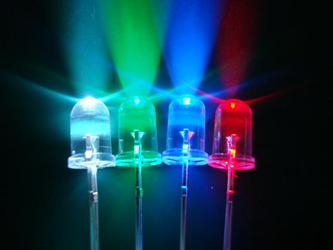
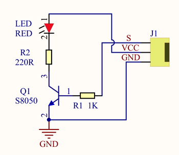
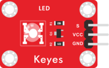
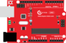
.. |image33| image:: media/3dca1bdd1d1420c1d12b16cbf52fee00.png
.. |image34| image:: media/31fb938502d3d519813c391569d6a3f3.png

.. |image36| image:: media/07752ebfc8e8af62f1b86c4a725ea284.jpg
.. |image37| image:: media/c5bf59a8e5cdded95c02334369ab6fdd.png

.. |image39| image:: media/3dca1bdd1d1420c1d12b16cbf52fee00.png
.. |image40| image:: media/31fb938502d3d519813c391569d6a3f3.png

.. |image42| image:: media/07752ebfc8e8af62f1b86c4a725ea284.jpg
.. |image43| image:: media/c5bf59a8e5cdded95c02334369ab6fdd.png

.. |image45| image:: media/3dca1bdd1d1420c1d12b16cbf52fee00.png
.. |image46| image:: media/31fb938502d3d519813c391569d6a3f3.png

.. |image48| image:: media/07752ebfc8e8af62f1b86c4a725ea284.jpg
.. |image49| image:: media/c5bf59a8e5cdded95c02334369ab6fdd.png
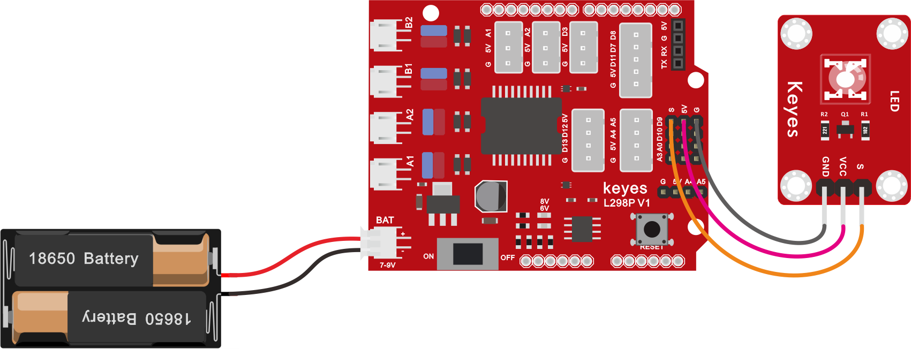
.. |image51| image:: media/a6dbf9a1d18d8849437f013dcaf2d4a6.png

.. |image53| image:: media/3dca1bdd1d1420c1d12b16cbf52fee00.png
.. |image54| image:: media/31fb938502d3d519813c391569d6a3f3.png

.. |image56| image:: media/07752ebfc8e8af62f1b86c4a725ea284.jpg
.. |image57| image:: media/c5bf59a8e5cdded95c02334369ab6fdd.png

.. |image59| image:: media/3dca1bdd1d1420c1d12b16cbf52fee00.png
.. |image60| image:: media/31fb938502d3d519813c391569d6a3f3.png

.. |image62| image:: media/07752ebfc8e8af62f1b86c4a725ea284.jpg
.. |image63| image:: media/c5bf59a8e5cdded95c02334369ab6fdd.png

.. |image65| image:: media/3dca1bdd1d1420c1d12b16cbf52fee00.png
.. |image66| image:: media/31fb938502d3d519813c391569d6a3f3.png

.. |image68| image:: media/07752ebfc8e8af62f1b86c4a725ea284.jpg
.. |image69| image:: media/c5bf59a8e5cdded95c02334369ab6fdd.png

.. |image71| image:: media/8d32c66be794f5c422e946ea3500aa81.png
.. |image72| image:: media/553f3d1b6ca04e1aa0479841dd075fa2.png
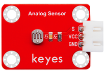

.. |image75| image:: media/3dca1bdd1d1420c1d12b16cbf52fee00.png
.. |image76| image:: media/31fb938502d3d519813c391569d6a3f3.png

.. |image79| image:: media/07752ebfc8e8af62f1b86c4a725ea284.jpg

.. |image81| image:: media/c5bf59a8e5cdded95c02334369ab6fdd.png

.. |image83| image:: media/3dca1bdd1d1420c1d12b16cbf52fee00.png
.. |image84| image:: media/31fb938502d3d519813c391569d6a3f3.png

.. |image87| image:: media/07752ebfc8e8af62f1b86c4a725ea284.jpg

.. |image89| image:: media/c5bf59a8e5cdded95c02334369ab6fdd.png

.. |image91| image:: media/3dca1bdd1d1420c1d12b16cbf52fee00.png
.. |image92| image:: media/31fb938502d3d519813c391569d6a3f3.png

.. |image95| image:: media/07752ebfc8e8af62f1b86c4a725ea284.jpg

.. |image97| image:: media/c5bf59a8e5cdded95c02334369ab6fdd.png
.. |image98| image:: media/699ddc22f84ee584287e5f3d9f35e035.png
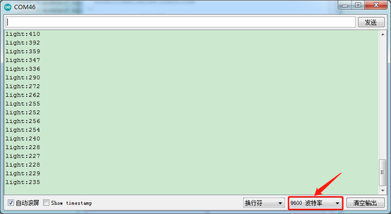
.. |image100| image:: media/9bd3c21cc318d3a8f16febf3c3543c61.png
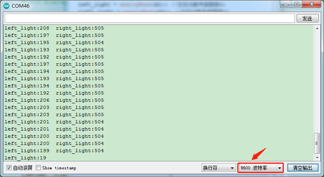
.. |image102| image:: media/ebfc39b179ba70727ddf81ce6817deb5.png
.. |image103| image:: media/69be958142b773acdae33eeef12afed7.png
.. |image104| image:: media/5f3471aed2a4350556b9f7cd0b3284c5.png
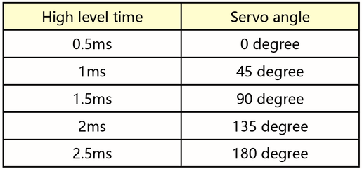

.. |image107| image:: media/3dca1bdd1d1420c1d12b16cbf52fee00.png
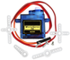

.. |image110| image:: media/c5bf59a8e5cdded95c02334369ab6fdd.png
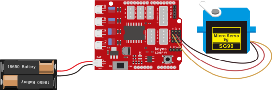
.. |image112| image:: media/2a0b40b983f1aead31d43e1662c4257e.png
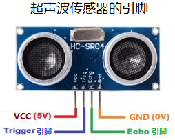

.. |image115| image:: media/3dca1bdd1d1420c1d12b16cbf52fee00.png
.. |image116| image:: media/31fb938502d3d519813c391569d6a3f3.png
.. |image117| image:: media/393e74e8219e2ae066a43f5f19835ea0.png
.. |image118| image:: media/146f0fc8a39a7d767675ff130236d967.png
.. |image119| image:: media/07752ebfc8e8af62f1b86c4a725ea284.jpg

.. |image121| image:: media/c5bf59a8e5cdded95c02334369ab6fdd.png

.. |image123| image:: media/3dca1bdd1d1420c1d12b16cbf52fee00.png
.. |image124| image:: media/31fb938502d3d519813c391569d6a3f3.png
.. |image125| image:: media/393e74e8219e2ae066a43f5f19835ea0.png
.. |image126| image:: media/146f0fc8a39a7d767675ff130236d967.png
.. |image127| image:: media/07752ebfc8e8af62f1b86c4a725ea284.jpg

.. |image129| image:: media/c5bf59a8e5cdded95c02334369ab6fdd.png

.. |image131| image:: media/3dca1bdd1d1420c1d12b16cbf52fee00.png
.. |image132| image:: media/31fb938502d3d519813c391569d6a3f3.png
.. |image133| image:: media/393e74e8219e2ae066a43f5f19835ea0.png
.. |image134| image:: media/146f0fc8a39a7d767675ff130236d967.png
.. |image135| image:: media/07752ebfc8e8af62f1b86c4a725ea284.jpg

.. |image137| image:: media/c5bf59a8e5cdded95c02334369ab6fdd.png
.. |image138| image:: media/7d2dccb20acaf9b17c53063421a5faa0.png
.. |image139| image:: media/6637578e3d2c6f902ee32931532a83ca.png
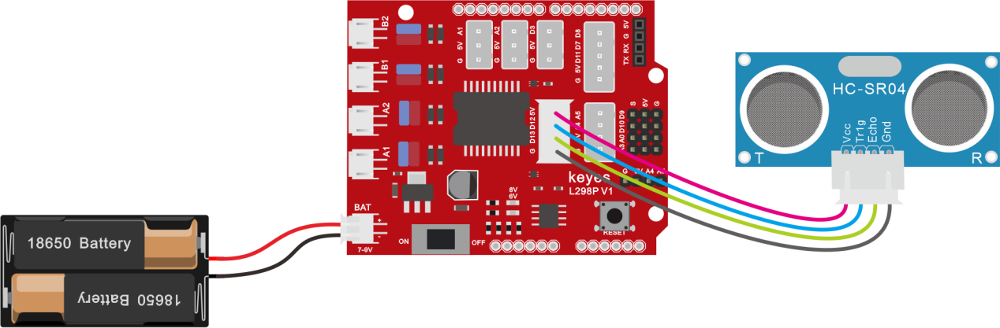
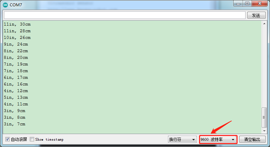
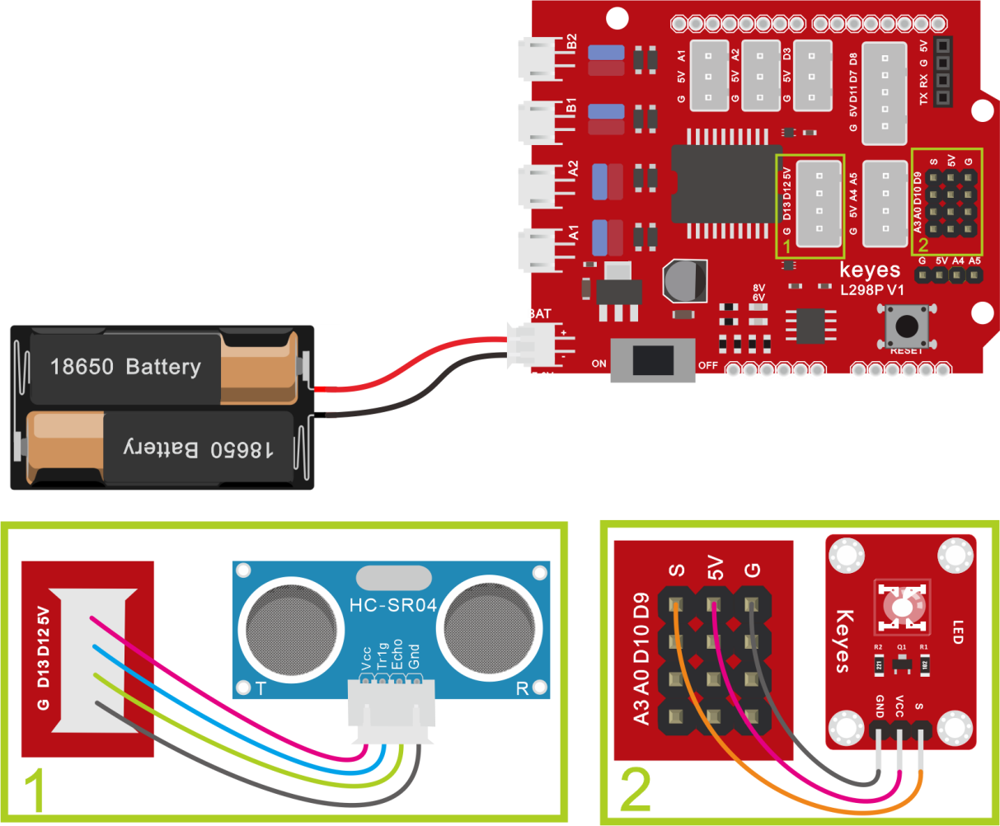
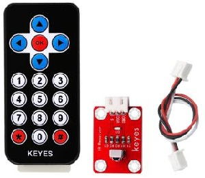
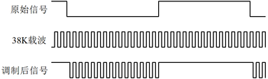
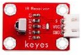
.. |image146| image:: media/17b787d350e8882a03f0c31eeee3c9f2.png

.. |image148| image:: media/3dca1bdd1d1420c1d12b16cbf52fee00.png
.. |image149| image:: media/31fb938502d3d519813c391569d6a3f3.png
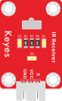

.. |image153| image:: media/07752ebfc8e8af62f1b86c4a725ea284.jpg
.. |image154| image:: media/61437329d2cd93dc1815e829f639cca6.png
.. |image155| image:: media/c5bf59a8e5cdded95c02334369ab6fdd.png

.. |image157| image:: media/3dca1bdd1d1420c1d12b16cbf52fee00.png
.. |image158| image:: media/31fb938502d3d519813c391569d6a3f3.png

.. |image162| image:: media/07752ebfc8e8af62f1b86c4a725ea284.jpg
.. |image163| image:: media/61437329d2cd93dc1815e829f639cca6.png
.. |image164| image:: media/c5bf59a8e5cdded95c02334369ab6fdd.png

.. |image166| image:: media/3dca1bdd1d1420c1d12b16cbf52fee00.png
.. |image167| image:: media/31fb938502d3d519813c391569d6a3f3.png

.. |image171| image:: media/07752ebfc8e8af62f1b86c4a725ea284.jpg
.. |image172| image:: media/61437329d2cd93dc1815e829f639cca6.png
.. |image173| image:: media/c5bf59a8e5cdded95c02334369ab6fdd.png
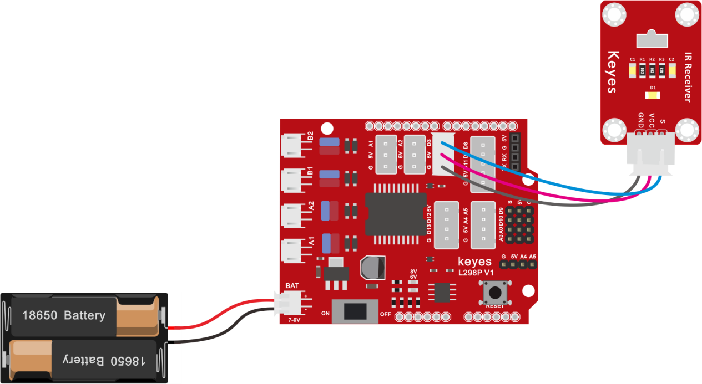
.. |image175| image:: media/56ad2d8c8eb870420d507cd5d70efc4f.png
.. |image176| image:: media/e7946515345fdf65e1b3d58893f9a207.png
.. |image177| image:: media/3e1b8f89ced30ab39050a9693b615f8f.png
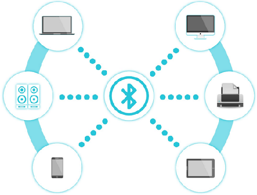
.. |image179| image:: media/27e47e630140eb72f69dad02549438b4.png

.. |image181| image:: media/3dca1bdd1d1420c1d12b16cbf52fee00.png
.. |image182| image:: media/31fb938502d3d519813c391569d6a3f3.png
.. |image183| image:: media/27e47e630140eb72f69dad02549438b4.png
.. |image184| image:: media/07752ebfc8e8af62f1b86c4a725ea284.jpg

.. |image186| image:: media/c5bf59a8e5cdded95c02334369ab6fdd.png

.. |image188| image:: media/3dca1bdd1d1420c1d12b16cbf52fee00.png
.. |image189| image:: media/31fb938502d3d519813c391569d6a3f3.png
.. |image190| image:: media/27e47e630140eb72f69dad02549438b4.png
.. |image191| image:: media/07752ebfc8e8af62f1b86c4a725ea284.jpg

.. |image193| image:: media/c5bf59a8e5cdded95c02334369ab6fdd.png

.. |image195| image:: media/3dca1bdd1d1420c1d12b16cbf52fee00.png
.. |image196| image:: media/31fb938502d3d519813c391569d6a3f3.png
.. |image197| image:: media/27e47e630140eb72f69dad02549438b4.png
.. |image198| image:: media/07752ebfc8e8af62f1b86c4a725ea284.jpg

.. |image200| image:: media/c5bf59a8e5cdded95c02334369ab6fdd.png
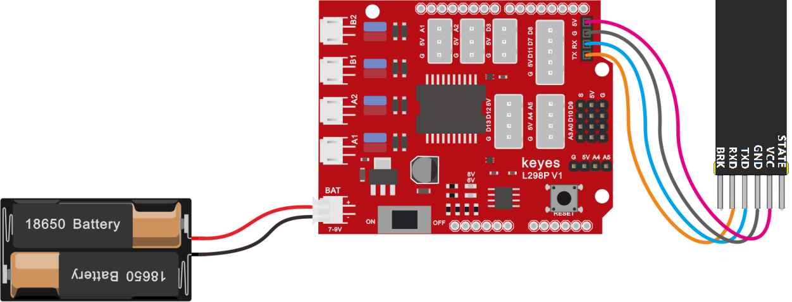
.. |image202| image:: media/e920dec9583352e3505ef6662868ec1a.png
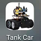
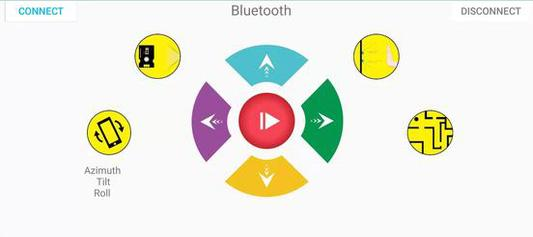
.. |image205| image:: media/36b1f3e7cfca7e69178124d46abfa609.png
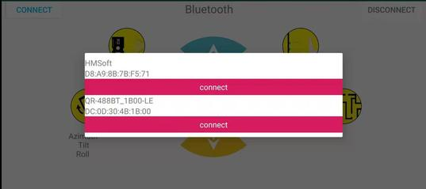
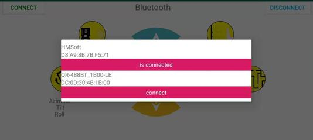
.. |image208| image:: media/af6836387c7ddd16faa20396439cf0dd.png
.. |image209| image:: media/6ca6b22d85030f744a22a61abb70c261.png
.. |image210| image:: media/3c0249b480b0453172eb46c29d44078a.png
.. |image211| image:: media/5e92657dcaeaebeccbe0ef212daf04ec.png

.. |image215| image:: media/2ea70aea70f675bf3683c6b8d849f2c7.png

.. |image217| image:: media/2ea70aea70f675bf3683c6b8d849f2c7.png
.. |image218| image:: media/26cb7b1cfaa0d52caa58cb12cc782562.png
.. |image219| image:: media/991bfe4ef7264a6b83455ac668ecc10b.png

.. |image223| image:: media/3dca1bdd1d1420c1d12b16cbf52fee00.png

.. |image226| image:: media/c5bf59a8e5cdded95c02334369ab6fdd.png

.. |image228| image:: media/3dca1bdd1d1420c1d12b16cbf52fee00.png

.. |image231| image:: media/c5bf59a8e5cdded95c02334369ab6fdd.png

.. |image233| image:: media/3dca1bdd1d1420c1d12b16cbf52fee00.png

.. |image236| image:: media/c5bf59a8e5cdded95c02334369ab6fdd.png

.. |image238| image:: media/97ff08495c4301a9ff3e7a7714bf7b00.jpg

.. |image240| image:: media/3dca1bdd1d1420c1d12b16cbf52fee00.png

.. |image243| image:: media/c5bf59a8e5cdded95c02334369ab6fdd.png

.. |image246| image:: media/3dca1bdd1d1420c1d12b16cbf52fee00.png

.. |image249| image:: media/c5bf59a8e5cdded95c02334369ab6fdd.png

.. |image252| image:: media/3dca1bdd1d1420c1d12b16cbf52fee00.png

.. |image255| image:: media/c5bf59a8e5cdded95c02334369ab6fdd.png

.. |image258| image:: media/2f63c317b84c809c96550cc1e204664e.png

.. |image271| image:: media/b8373eb149df42e9b559824a8f1ccb82.png

.. |image275| image:: media/d3aa71456797375083d34feeffe11d66.png

.. |image277| image:: media/301446808bab83e2ff62ecc31e607b29.png

.. |image280| image:: media/e7fbd5f40b576712264670f1da25e73a.png
.. |image281| image:: media/aae33c656475a9d989dddf5fc2f6b967.png
.. |image282| image:: media/7ee39310d35f29fad61e3a211e55e98d.png
.. |image283| image:: media/62934fafbccedab49b5e8e62ab52d595.png
.. |image284| image:: media/b676867d8d9b4f1973244a255f46f1fc.png

.. |image287| image:: media/5d97b792798ff2222be7381a2e5f894b.png

.. |image289| image:: media/868c19b84dc030077e9a0b1e98e68c47.png

.. |image293| image:: media/bce9cba2c6d2465fbcce570ad4210eba.png
.. |image294| image:: media/ad907a618af86f30d52986bbbd57ba76.png
.. |image295| image:: media/9716a4ed61a4064d2f47a7b73eccaf87.png
.. |image296| image:: media/40626a911cd980880f4c472ad10ab467.png

.. |image298| image:: media/1233714e0234b6245cedbc3eff07864d.png
.. |image299| image:: media/35b811ab85a240ba2eabeffd8379b337.png
.. |image300| image:: media/38f4b9a388eb3633c4b0f5c04545c130.png
.. |image301| image:: media/720164d43dbe50d388f5887eafec078b.png
.. |image302| image:: media/dd17f04276c6ec578ce69bdd6b709ab0.png

.. |image305| image:: media/558a091d1dff040217a8c8ec8e3b7cdb.png

.. |image311| image:: media/418535b9bdcc25b1fb706b90205869b2.png

.. |image313| image:: media/1233714e0234b6245cedbc3eff07864d.png
.. |image314| image:: media/35b811ab85a240ba2eabeffd8379b337.png
.. |image315| image:: media/38f4b9a388eb3633c4b0f5c04545c130.png
.. |image316| image:: media/720164d43dbe50d388f5887eafec078b.png
.. |image317| image:: media/dd17f04276c6ec578ce69bdd6b709ab0.png

.. |image320| image:: media/558a091d1dff040217a8c8ec8e3b7cdb.png

.. |image326| image:: media/418535b9bdcc25b1fb706b90205869b2.png

.. |image328| image:: media/1233714e0234b6245cedbc3eff07864d.png
.. |image329| image:: media/35b811ab85a240ba2eabeffd8379b337.png
.. |image330| image:: media/38f4b9a388eb3633c4b0f5c04545c130.png
.. |image331| image:: media/720164d43dbe50d388f5887eafec078b.png
.. |image332| image:: media/dd17f04276c6ec578ce69bdd6b709ab0.png

.. |image335| image:: media/558a091d1dff040217a8c8ec8e3b7cdb.png

.. |image341| image:: media/418535b9bdcc25b1fb706b90205869b2.png

