.. _7-mixly_教程:

7. Mixly_教程
=============

.. _71-mixly_资料下载:

7.1. Mixly_资料下载
-------------------

\ **⚠️特别提示:**
请先下载本教程需要用到的Mixly_资料(包含：Mixly_代码、Mixly库文件等）和Android_APP等，保存至您方便使用的路径下。

**下载：** :download:`Mixly_资料 <./Mixly_资料.7z>` 和 :download:`Android_APP <./Android_APP.7z>`

.. _72-mixly-ide-开发环境设置:

7.2. Mixly IDE 开发环境设置
---------------------------

.. _721-mixly-ide下载安装:

7.2.1. Mixly IDE下载、安装
~~~~~~~~~~~~~~~~~~~~~~~~~~

**下载软件：**

我们通过百度网盘分享：mixly2.0-2024 文件

\ **下载链接：**\ 
https://pan.baidu.com/s/1sV0DUDKg7OiQcKyIkBI1Ew?pwd=keye

\ **提取码：**\  keye

根据计算机系统选择下载对应的mixly2.0版本，如下图所示：

|Img|

Mixly For Windows：

Windows系统一般是下载“\ **mixly2.0-win32-x64-rc4完整版.zip**\ ”版本，

|image1|

Mixly For Mac(根据系统选择)：

|image2|

Mixly For Linux(根据系统选择)：

|image3|

.. _722-mixly-ide安装及页面介绍:

7.2.2. Mixly IDE安装及页面介绍
~~~~~~~~~~~~~~~~~~~~~~~~~~~~~~

**Windows版本安装**

下载mixly2.0-win32-x64-rc4完整版压缩包之后，重新命名为 mixly2.0
，右键解压到本地磁盘。

⚠️ **特别提醒：**
(1)建议解压到硬盘根目录，路径不能包含中文及特殊字符(如:.\_( )等)。
(2)建议安装路径如 D:\\mixly2.0

因为Mixly是一个绿色免安装软件，所以“mixly2.0-win32-x64-rc4完整版”版本在解压之后就可以直接使用了。如果是下载“一键更新版.7z”版本的压缩包，压缩包解压后，需要左键双击打开“一键更新.bat”按照提示更新Mixly。

|image4|

**MAC版本安装：**

提供有MAC安装Mixly2.0.txt的文本，安装时可以参考里面的安装方法。

|image5|

**Linux版本安装：**

提供有Linux安装Mixly2.0.txt的文本，安装时可以参考里面的安装方法。

|image6|

**启动软件(这里以Windows版本为例，其他系统版本可以参考)：**

这里双击“\ **Mixly.exe**\ ”就能打开Mixly软件。如下图所示：

|image7|

打开Mixly软件后，找到并且单击“ **Arduino AVR**
”就可以进入Mixly编程界面。软件界面如下图所示：

|image8|

**页面介绍(这里以Windows版本为例):**

|image9|

|image10|

总体来说，Mixly软件界面分为4部分：

1.界面左侧为模块区，这里包含了Mixly中所有能用到的程序模块，根据功能的不同，大概分为以下几类:“输入/输出”、“控制”、“数学”、“逻辑”、“文本”、“数组”、“变量”、“函数”、“串口”、“传感器”、“执行器”、“显示器”、“通信”、“存储”、“网络”。每种类型的模块都用不同的颜色块表示，其中每一个分类中的模块会在附录A中有专门的介绍。

2.模块区的右侧是程序构建区，模块区的模块可通过鼠标拖拽放到程序构建区，拖诟过来的模块会在这里组合成一段有一定逻辑关系的程序块。这个区域有点类似代码程序编辑软件中写代码的地方，在这个区域的右下角有一个垃圾桶，当我们删除模块时，就要将模块拖到垃圾桶中，在垃圾桶的上方有三个圆形的按钮，能够实现程序构建区的放大、缩小以及居中。

3.模块区和程序构建区的上方是基本功能区，类似一般软件的菜单区。这里不仅包含了“新建”、“打开”、“保存”、“另存为”、“导出库”和“管理库”软件都具有的按钮，还包含了硬件编程软件中需要用到的“编译”、“上传”、“控制板选择”、“串口端口”、“串口”这样的按钮。

4.界面的最下方是提示区，这里在软件编译、上传的过程中会显示相应的提示信息。我们可以通过提示信息来解决编译上传过程中出现的一些问题。

最后还要补充两点：

第一点是 Mixly支持多国语言，我们可以通过如下界面找到并且点击 |image11|
进入个性化设置页面，找到语言下面的简体中文下拉菜单，选择不同的语言版本，此时这个下拉菜单显示的是简体中文，如下图所示：

|image12|

|image13|

第二点是在界面最上方右侧有一个 |image14|
按钮，单击这个按钮就能进入纯代码形式，如下图所示：

|image15|

Mixly作为一款将图形化编程方式和代码编程方式融合在一起的开发环境，如果只能单独地显示代码或显示图形程序块，那么肯定是不够好的。在Mixly中是能够将代码和图形程序块一起呈现在屏幕上的，这个功能可以通过界面最上方右侧有一个按钮实现，单击这个
|image16| 按钮之后，如下图所示：

|image17|

这时，在程序构建区的右侧会显示出对应的代码，这段代码是与程序构建区中的模块所组成的程序块对应的，会随着模块的变化而变化，不过区域中的代码是不可编辑的。同时，界面最右侧那个向左的箭头按钮变成了向右的箭头。

**注意：想了解更多关于Mixly相关知识的请点击链接：**\ https://mixly.readthedocs.io/zh-cn/latest/
。

**Mixly 软件相关使用教程**

https://www.bilibili.com/video/bv1BE411A7hX

https://www.bilibili.com/video/BV1jE411A78S

https://www.bilibili.com/video/BV1YE411A7FT

https://wiki.mixly.org/

.. _73-添加mixly库文件:

7.3. 添加Mixly库文件
--------------------

（以下是以Windows系统为例，MacOS系统可以参考）

（注意：如果库文件已经导入了，则不需要再次导入；如果没有，则需要进行以下操作）

我们提供的Mixly库文件在如下路径：

|image18|

Mixly软件下载安装后，点击 Arduino AVR
进入代码编辑器，先点击右上角“设置”，再点击“管理库”进入添加库文件界面。如下图所示：

|image19|

|image20|

在Mixly窗口中，先点击“导入库”，再点击\ |image21|\ 进入库文件所放的位置，找到
**index.xml**
库文件并选中它，然后单击“确定”。之后，就可以看到库文件在导入中，一会儿会出现“导入成功”字样，说明库文件导入成功。如下图所示：

|image22|

|image23|

|image24|

点击“管理库”可以查看到刚加入的库文件。

|image25|

关闭添加库文件的窗口界面，在代码编辑器左侧看到所添加的库文件。如下图所示：

|image26|

⚠️ **特别提醒：本套件是选用 “tank robot” 库**\ 。

|image27|

.. _74-mixly-ide的使用方法:

7.4. Mixly IDE的使用方法：
--------------------------

接下来，我们将以UNO R3控制板控制LED亮灭为例：

（1）连接指南:

通过USB数据线将控制板连接到电脑上。LED灯的控制引脚：

- LED灯（S引脚）D9

|image28|

（2）打开一下程序代码：

|image29|

1.
确保Arduino主控板与计算机连接成功，然后双击“Mixly.exe”图标打开Mixly软件。

|image30|

2.
“文件”-->“打开”，然后选择保存代码的路径，选中代码文件打开即可。如下图所示：

|image31|

|image32|

3. 代码文件打开后，需要手动选择Arduino主控板的板型“Arduino/Genuino
Uno”和串口端口（COM26），如下图所示：

|image33|

|image34|

4.
接着点击“编译”对代码进行编译，如果代码编译成功，说明代码没问题，可以进行下一步操作。

|image35|

5. 点击\ |image36|\ ，把代码上传到你的控制板上。

|image37|

|image38|

.. _75-项目教程:

7.5. 项目教程
-------------

好了，所有的东西都已经准备完毕，我们正式开始迷你坦克机器人的编程项目。前面我们从简单的传感器和模块开始，循序渐进完成模块传感器的测试项目，现在再来完成几个不同类型的机器人，最后我们把所有学到的知识结合到一起，完成一个综合的项目：多功能桌面小车。

**注意：**
本项目中的各传感器/模块上标有（G）表示负极，是连接到控制板或传感器扩展板上的G或-或GND；标有（V）表示正极，是连接到控制板或扩展板上的V或VCC或+或5V。

项目一 LED灯闪烁
~~~~~~~~~~~~~~~~

**项目介绍：**

|image39|

前面我们安装了keyes UNO
R3开发板的驱动。接下来的项目我们就要由简单到复杂，一步一步探索Arduino的世界了。首先我们要来完成经典的“Arduino点亮LED”，也就是Blink项目。Blink对于学习Arduino的爱好者而言，是最基础的项目是新手必须经历的一个练习。

LED，发光二极管的简称。由含镓（Ga）、砷（As）、磷（P）、氮（N）等的化合物制成。当电子与空穴复合时能辐射出可见光，因而可以用来制成发光二极管。在电路及仪器中作为指示灯，或者组成文字或数字显示。

为了实验的方便，我们将LED发光二极管做成了一个模块，在第一个项目中，我们用一个最基本的测试代码来控制LED，亮一秒钟，灭一秒钟，来实现闪烁的效果。你可以改变代码中LED灯亮灭的时间，实现不同的闪烁效果。LED模块信号端S为高电平时LED亮起，S为低电平时LED熄灭。

|image40|

|image41|

**LED模块参数：**

控制接口: 数字口

工作电压: DC 3.3-5V

排针间距: 2.54mm

LED显示颜色：红色

**项目组件：**

+-----------------+------------------------+------------------------+
| UNO R3 开发板*1 | L298P 电机驱动扩展板   | LED白发红模块*1        |
|                 | V1*1                   |                        |
+=================+========================+========================+
| |image54|       | |image55|              | |image56|              |
+-----------------+------------------------+------------------------+
| USB线*1         | 3Pin 双母头杜邦线*1    | 18650双节电池盒        |
|                 |                        | (18                    |
|                 |                        | 650电池*2(电池自配))*1 |
+-----------------+------------------------+------------------------+
| |image57|       | |image58|              | |image59|              |
+-----------------+------------------------+------------------------+

**接线图：**

**⚠️特别注意：坦克智能车已经组装好了，这里不需要把传感器模块和其他的都拆下来又重新组装和接线，这里再次提供接线图，是为了方便您编写代码。但是，LED灯是需要另外连接上去的！**

|image60|

由上图我们可以看到，扩展板是堆叠在开发板上的，LED模块的-接到了扩展板的G,LED模块的+接到了扩展板的5V，LED模块的S已经接到了扩展板上的D9接口，接好线之后我们开始编写代码：

**项目代码：**

（\ **特别提醒：在上传程序代码前，需要把蓝牙模块取下，否则代码会上传失败。需要上传代码成功后，再连接蓝牙模块。**\ ）

|image61|

**项目结果：**

点击上传程序，你应该看到D9脚接着的LED打开和关闭，而且间隔的时间是一秒钟。

**代码说明:**

|image62|

LED点亮一秒

|image63|

LED熄灭一秒

**项目拓展：**

前面我们控制了LED模块亮1秒钟,灭一秒钟，现在我们来拓展一下思路，通过改变delay的时间来改变LED
灯闪烁的频率。

代码如下:

（\ **特别提醒：在上传程序代码前，需要把蓝牙模块取下，否则代码会上传失败。需要上传代码成功后，再连接蓝牙模块。**\ ）

|image64|

怎么样是不是很好理解，就是通过改变延时(delay)这个代码的时间，来改变LED亮和灭的频率，不多说，我们上传代码。看看这个LED灯闪烁的频率是不是比之前快了？

项目二 LED 亮度的调节
~~~~~~~~~~~~~~~~~~~~~

**项目介绍：**

前面课程中，我们详细的介绍了通过代码控制LED亮灭，实现闪烁的效果。这节课我们使用PWM来控制LED亮度不断地变化，模拟我们呼吸的效果。

PWM是使用数字手段来控制模拟输出的一种手段。使用数字控制产生占空比不同的方波（一个不停在高电平与低电平之间切换的信号)来控制模拟输出。一般来说端口的输入电压只有两个0V与5V。如果想要改变灯的亮度怎么办呢个？有同学说串联电阻，对，这个方法是正确的。但是，如果想要得到不同的亮度，且在不同亮度之间来回变动怎么办呢？不可能不停地切换电阻吧。这种情况下就需要使用PWM了，那它是怎么控制的呢？

|image65|

对于Arduino的数字端口电压输出只有LOW与HIGH两个，对应的就是0V与5V的电压输出，可以把LOW定义为0，HIGH定义为1，1秒内让Arduino输出500个0或者1的信号。如果这500个全部为1，那就是完整的5V，如果全部为0，那就是0V。如果010101010101这样输出，刚好一半，端口输出的平均电压就为2.5V了。这个和放映电影是一个道理，咱们所看的电影并不是完全连续的，它其实是每秒输出25张图片。在这种情况下，人的肉眼是分辨不出来的，看上去就是连续的了。PWM也是同样的道理，如果想要不同的电压，就控制0与1的输出比例控制就可以了。当然这和真实的连续输出还是有差别的，单位时间内输出的0,1信号越多，控制的就越精确。

**项目组件：**

+---------------------+----------------------+----------------------+
| UNO R3 for 开发板*1 | L298P 电机驱动扩展板 | LED白发红模块*1      |
|                     | V1*1                 |                      |
+=====================+======================+======================+
| |image78|           | |image79|            | |image80|            |
+---------------------+----------------------+----------------------+
| USB线*1             | 3Pin 双母头杜邦线*1  | 18650双节电池盒      |
|                     |                      | (1865                |
|                     |                      | 0电池*2(电池自配))*1 |
+---------------------+----------------------+----------------------+
| |image81|           | |image82|            | |image83|            |
+---------------------+----------------------+----------------------+

**接线图：**

**⚠️特别注意：坦克智能车已经组装好了，这里不需要把传感器模块和其他的都拆下来又重新组装和接线，这里再次提供接线图，是为了方便您编写代码。但是，LED灯是需要另外连接上去的！**

Arduino的PWM引脚在3，5，6，9，10，11,上一小节的接线刚刚好在9脚，所以我们这个接线不用变

|image84|

**项目代码：**

（\ **特别提醒：在上传程序代码前，需要把蓝牙模块取下，否则代码会上传失败。需要上传代码成功后，再连接蓝牙模块。**\ ）

|image85|

**项目结果：**

代码下载完成后，我们可以看到LED会有个逐渐由亮到灭的一个缓慢过程，而不是直接的亮灭，如同呼吸一般，均匀变化。

PWM是一项通过数字方法来获得模拟量的技术。数字控制来形成一个方波，方波信号只有开关两种状态（也就是我们数字引脚的高低）。通过控制开与关所持续时间的比值就能模拟到一个0到5V之间变化的电压。开（学术上称为高电平）所占用的时间就叫做脉冲宽度，所以PWM也叫做脉冲宽度调制。

通过下面五个方波来更形象的了解一下PWM。

|image86|

**PWM示意图**

上图绿色竖线代表方波的一个周期。每个analogWrite(value)中写入的value都能对应一个百分比，这个百分比也称为占空比(Duty
Cycle)，指的是高电平在周期内占的时间比值，也就是：占空比=高电平时间
/周期时间。图中，从上往下，第一个方波，占空比为0%，对应的value为0。LED亮度最低，也就是灭的状态。高电平持续时间越长，也就越亮。所以，最后一个占空比为100%的对应value是255，LED最亮。50%就是最亮的一半了，25%则相对更暗。

PWM比较多的用于调节LED灯的亮度。或者是电机的转动速度，电机带动的车轮速度也就能很容易控制了，在玩一些Arduino机器人时，更能体现PWM的好处。

**项目拓展：**

我们不改变灯的脚位，只是改变程序里面延时(delay)的值，看看它如何改变渐变效果。

实验代码：

（\ **特别提醒：在上传程序代码前，需要把蓝牙模块取下，否则代码会上传失败。需要上传代码成功后，再连接蓝牙模块。**\ ）

|image87|

上传代码到开发板，看LED渐变的效果是不是慢了一些。

项目三 光敏电阻传感器
~~~~~~~~~~~~~~~~~~~~~

**项目介绍**\ ：

|image88|

在套件中，包含两个光敏电阻模块，我们可以利用这两个模块和小车搭配做一个追光智能车。在这一课程中，我们先学习了解下光敏电阻模块和使用方法。

光敏电阻环境光线最敏感，不同的光照强度，光敏电阻的阻值不一样。我们利用光敏电阻该特性，设计电路，生成光敏电阻模块。模块信号端连接单片机模拟口，当光照强度越强时，模拟口电压越大，即单片机的模拟值也大；反之，光照强度越弱时，模拟口电压越小，即单片机的模拟值也小。这样，我们就可以利用光敏电阻模块读取对应模拟值，感应环境中光照强度了。

**参数：**

工作电压：3.3V-5V（DC）

接口：3PIN接口

输出信号：模拟信号

**项目组件：**

+----------------+----------------+----------------+----------------+
| UNO R3         | L298P          | L              | 光             |
| 开发板*1       | 电机驱动扩展板 | ED白发红模块*1 | 敏电阻传感器*2 |
|                | V1*1           |                |                |
+================+================+================+================+
| |image105|     | |image106|     | |image107|     | |image108|     |
+----------------+----------------+----------------+----------------+
| HX-2.54 3P     | 3Pin           | USB线*1        | 1              |
| 双头 26AWG*2   | 双母头杜邦线*1 |                | 8650双节电池盒 |
|                |                |                | (18650电池*    |
|                |                |                | 2(电池自配))*1 |
+----------------+----------------+----------------+----------------+
| |image109|     | |image110|     | |image111|     | |image112|     |
+----------------+----------------+----------------+----------------+

**接线图:**

**⚠️特别注意：坦克智能车已经组装好了，这里不需要把传感器模块和其他的都拆下来又重新组装和接线，这里再次提供接线图，是为了方便您编写代码。但是，LED灯是需要另外连接上去的！**

接线注意：左边的光敏电阻模块的“-”、“+”和S引脚分别接在keyes传感器扩展板G（GND）、V（VCC）、A1；同样地，右边的光敏电阻模块接在G（GND）、V（VCC）A2。我们这里先在左边接一个测试。

|image113|

**项目代码：**

（\ **特别提醒：在上传程序代码前，需要把蓝牙模块取下，否则代码会上传失败。需要上传代码成功后，再连接蓝牙模块。**\ ）

|image114|

**项目结果：**

上传代码到开发板，单击\ |image115|\ ，在串口监视器窗口设置波特率为9600。可以看到打印出的光敏传感器检测的值，如果我们用手给它遮挡光线，我们发现值变小了。

|image116|

**项目拓展：**

上面我们了解了光敏传感器的工作原理，接下来我们用到两个光敏传感器，分别接在A1（左）和A2（右）。在第9脚接上一个LED灯，然后通过读取左右两个光敏传感器的状态，来控制LED的亮和灭。如下图接线：

|image117|

我们开始来编写代码：

（\ **特别提醒：在上传程序代码前，需要把蓝牙模块取下，否则代码会上传失败。需要上传代码成功后，再连接蓝牙模块。**\ ）

|image118|

上传代码到开发板，用我们的手去一个个的遮掩光敏传感器，我们看看LED灯的状态发生了改变没有？当我们用手去遮挡任一光敏传感器的时候，我们可以看到LED灯亮起来了，同时串口显示对应光敏传感器的检测也变小了；反之，则相反。

|image119|

**代码解释：**

|image120|

串口打印光敏传感器检测到的光照强度模拟值。

|image121|

这些是逻辑运算符号。

|image122|

这是简单的条件判断语句，如果\ |image123|\ 里的表达式为真，则执行 “执行”
块内的代码。

|image124|

这也是简单的条件判断语句，如果\ |image125|\ 里的表达式为真，则执行
“执行” 块内的代码。如果\ |image126|\ 里表达式为假 ，则执行 “否则”
块内的代码。

|image127|

如果左侧的光敏传感器检测到的光照强度模拟值小于300或者右侧的光敏传感器检测到的光照强度模拟值小于300时，LED点亮；否则，LED不亮。

项目四 舵机控制
~~~~~~~~~~~~~~~

|image128|

**项目介绍：**

舵机是一种位置伺服的驱动器，主要是由外壳、电路板、无核心马达、齿轮与位置检测器所构成。其工作原理是由接收机或者单片机发出信号给舵机，其内部有一个基准电路，产生周期为20ms，宽度为1.5ms
的基准信号，将获得的直流偏置电压与电位器的电压比较，获得电压差输出。

|image129|
舵机有很多规格，但所有的舵机都有外接三根线，分别用棕、红、橙三种颜色进行区分，由于舵机品牌不同，颜色也会有所差异，棕色为接地线，红色为电源正极线，橙色为信号线。

舵机的转动的角度是通过调节PWM（脉冲宽度调制）信号的占空比来实现的，标准PWM（脉冲宽度调制）信号的周期固定为20ms（50Hz），理论上脉宽分布应在1ms到2ms
之间，但是，事实上脉宽可由0.5ms 到2.5ms
之间，脉宽和舵机的转角0°～180°相对应。

|image130|

对应的舵机角度值如下:

|image131|

**舵机参数：**

工作电压：DC 4.8V〜6V

可操作角度范围：大约 About 180°(在 500→2500 μsec)

脉波宽度范围：500→2500 μsec

空载转速：0.12±0.01 sec/60（DC 4.8V） 0.1±0.01 sec/60（DC 6V）

空载电流：200±20mA（DC 4.8V） 220±20mA（DC 6V）

停止扭力：1.3±0.01kg·cm（DC 4.8V） 1.5±0.1kg·cm（DC 6V）

停止电流：≦850mA（DC 4.8V） ≦1000mA（DC 6V）

待机电流：3±1mA（DC 4.8V） 4±1mA（DC 6V）

**项目组件：**

=============== ========================================= =============
UNO R3 开发板*1 L298P 电机驱动扩展板 V1*1                 SG90 9G舵机*1
=============== ========================================= =============
|image132|      |image133|                                |image134|
USB线*1         18650双节电池盒 (18650电池*2(电池自配))*1 
|image135|      |image136|                                
=============== ========================================= =============

**接线图**\ ：

**⚠️特别注意：坦克智能车已经组装好了，这里不需要把传感器模块和其他的都拆下来又重新组装和接线，这里再次提供接线图，是为了方便您编写代码！**

|image137|

**接线注意**\ ：舵机连接到G（GND）、V（VCC）、D10，舵机的棕色线是与Gnd(G)相连，红色线与5v(V)相连，橙色线是与数字10相连的。接舵机的时候必须要外接供电，因为驱动舵机的电流要求比较大，一般峰值的情况下接近1A，开发板的电流远远不够。如果不接外接电源，很有可能烧坏开发板。

**项目代码：**

（\ **特别提醒：在上传程序代码前，需要把蓝牙模块取下，否则代码会上传失败。需要上传代码成功后，再连接蓝牙模块。**\ ）

|image138|

**项目结果：**

上传代码成功，上电后，舵机从0°转到90°再转到180°，循环进行。

项目五 超声波模块项目
~~~~~~~~~~~~~~~~~~~~~

**项目介绍：**

|image139|

HC-SR04
超声波传感器利用声呐原理来测量物体的距离，就像蝙蝠那样。它具有出色的非接触式距离检测功能，精度高且读数稳定，使用方便。它配备有超声波发射器和接收器模块。

HC-SR04
或超声波传感器在众多电子项目中被广泛使用，用于创建障碍物检测和距离测量应用以及其他各种应用。在这里，我们带来了使用
Arduino 和超声波传感器测量距离的简单方法，以及如何将超声波传感器与
Arduino 配合使用。

**超声波参数：**

|image140|

工作电压：+5 伏

直流静态电流：<2 毫安

工作电流：15 毫安

有效角度：< 15°

测距范围：2 厘米 - 400 厘米

分辨率：0.3 厘米

测量角度：30 度

触发输入脉冲宽度：10 微秒

**项目组件：**

+----------------+----------------+----------------+----------------+
| UNO R3         | L298P          | L              | HC-SR04        |
| 开发板*1       | 电机驱动扩展板 | ED白发红模块*1 | 超声波传感器*1 |
|                | V1*1           |                |                |
+================+================+================+================+
| |image157|     | |image158|     | |image159|     | |image160|     |
+----------------+----------------+----------------+----------------+
| HX-2.54 4P     | 3Pin           | USB线*1        | 1              |
| 双头 连接线*1  | 双母头杜邦线*1 |                | 8650双节电池盒 |
|                |                |                | (18650电池*2   |
|                |                |                | (电池自配))    |
|                |                |                | \*1            |
+----------------+----------------+----------------+----------------+
| |image161|     | |image162|     | |image163|     | |image164|     |
+----------------+----------------+----------------+----------------+

**超声波模块知识：**

原理：看超声波的图可知，像是有两个眼睛，其一边是发射超声的，一边是接收超声波的，然后检测从发射遇到障碍物返回被接收到所需的时间t，再根据声音在空气中的传播速度大概是343m/s,

距离 = 速度 \* 时间 ，

由于超声波发射返回是两段路程了，所以需要除以2，故超声波测到的
距离=（速度 \* 时间）/2

超声波模块的使用方法及时序图：

1、使用GPIO引脚给SR04的Trig引脚至少10μs的高电平信号，触发SR04模块测距功能；

2、触发后，模块会自动发送8个40KHz的超声波脉冲，并自动检测是否有信号返回。这步会由模块内部自动完成。

3、如有信号返回，Echo引脚会输出高电平，高电平持续的时间就是超声波从发射到返回的时间。

|image165|

超声波模块的电路图

|image166|

**接线图：**

**⚠️特别注意：坦克智能车已经组装好了，这里不需要把传感器模块和其他的都拆下来又重新组装和接线，这里再次提供接线图，是为了方便您编写代码。但是，LED灯是需要另外连接上去的！**

接线注意：超声波传感器模块的VCC引脚连接至传感器扩展板的5v(V)，Trig引脚至数字12(S)，Echo引脚至数字13(S)，Gnd引脚至Gnd(G)。

|image167|

**项目代码：**

（\ **特别提醒：在上传程序代码前，需要把蓝牙模块取下，否则代码会上传失败。需要上传代码成功后，再连接蓝牙模块。**\ ）

|image168|

**项目结果：**

上传好测试代码到开发板，单击\ |image169|\ ，在串口监视器窗口设置波特率为9600，我们可以看到超声波模块显示的距离，单位是英尺和厘米。用手阻挡超声波模块，我们看到显示距离的数值变小了。

|image170|

**项目拓展：**

我们刚刚测出了超声波显示的距离，那我们动动脑筋，能不能用测出的距离来做一些控制呢，如果控制一个LED灯的亮和灭。我们来试一下，在D9脚接上一个LED灯模块。

|image171|

实验代码：

（\ **特别提醒：在上传程序代码前，需要把蓝牙模块取下，否则代码会上传失败。需要上传代码成功后，再连接蓝牙模块。**\ ）

|image172|

上传好测试代码到开发板，我们用手去靠近超声波传感器，看LED灯亮起来了没有。

**代码说明:**

|image173|

将超声波传感器检测到的距离值赋给于变量 distance。

|image174|

如果超声波传感器检测到的距离值（2≤distance≤10）的范围内，LED点亮；否则，LED不亮。

项目六 红外接收原理及应用
~~~~~~~~~~~~~~~~~~~~~~~~~

**项目介绍：**

|image175|

红外遥控在日常生活中随处可见，它被用来控制各种家电，如电视、音响、录影机和卫星信号接收器。红外遥控是由红外发射和红外接收系统组成的，也就是一个红外遥控器和红外接收模块和一个能解码的单片机组成的。 

|image176|

红外发射的遥控器发射的38K红外载波信号是由遥控器里的编码芯片对其进行编码。它是以一段引导码，用户码，数据码，数据反码组成，利用脉冲的时间间隔来区别是0还是1信号(高电平低电平之比约为1:1时被认为是信号0)，而编码就是由这些0、1信号组成。同一个遥控器的用户码是不变的，用数据吗不同来分辨遥控器按的键不同。当按下遥控器按键时，遥控器发送出红外载波信号，红外接收器接收到信号时程序对载波信号进行解码，通过数据码的不同来判断按下的是哪个键。单片机由接收到的01信号进行解码，由此判断遥控器按下的是什么键。

红外接收我们用的是一个红外接收模块，主要由红外接收头组成，它是集接收、放大、解调一体的器件，它内部IC就已经完成了解调，能够完成从红外线接收到输出与TTL电平信号兼容的所有工作，输出的就是数字信号。他适用于红外线遥控和红外线数据传输。接收器做成的红外接收模块只有三个引脚，信号线，VCC，GND。与arduino和其他单片机连接通信非常方便。

**红外接收的参数：**

下图为红外接收模块的实物图和电路图

|image177|

|image178|

工作电压：3.3-5V（DC）

接口：3PIN接口

输出信号：数字信号

接收角度：90度

频率：38khz

接收距离：10米

**项目组件：**

+-------------+-------------+-------------+-------------+-------------+
| UNO         | L298P       | LED白       | 红外接      | JMP-1       |
| R3开发板*1  | 电机        | 发红模块*1  | 收传感器*1  | 17键        |
|             | 驱动扩展板  |             |             | 红外遥控*1  |
|             | V1*1        |             |             |             |
+=============+=============+=============+=============+=============+
| |image197|  | |image198|  | |image199|  | |image200|  | |image201|  |
+-------------+-------------+-------------+-------------+-------------+
| USB线*1     | 3Pin        | XH2.54-3Pin | 18650双     |             |
|             | 双母        | +杜邦母双*1 | 节电池盒（  |             |
|             | 头杜邦线*1  |             | 18650电池*2 |             |
|             |             |             | （电池      |             |
|             |             |             | 自配））\*1 |             |
+-------------+-------------+-------------+-------------+-------------+
| |image202|  | |image203|  | |image204|  | |image205|  |             |
+-------------+-------------+-------------+-------------+-------------+

**接线图：**

**⚠️特别注意：坦克智能车已经组装好了，这里不需要把传感器模块和其他的都拆下来又重新组装和接线，这里再次提供接线图，是为了方便您编写代码。但是，LED灯是需要另外连接上去的！**

接线注意：由于红外接收传感器输入的数字信号，将红外接收传感器模块的“-”、“+”和S引脚分别用导线连接到keyes传感器扩展板G（GND）、V（VCC）、D3，模拟口在数字口不够的情况下，模拟口也可以当数字口使用，模拟口A0相当于数字口14，A1相当于数字口15，以此类推。

|image206|

**项目代码：**

（\ **特别提醒：在上传程序代码前，需要把蓝牙模块取下，否则代码会上传失败。需要上传代码成功后，再连接蓝牙模块。**\ ）

|image207|

**项目结果：**

上传好测试代码，单击\ |image208|\ ，在串口监视器窗口设置波特率为9600，拿出遥控器，对准红外接收传感器发送信号，即可看相应按键的键值，如果按键时间过长，容易出现乱码，出现
FFFFFFFF，请忽略。

|image209|

我们通过测试得出的数值，做了一个遥控器按键值表，方便以后使用。

|image210|

**项目拓展：**

我们刚刚解码了红外遥控器的按键值，那我们能不能用测出的按键值来做一些控制呢，如果控制一个LED灯的亮和灭。我们来试一下，在9脚接上一个LED灯模块。红外接收器的脚位不变,当有遥控器的按键按下时,接在数字引脚9上的发光LED就会点亮，再按一下按键，led熄灭，接线图如下：

|image211|

实验代码：

（\ **特别提醒：在上传程序代码前，需要把蓝牙模块取下，否则代码会上传失败。需要上传代码成功后，再连接蓝牙模块。**\ ）

|image212|

上传代码带开发板,当遥控器按下OK按键时,LED就会亮，再按一下LED就会灭,同时电脑的串口会出现按键的命令编码.

**代码说明：**

|image213|

如果红外接收器接收到红外遥控器的按键值，串口打印对应的16进制按键值。

|image214|

如果按下"OK"按键，红外接收器接收到"OK"按键值，LED点亮；否则如果，再次按下"OK"按键，红外接收器再次接收到"OK"按键值，LED熄灭。

项目七 蓝牙遥控的原理及应用
~~~~~~~~~~~~~~~~~~~~~~~~~~~

**项目介绍：**

蓝牙是一种简单且便捷的无线通信模块，自过去几十年以来便广受欢迎，并且易于使用。如今，它已被广泛应用于大多数电池供电的设备中。

|image215|

多年来，蓝牙标准经历了多次升级，以满足客户的需求以及适应技术的发展变化，这些升级都是根据时代和环境的需要而进行的。

在过去几年里，许多方面都有了变化，包括数据传输速率、可穿戴设备和物联网设备的能耗以及安全系统。

接下来我们将学习如何使用 Arduino 板来连接 蓝牙模块。HM-10
是一款易于获取的蓝牙 4.0
模块。该模块用于实现无线数据通信。该模块是通过采用德州仪器的 CC2540 或
CC2541 蓝牙低功耗（BLE）系统级芯片（SoC）而设计的。

**蓝牙参数**\ ：

蓝牙协议：蓝牙规范 V4.0 BLE

串行端口传输接收中无字节限制

|image216|

在开放环境中，能够实现与 iPhone 4s 进行 100 米的超远距离通信。

工作频率：2.4GHz ISM 频段

调制方式：高斯频率调制（GFSK）

传输功率：-23 分贝毫瓦、-6 分贝毫瓦、0 分贝毫瓦、6 分贝毫瓦，可通过 AT
命令进行调整。

灵敏度：在误码率为 0.1% 的情况下，≤ -84 分贝毫瓦。

传输速率：异步模式：6K 字节；同步模式：6k 字节

安全特性：身份验证与加密

支持服务：中央及外围 UUID 分别为 FFE0、FFE1

功耗情况：自动休眠模式下，待机电流为 400 微安至 800 微安，传输时电流为
8.5 毫安。

工作电压：DC 5 V

工作温度：-5 至 +65 摄氏度

**项目组件：**

+----------------+----------------+----------------+----------------+
| UNO R3         | L298P          | L              | Bluetooth-4.0  |
| 开发板*1       | 电机驱动扩展板 | ED白发红模块*1 | 蓝牙4.0 V2*1   |
|                | V1*1           |                |                |
+================+================+================+================+
| |image231|     | |image232|     | |image233|     | |image234|     |
+----------------+----------------+----------------+----------------+
| 3Pin           | USB线*1        | 1              |                |
| 双母头杜邦线*1 |                | 8650双节电池盒 |                |
|                |                | (18650电池*2   |                |
|                |                | （电池自配）)  |                |
|                |                | \*1            |                |
+----------------+----------------+----------------+----------------+
| |image235|     | |image236|     | |image237|     |                |
+----------------+----------------+----------------+----------------+

**接线图：**

1. 状态：状态测试引脚，与内部 LED 相连，通常保持其不连接状态。

2. RXD：串行接口，接收端口。

3. TXD：串行接口，发送端。

4. GND：接地。

5. VCC：电源的正极。

6. EN/BRK：断开连接，意思是中断蓝牙连接，通常情况下，保持连接状态即可。

|image238|

蓝牙是直接插在电机驱动扩展板上的，注意一下方向，而且在上传代码之前不要插上蓝牙。

**项目代码：**

（\ **特别提醒：在上传程序代码前，需要把蓝牙模块取下，否则代码会上传失败。需要上传代码成功后，再连接蓝牙模块。**\ ）

|image239|

上传代码到开发板，然后再插上蓝牙模块。

**下载蓝牙测试APP：**

**安卓系统手机APP**

1. 扫码下载 |image240|
或者进入APP下载链接：\ http://8.210.52.206/Tank_Car.apk

**注意：当我们扫码下载的时候需要使用手机浏览器的扫码功能扫码打开，使用微信扫码可能无效。**

2. 下载后安装，安装成功，显示图标如下。

|image241|

3.
**一定要先打开手机上的蓝牙开关，再点击上图图标**\ ，进入APP，显示如下图。

|image242|

4.
上传代码成功后，正确插好蓝牙模块，上电后，蓝牙模块上LED闪烁。点击APP\ |image243|\ 图标，搜索到蓝牙，显示如下图。

|image244|

5. 点击 **connect** ，之后 **connect** 变成 **is connected**
，说明蓝牙连接成功，显示如下图，蓝牙模块上LED变为常亮。

|image245|

**苹果系统手机APP**

1. 打开App Store。

|image246|

2. 点击搜索，搜索keyes，下载搜索到的keyes BT car。

|image247|

3. 打开keyes BT car。

|image248|

4. 一定要先开启手机蓝牙，再点击左上角的 **CONNECT**
按钮，进行蓝牙搜索和连接。

|image249|

5. 点击坦克车的图片\ |image250|\ 按钮，进入控制坦克车的界面

|image251|

单击\ |image252|\ ，在串口监视器窗口设置波特率为9600，在APP上点击各个按钮，等待手机发出的指令。指令如下：

|image253|

**项目拓展：**

上面的项目，我们讲解了蓝牙接收到手机发送的信号并且在开发板的串口显示出来，比如我们按下\ |image254|\ ，然后我们就会接收到‘B’，当我们松开的时候又接收到‘S’。那接下来我们就要想一下了，我们可以利用接收到的信号去做一些事情吗，答案是肯定的，我们这里就利用手机发送的命令去打开或者关闭一个LED灯。看接线图，在D9脚接了一个LED。

|image255|

实验代码：

（\ **特别提醒：在上传程序代码前，需要把蓝牙模块取下，否则代码会上传失败。需要上传代码成功后，再连接蓝牙模块。**\ ）

|image256|

上传代码完成后，单击\ |image257|\ ，在串口监视器窗口设置波特率为9600，插上蓝牙模块，打开App，单击
**CONNECT**
连接上蓝牙，点击手机APP上\ |image258|\ 以控制LED。当您按住发送``B''时，LED将打开，而当您松开发送``S''时，LED将关闭。

|image259|

项目八 电机的驱动和调速
~~~~~~~~~~~~~~~~~~~~~~~

**项目介绍：**

驱动电机的方法有很多，我们这个智能车用到的是最常用的L298P这个方案，
L298P是ST意法半导体公司出品的优秀大功率电机专用驱动芯片，可直接驱动直流电机、二相、四相步进电机，驱动电流达2A，电机输出端采用8只高速肖特基二极管作为保护。

我们根据L298P的电路设计了一款扩展板，叠层的设计可直接插接到开发板上使用，降低了用户使用和驱动电机的技术难度。我们来看一下这个板子的电路图和示意图：

|image260|

|image261|

|image262|

为了调节小车上的4个电机，使得电机电机的驱动方向与后续的课程代码描述一致。驱动板上自带8个跳线帽，也可用于控制电机转向，例如当MA电机接口前方2个跳线帽由横向连接改为纵向连接时，MA电机的转动方向就和原来的转动方向相反。

**规格参数：**

逻辑部分输入电压：DC 5V

驱动部分输入电压：DC 7-12V

逻辑部分工作电流：<36mA

驱动部分工作电流：<2A

最大耗散功率：25W（T=75℃）

控制信号输入电平：高电平2.3V<Vin<5V  ，低电平-0.3V<Vin<1.5V

工作温度：-25＋130℃

**驱动小车运行原理：**

根据上面电机驱动板的电路图和示意图，我们让左边电机（MA电机）的方向引脚在D2，调速引脚在D6，右边电机（MB电机）的方向引脚在D4，调速引脚在D5，按照以下表格的运动逻辑，我们就可以知道如何通过控制数字口和PWM口来控制2个电机转动，从而实现智能小车的行走。其中PWM值范围为0-255，设置数值越大，电机转动越快。（电机扩展板上的A1、A2接口是接左边电机、B1、B2接口是接右边电机）

==== ==== ========= ======== ==== ========= ========
\    D2   D6（PWM） 电机MA   D4   D5（PWM） 电机MB
==== ==== ========= ======== ==== ========= ========
前进 HIGH 200       逆时针转 HIGH 200       顺时针转
后退 LOW  200       顺时针转 LOW  200       逆时针转
左转 LOW  200       顺时针转 HIGH 200       顺时针转
右转 HIGH 200       逆时针转 LOW  200       逆时针转
停止 /    0         停止     /    0         停止
==== ==== ========= ======== ==== ========= ========

**项目组件：**

+-----------------+-----------------------------------+--------------+
| UNO R3 开发板*1 | L298P 电机驱动扩展板 V1*1         | 金属电机 \*2 |
+=================+===================================+==============+
| |image273|      | |image274|                        | |image275|   |
+-----------------+-----------------------------------+--------------+
| USB线           | 18650双节电池盒（18650电池*2      |              |
|                 | （电池自配））\*1                 |              |
+-----------------+-----------------------------------+--------------+
| |image276|      | |image277|                        |              |
+-----------------+-----------------------------------+--------------+

**接线图：**

**⚠️特别注意：坦克智能车已经组装好了，这里不需要把传感器模块和其他的都拆下来又重新组装和接线，这里再次提供接线图，是为了方便您编写代码！**

|image278|

**项目代码：**

（\ **特别提醒：在上传程序代码前，需要把蓝牙模块取下，否则代码会上传失败。需要上传代码成功后，再连接蓝牙模块。**\ ）

|image279|

**项目结果：**

上传代码成功，外接电源，将拨码开关拨到ON端。上电后，智能车前进1秒，后退1秒，左转1秒，右转1秒，停止1秒，循环。

**项目拓展**\ ：

我们来通过调整PWM控制电机的速度，为后面我们控制车速做一个铺垫，接线不变

实验代码：

（\ **特别提醒：在上传程序代码前，需要把蓝牙模块取下，否则代码会上传失败。需要上传代码成功后，再连接蓝牙模块。**\ ）

**注意：**
如果上电后，小车的运动缓慢，可能是代码中PWM值设置太小了，可以设置为150.

|image280|

上传代码成功，外接电源，将拨码开关拨到ON端。上电后，智能车前进1秒，后退1秒，左转1秒，右转1秒，停止1秒，循环。怎么样，电机转动的速度是不是慢了很多？

项目九 LED表情灯板
~~~~~~~~~~~~~~~~~~

**项目介绍：**

如果在我们的机器人上加一块表情面板，这将是多么好玩的一件事情，keyes的8\ *16点阵就可以满足你的要求。你可以自己创建面部表情，动画，图案或者是其他有趣的显示。8*\ 16
LED灯板自带128个LED。微处理器（arduino）的数据通过两线总线接口与AiP1640通讯，从而控制模块上128个LED的亮灭，从而让模块上点阵显示你需要的图案。为方便接线，我们还配送一根HX-2.54
4Pin接线。

**规格参数**

|image281|

工作电压: DC 3.3-5V

功率损耗：400mW

震荡频率：450KHz

驱动电流：200mA

工作温度：-40~80℃

**项目组件：**

+-----------------+------------------------------+-------------------+
| UNO R3 开发板*1 | L298P 电机驱动扩展板 V1*1    | 8x16 LED灯板*1    |
+=================+==============================+===================+
| |image294|      | |image295|                   | |image296|        |
+-----------------+------------------------------+-------------------+
| USB线*1         | 18650双节电池盒 (18650电池*2 | 4P 转杜邦线母单*1 |
|                 | （电池自配）) \*1            |                   |
+-----------------+------------------------------+-------------------+
| |image297|      | |image298|                   | |image299|        |
+-----------------+------------------------------+-------------------+

**8*16点阵模块详细介绍：**

1. 8*16点阵的电路图：

|image300|

2. 控制8*16点阵的原理：

是怎么控制8\ *16点阵的每个led灯的呢？要知道一个字节有8位，每一位是0或1，0时关闭led，1时打开led灯，那么一个字节就可以控制点阵一列的led灯开关了，自然16个字节就可以控制16列led灯，即控制了8*\ 16点阵。

3. 接口说明及通讯协议：

微处理器（arduino）的数据通过两线总线接口与AiP1640通讯。

通讯协议图如下(SCLK)就是SCL，(DIN)就是SDA ：

|image301|

① 数据输入的开始条件是，SCL为高电平，SDA由高变低。

② 数据命令设置，有下图所示方法可选

我们的示例程序中选择 地址自动加1的方式，其二进制是0100
0000对应的十六进制为0x40

|image302|

③ 地址命令设置，有如下图地址可以选

我们示例程序中选了第一个00H，其二进制1100 0000对应的十六进制是0xc0

|image303|

④
数据输入的要求是，在输入数据时当SCL是高电平时，SDA上的信号必须保持不变，只有SCL上的时钟信号为低电平时，SDA上的信号才可以改变。数据的输入是
低位在前，高位在后 传输。

⑤
数据传输结束的条件是，SCL为低时，SDA为低，SCL为高时，SDA电平也变为高电平。

⑥ 显示控制，设置不同脉宽，脉宽有如下图可选

我们示例中选了脉宽为4/16，1000 1010对应的十六进制是0x8A

|image304|

对应我们的示例程序来学习会理解的更好。

4. 取模工具的使用说明

|image305|

设置时，我们需要把一个图案转换成1组16个的16位数据，这里就需要用到一个取模软件,这个软件已放入资料文件夹中。使用时打开\ |image306|\ 图标，显示如下图。

|image307|

点击\ |image308|\ 这个图标新建图案，根据显示屏规格，设置宽度为16，高度为8，如下图。

|image309|

初始时发现格点不大，不方便设置，我们可以通过设置模拟动画，设置格点大小，点击如下图。

|image310|

一直鼠标左键点击\ |image311|\ ，就可以一直放大格点了。

放大后，我们就可以通过用鼠标点击白色区域，设置显示图案了。

|image312|

设置时，鼠标点击（左右键都可以）白色格点，变为黑色；再点击黑色格点，变为白色。黑色代表该格点显示亮起，白色代表格点不显示。显示屏最多能设置16*8个点显示。设置笑脸显示如下图。

|image313|

设置参数设置，选择其他选项，设置如下图。设置完成点击\ |image314|\ 。

|image315|

|image316|

设置取模方式，选择C51格式选择如下图。

|image317|

设置成功后，在以下区域就可以看到对应的16个数据了，只需要将数据复制粘贴在数组中，就可以用直接调用了。（0x00,0x00,0x1C,0x02,0x02,0x02,0x5C,0x40,0x40,0x5C,0x02,0x02,0x02,0x1C,0x00,0x00）

|image318|

**特别提醒：由于图形化编程的代码块中已经有定义好的图案，可以不用取模工具设置图案而获取代码。**

**接线图：**

**⚠️特别注意：坦克智能车已经组装好了，这里不需要把传感器模块和其他的都拆下来又重新组装和接线，这里再次提供接线图，是为了方便您编写代码！**

|image319|

**接线注意：** 8x16
LED灯板的GND、VCC、SDA、SCL分别对应的接到keyes传感器扩展板-（GND）、+（VCC）、A4、A5进行两线串行通信。（注意：这里是接了arduino
IIC的引脚，但是这个模块并不是IIC通讯的，是可以接任意两个引脚的。）

**项目代码**

点阵显示上面画的微笑表情的代码

（\ **特别提醒：在上传程序代码前，需要把蓝牙模块取下，否则代码会上传失败。需要上传代码成功后，再连接蓝牙模块。**\ ）

|image320|

**项目结果：**

在 UNO R3
开发板上传代码成功，按照接线图接线，拨码开关拨打到右端上电后，看一下，我们的显示屏上是不是显示了一个笑脸。

|image321|

**项目拓展：**

我们利用刚刚学到的取模工具,让点阵循环显示：前进图案、后退图案、左转图案、右转图案、停止图案，然后清除图案，时间间隔为2000毫秒。

前进的代码块：

|image322|

后退的代码块：

|image323|

左转的代码块：

|image324|

右转的代码块：

|image325|

停止的代码块：

|image326|

清屏的代码块：

|image327|

接线图不变：

|image328|

实验代码：

（\ **特别提醒：在上传程序代码前，需要把蓝牙模块取下，否则代码会上传失败。需要上传代码成功后，再连接蓝牙模块。**\ ）

下面就是多个图案切换显示的代码

|image329|

上传代码到开发板，我们看到表情面板（8*16点阵）显示：前进图案、后退图案、左转图案、右转图案、停止图案、然后清除图案，时间间隔为2000毫秒。循环反复。

项目十 寻光智能车
~~~~~~~~~~~~~~~~~

**项目介绍：**

前面我们详细的介绍了智能车上各个传感器、模块、扩展板的使用方法。在这里我们可以结合第3课和第8课中知识制作一个寻光智能车。实验中，我们通过2个光敏电阻模块检测智能车左右两边的光照强度，读取中对应的模拟值，然后根据这2个数据控制两个电机的转动，从而控制智能车的运动状态。

**寻光智能车具体逻辑如下表格：**

=========================== ===================================
检测 （亮度越大，数值越大） 左边光敏电阻模块(left_light)
=========================== ===================================
检测 （亮度越大，数值越大） 右边光敏电阻模块(right_light)
条件                        left_light＞650并且right_light＞650
状态                        前进（PWM设为200）
条件                        left_light＞650并且right_light≤650
状态                        左旋转（PWM设为200）
条件                        left_light≤650并且right_light＞650
状态                        右旋转（PWM设为200）
条件                        left_light≤650并且right_light≤650
状态                        停止
=========================== ===================================

**接线图：**

**⚠️特别注意：坦克智能车已经组装好了，这里不需要把传感器模块和其他的都拆下来又重新组装和接线，这里再次提供接线图，是为了方便您编写代码！**

|image330|

**测试代码：**

（\ **特别提醒：在上传程序代码前，需要把蓝牙模块取下，否则代码会上传失败。需要上传代码成功后，再连接蓝牙模块。**\ ）

|image331|

好了，
迷你智能车寻光功能效果的代码全部编写好了，上传程序，看看精彩的效果！

**测试结果：**

上传代码成功后，按照接线图接线，拨码开关拨打到右端上电后，智能车能够跟随着光移动。

项目十一 超声波跟随智能车
~~~~~~~~~~~~~~~~~~~~~~~~~

**项目介绍：**

我们结合硬件知识-各种传感器，模块，电机驱动器，来制造超声波跟随机器人车！

实验中，我们通过检测智能车和前方障碍物的距离，然后根据这个数据控制两个电机的转动，从而控制智能车的运动状态。

**跟随智能车具体逻辑如下表格：**

==== ==============================================
检测 超声波测试前方物体距离（distance（单位：cm））
==== ==============================================
条件 distance<8
状态 后退（PWM设为200）
条件 8≤distance<13
状态 停止
条件 13≤distance≤35
状态 前进（PWM设为200）
条件 distance＞35
状态 停止
==== ==============================================

按照前面思路设计好智能车后，我们就需要按照设计思路开始制作智能车。我们需要设计对应的接线，测试代码，然后接线上传代码，运行，确保智能车能够实现理想中的功能。

**接线图：**

**⚠️特别注意：坦克智能车已经组装好了，这里不需要把传感器模块和其他的都拆下来又重新组装和接线，这里再次提供接线图，是为了方便您编写代码！**

超声波模块+电机

**接线注意：**
A、B两电机分别对应的连接电机驱动扩展板上的接口A和接口B；超声波传感器模块的V引脚至V，T（Trig）引脚至数字12(S)，E（Echo）引脚至数字13(S)，G引脚至G；电源接到BAT接口。

|image332|

**测试代码：**

（\ **特别提醒：在上传程序代码前，需要把蓝牙模块取下，否则代码会上传失败。需要上传代码成功后，再连接蓝牙模块。**\ ）

|image333|

好了，
迷你智能车跟随功能效果的代码全部编写好了，上传程序，看看精彩的效果！

**测试结果：**

将驱动扩展板堆叠在UNO
R3板上，上传好代码，按照接线图接线，将拨码开关拨至ON端后，智能车能够随着前方障碍物的移动而移动。

项目十二 自动避障智能车
~~~~~~~~~~~~~~~~~~~~~~~

**项目介绍：**

在上课程中，我们制作了一个跟随智能车。实际上，利用同样的电子元件，同样的接线方法，我们只需要更改一个测试代码就可以将跟随智能车变为避障智能车。

**避障智能车具体逻辑如下表格：**

============= ========================================= ======
检测          左边障碍物距离（distance_l（单位：cm））  
============= ========================================= ======
检测          右边障碍物距（distance_r（单位：cm））    
检测          中间障碍物距离（distance（单位：cm））    
条件1         条件2                                     状态
0<distance<20 distance_l > distance_r 如果左边大于右边  向左转
0<distance<20 distance_l<=distance_r 如果左边不大于右边 向右转
distance>=20  ——                                        前进
============= ========================================= ======

使用的电子元件，接线方法和课程四一样，更换测试代码，运行，确保智能车能够实现理想中的功能。

**接线图：**

**⚠️特别注意：坦克智能车已经组装好了，这里不需要把传感器模块和其他的都拆下来又重新组装和接线，这里再次提供接线图，是为了方便您编写代码！**

超声波模块+电机+舵机

接线注意：左、右电机分别对应的连接电机驱动扩展板上的接口A和接口B；超声波传感器模块的V引脚至5V，T（Trig）引脚至数字12(S)，E（Echo）引脚至数字13(S)，G引脚至G；舵机的黄线接数字口D10（S），红线接5V，棕线接G；电源接到BAT接口。

|image334|

**测试代码**

（\ **特别提醒：在上传程序代码前，需要把蓝牙模块取下，否则代码会上传失败。需要上传代码成功后，再连接蓝牙模块。**\ ）

.. code:: c

   /*
     迷你履带坦克机器人
     课程 12
     超声波避障智能车
     http://www.keyes-robot.com
   */
   #include <Servo.h>
   Servo myservo;  // create servo object to control a servo
   //数组，用于储存图案的数据，可以自己算也可以从取摸工具中得到
   unsigned char front[] = {0x00, 0x00, 0x00, 0x00, 0x00, 0x24, 0x12, 0x09, 0x12, 0x24, 0x00, 0x00, 0x00, 0x00, 0x00, 0x00};
   unsigned char back01[] = {0x00, 0x00, 0x00, 0x00, 0x00, 0x24, 0x48, 0x90, 0x48, 0x24, 0x00, 0x00, 0x00, 0x00, 0x00, 0x00};
   unsigned char left[] = {0x00, 0x00, 0x00, 0x00, 0x00, 0x00, 0x44, 0x28, 0x10, 0x44, 0x28, 0x10, 0x44, 0x28, 0x10, 0x00};
   unsigned char right[] = {0x00, 0x10, 0x28, 0x44, 0x10, 0x28, 0x44, 0x10, 0x28, 0x44, 0x00, 0x00, 0x00, 0x00, 0x00, 0x00};
   unsigned char STOP01[] = {0x2E, 0x2A, 0x3A, 0x00, 0x02, 0x3E, 0x02, 0x00, 0x3E, 0x22, 0x3E, 0x00, 0x3E, 0x0A, 0x0E, 0x00};
   unsigned char clear[] = {0x00, 0x00, 0x00, 0x00, 0x00, 0x00, 0x00, 0x00, 0x00, 0x00, 0x00, 0x00, 0x00, 0x00, 0x00, 0x00};
   #define SCL_Pin  A5  //设置时钟引脚为 A5
   #define SDA_Pin  A4  //设置数据引脚为 A4
   int trigPin = 12;  //定义TRIG引脚接D12
   int echoPin = 13;   //定义ECHO引脚接D13
   int distance, distance_l, distance_r;
   int MA = 2; //定义电机A方向控制引脚为D2
   int PWMA = 6; //定义电机A速度控制引脚为D6
   int MB = 4; //定义电机A方向控制引脚为D4
   int PWMB = 5; //定义电机A速度控制引脚为D5

   void setup ()
   {
     Serial.begin(9600);     //测量结果将通过此串口输出至 PC 上的串口监视器
     myservo.attach(10);  // attaches the servo on pin 10 to the servo object
     pinMode(echoPin, INPUT);      //设置EchoPin 为输入模式
     pinMode(trigPin, OUTPUT);     //设置超声波数字IO脚模式，OUTPUT为输出
     pinMode(MA, OUTPUT); //配置电机引脚为输出模式
     pinMode(PWMA, OUTPUT);
     pinMode(MB, OUTPUT);
     pinMode(PWMB, OUTPUT);
     pinMode(SCL_Pin, OUTPUT); //  设置时钟引脚为输出
     pinMode(SDA_Pin, OUTPUT); //设置数据引脚为输出
     matrix_display(clear);// 清屏
     myservo.write(90);  //舵机角度为90
     delay(500);
   }

   void loop()
   {
     distance = get_distance(); //调用测距函数

     if (distance > 0 && distance < 20) { //如果距离小于20且大于0
       stopp();//停止
       delay(100);
       myservo.write(175); //舵机转到175度
       delay(500);
       distance_l = get_distance(); //获取左边的距离
       delay(100);
       myservo.write(5); //舵机转到5度
       delay(500);
       distance_r = get_distance(); //获取右边的距离
       delay(100);
       if (distance_l > distance_r) { //比较距离，如果左边大于右边
         turnL();  //向左转
         delay(500);
         myservo.write(90);//舵机回到90度
         matrix_display(front);   //点阵显示前进图案

       }
       else { //否则如果右边大于左边
         turnR();//向右转
         delay(500);
         myservo.write(90);//舵机回到90度
         matrix_display(front);   //显示前进图案
       }
     }

     else { //前方距离小于等于10cm时
       advance();//前进
     }

   }

   int get_distance() {
     int distance = 0;
     digitalWrite(trigPin, LOW);     // 通过Trig/Pin 发送脉冲，触发 HC-SR04 测距，使发出发出超声波信号接口低电平2μs
     delayMicroseconds(2);
     digitalWrite(trigPin, HIGH);    // 使发出发出超声波信号接口高电平10μs，这里是至少10μs
     delayMicroseconds(10);
     digitalWrite(trigPin, LOW);     // 保持发出超声波信号接口低电平
     distance = pulseIn(echoPin, HIGH) / 58; // 读出脉冲时间,将脉冲时间转化为距离（单位：厘米）
     delay(20);
     return distance;
   }

   void advance() { //小车前进
     matrix_display(front);  //显示向前的图案
     digitalWrite(MA, HIGH); //电机A逆时针转
     analogWrite(PWMA, 200); //电机A速度为200
     digitalWrite(MB, HIGH); //电机B顺时针转
     analogWrite(PWMB, 200); //电机B速度为200
   }

   void back() { //小车后退
     matrix_display(back01);  //显示后退的图案
     digitalWrite(MA, LOW); //电机A顺时针转
     analogWrite(PWMA, 200); //电机A速度为200
     digitalWrite(MB, LOW); //电机B逆时针转
     analogWrite(PWMB, 200); //电机B速度为200
   }

   void turnL() { //小车左转
     matrix_display(left);  //显示左转的图案
     digitalWrite(MA, LOW); //电机A顺时针转
     analogWrite(PWMA, 200); //电机A速度为200
     digitalWrite(MB, HIGH); //电机B顺时针转
     analogWrite(PWMB, 200); //电机B速度为200
   }

   void turnR() { //小车右转
     matrix_display(right);  //显示右转的图案
     digitalWrite(MA, HIGH); //电机A逆时针转
     analogWrite(PWMA, 200); //电机A速度为200
     digitalWrite(MB, LOW); //电机B逆时针转
     analogWrite(PWMB, 200); //电机B速度为200
   }

   void stopp() { //小车停止
     matrix_display(STOP01);  //显示停止的图案
     analogWrite(PWMA, 0); //电机A速度为0
     analogWrite(PWMB, 0); //电机B速度为0
   }

   //这个函数用于点阵屏显示
   void matrix_display(unsigned char matrix_value[])
   {
     IIC_start();  //调用数据传输开始条件的函数
     IIC_send(0xc0);  //选择地址
     for (int i = 0; i < 16; i++) //图案数据有16个字节
     {
       IIC_send(matrix_value[i]); //传输图案的数据
     }
     IIC_end();   //结束图案数据传输
     IIC_start();
     IIC_send(0x8A);  //显示控制，选择脉宽为4/16
     IIC_end();
   }
   //传输数据开始的条件
   void IIC_start()
   {
     digitalWrite(SCL_Pin, HIGH);
     delayMicroseconds(3);
     digitalWrite(SDA_Pin, HIGH);
     delayMicroseconds(3);
     digitalWrite(SDA_Pin, LOW);
     delayMicroseconds(3);
   }
   //传输数据
   void IIC_send(unsigned char send_data)
   {
     for (char i = 0; i < 8; i++) //每个字节有8位
     {
       digitalWrite(SCL_Pin, LOW); //将时钟引脚SCL_Pin拉低，才可以改变SDA的信号
       delayMicroseconds(3);
       if (send_data & 0x01) //根据字节的每一位是1还是0来设置SDA_Pin的高低电平
       {
         digitalWrite(SDA_Pin, HIGH);
       }
       else
       {
         digitalWrite(SDA_Pin, LOW);
       }
       delayMicroseconds(3);
       digitalWrite(SCL_Pin, HIGH); //将时钟引脚SCL_Pin拉高，停止数据的传输
       delayMicroseconds(3);
       send_data = send_data >> 1;  //一位一位的检测，所以将数据右移一位
     }
   }
   //数据传输结束的标志
   void IIC_end()
   {
     digitalWrite(SCL_Pin, LOW);
     delayMicroseconds(3);
     digitalWrite(SDA_Pin, LOW);
     delayMicroseconds(3);
     digitalWrite(SCL_Pin, HIGH);
     delayMicroseconds(3);
     digitalWrite(SDA_Pin, HIGH);
     delayMicroseconds(3);
   }

好了，
迷你智能车避障功能效果的代码全部编写好了，上传程序，看看精彩的效果！

**测试结果**

将驱动扩展板堆叠在UNO
R3板上，上传好代码，将拨码开关拨至ON端后，智能车能够自动避开障碍物行走。

项目十三 红外遥控智能车
~~~~~~~~~~~~~~~~~~~~~~~

**项目介绍：**

前面的学习中我们详细的介绍了智能车上各个传感器、模块、扩展板的使用方法。在这里我们可以再结合前面课程中知识制作一个红外控制智能车。在传感器项目第四课中，我们已经测试出红外遥控器各个按键对应的键值。实验中，我们可以通过代码设置（键值），让对应的按键控制智能车对应的运动状态，且相应的状态模式显示在8X16
LED矩阵上。

**红外遥控智能车具体逻辑如下表格：**

================== ============ ==========
按键：\ |image335| 键值：FF629D 状态：前进
================== ============ ==========
按键：\ |image336| 键值：FFA857 状态：后退
按键：\ |image337| 键值：FF22DD 状态：左转
按键：\ |image338| 键值：FFC23D 状态：右转
按键：\ |image339| 键值：FF02FD 状态：停止
================== ============ ==========

按照前面思路设计好智能车后，我们就需要按照设计思路开始制作智能车。我们需要设计对应的接线，测试代码，然后接线上传代码，运行，确保智能车能够实现理想中的功能。

**接线图：**

**⚠️特别注意：坦克智能车已经组装好了，这里不需要把传感器模块和其他的都拆下来又重新组装和接线，这里再次提供接线图，是为了方便您编写代码！**

电机+红外接收模块

接线注意：
由于红外接收传感器输入的数字信号，将红外接收传感器模块用导线连接到电机驱动扩展板上的G、V、D3，左、右电机分别对应的连接到堆叠在UNO
R3板上的电机驱动扩展板上的接口A和接口B，电源接到BAT接口。

|image340|

**测试代码：**

（\ **特别提醒：在上传程序代码前，需要把蓝牙模块取下，否则代码会上传失败。需要上传代码成功后，再连接蓝牙模块。**\ ）

|image341|

好了，上传程序，红外遥控器对准红外接收器，按下红外遥控器对应按键，看看效果吧！

**测试结果**\ ：

将驱动扩展板堆叠在UNO
R3板上，上传好代码，按照接线图接线，将拨码开关拨至ON端后，我们就能用红外遥控控制智能车运动了。

项目十四 蓝牙遥控智能车
~~~~~~~~~~~~~~~~~~~~~~~

**项目介绍：**

前面课程中，我们利用红外控制智能车运动，在这课程中我们可以做一个蓝牙控制智能车。既然是控制智能车，那就有一个控制端和被控制端。课程中我们把手机当做控制端（主机），蓝牙模块（从机）连接的智能车当做被控制端。使用时，我们需要在手机上安装一个APP，然后连接蓝牙模块，然后我们利用蓝牙APP上各个按钮，控制智能车实现各种运动状态。

**蓝牙遥控智能车具体逻辑如下表格：**

经过前面 第7课 蓝牙遥控的原理及应用
的学习和了解，经过测试，我们得出了手机APP上各个按钮对应的控制字符，如下图：

|image342|

以下是APP上各个按钮对应的控制字符和对应的功能，这里我们整理了一个表格如下：

+-----------------+------------------------+------------------------+
| 按钮:|image373| |                        | 功能：                 |
|                 |                        | 配对连接HM-10蓝牙模块  |
+=================+========================+========================+
| 按钮:|image374| |                        | 功能：进入蓝牙控制界面 |
+-----------------+------------------------+------------------------+
| 按钮:|image375| |                        | 功能：断开蓝牙连接     |
+-----------------+------------------------+------------------------+
| 按钮:|image376| | 控制                   | 功能：按下             |
|                 | 字符：按下：F；松开：S | ，小车前进；松开就停止 |
+-----------------+------------------------+------------------------+
| 按钮:|image377| | 控制                   | 功能：按下             |
|                 | 字符：按下：B；松开：S | ，小车后退；松开就停止 |
+-----------------+------------------------+------------------------+
| 按钮:|image378| | 控制                   | 功能：按下，           |
|                 | 字符：按下：L；松开：S | 小车左旋转；松开就停止 |
+-----------------+------------------------+------------------------+
| 按钮:|image379| | 控制                   | 功能：按下，           |
|                 | 字符：按下：R；松开：S | 小车右旋转；松开就停止 |
+-----------------+------------------------+------------------------+
| 按钮:|image380| | 控制字符： 点击发送：S | 功能：                 |
|                 |                        | 小车停止，停止所有功能 |
+-----------------+------------------------+------------------------+
| 按钮:|image381| | 控制字符：             | 功能：点击一下开启     |
|                 |                        | 手机方向感应控制，再点 |
|                 |                        | 击一下退出方向感应控制 |
+-----------------+------------------------+------------------------+
| 按钮:|image382| | 控制字符： 点击发送：U | 功能：开启避障功能，   |
|                 |                        | 点击\ |image383|\ 退出 |
+-----------------+------------------------+------------------------+
| 按钮:|image384| | 控制字符： 点击发送：X | 功能：开启寻光功能，   |
|                 |                        | 点击\ |image385|\ 退出 |
+-----------------+------------------------+------------------------+
| 按钮:|image386| | 控制字符： 点击发送：Y | 功能                   |
|                 |                        | ：开启超声波跟随功能， |
|                 |                        | 点击\ |image387|\ 退出 |
+-----------------+------------------------+------------------------+

**接线图：**

**⚠️特别注意：坦克智能车已经组装好了，这里不需要把传感器模块和其他的都拆下来又重新组装和接线，这里再次提供接线图，是为了方便您编写代码！**

蓝牙+电机

|image388|

接线注意：蓝牙模块的RXD、TXD、GND、VCC分别对应的接到电机驱动扩展板上的TX、RX、-（GND）、+（VCC），而蓝牙模块的STATE和BRK两引脚不需要接，电源接到BAT接口。

左、右两电机分别对应的连接到电机驱动扩展板上的接口A和接口B；蓝牙模块的RXD、TXD、GND、VCC分别对应的接到电机驱动扩展板上的TX、RX、-（GND）、+（VCC），而蓝牙模块的STATE和BRK两引脚不需要接，电源接到BAT接口。

**测试代码：**

（\ **特别提醒：在上传程序代码前，需要把蓝牙模块取下，否则代码会上传失败。需要上传代码成功后，再连接蓝牙模块。**\ ）

|image389|

好了，按住蓝牙APP的前进、后退、左转、右转、停止的按钮控制桌面迷你蓝牙智能车分别前进、后退、左转、右转、停止的程序代码全编写完了。上传程序，看看效果。

**测试结果：**

将驱动扩展板堆叠在UNO
R3板上，上传好代码，按照接线图接线，将拨码开关拨至ON端后，插上蓝牙模块，连接好蓝牙，手机APP连接蓝牙成功后，我们就能用手机APP控制智能车运动并在LED灯板上显示对应的图案了。

按下\ |image390|\ 按钮，小车前进；按下\ |image391|\ 按钮，小车后退；按下\ |image392|\ 按钮，小车左旋转；按下\ |image393|\ 按钮，小车右旋转；点击\ |image394|\ 按钮，小车停止；点击一下\ |image395|\ 按，开启手机重力感应控制，拿起手机从不同的方向移动手机，智能车会自动的移动，再点击一下\ |image396|\ 按钮，退出重力感应控制。

项目十五 多功能桌面小车
~~~~~~~~~~~~~~~~~~~~~~~

**项目介绍：**

在前面课程中，我们只是让智能车实现单个功能，那我们能不能把所有功能合在一起呢？能，在这一课程中，我们利用一个代码测试智能车，智能车包含前面课程中讲到的所有功能，我们利用手机蓝牙APP上按钮自动切换各种功能,简单方便。

**编程思路：**

按照前面思路设计好智能车后，我们就需要按照设计思路开始制作智能车。我们需要设计对应的接线，测试代码，然后接线上传代码，运行，确保智能车能够实现理想中的功能。

**接线图：**

**⚠️特别注意：坦克智能车已经组装好了，这里不需要把传感器模块和其他的都拆下来又重新组装和接线，这里再次提供接线图，是为了方便您编写代码！**

接线注意：

左、右光敏传感器分别连接到电机驱动扩展板上的G、V、A1；G、V、A2；

超声波传感器模块的VCC引脚连接至连接到电机驱动扩展板上的5V，T（Trig）引脚至数字12(S)，E（Echo）引脚至数字13(S)，Gnd引脚至G；

红外接收传感器模块用导线连接到电机驱动扩展板上的G、V、D3(S)；

左、右电机分别对应的连接到电机驱动扩展板上的接口A和接口B；

舵机的黄线接数字口D10（S），红线接5V，棕线接G；

LED点阵屏接IIC管脚（G、5V、A4、A5）；

蓝牙模块的RXD、TXD、GND、VCC分别对应的接到电机驱动扩展板上的TX、RX、-（GND）、+（VCC），而蓝牙模块的STATE和BRK两引脚不需要接，电源接到BAT接口。

|image397|

**测试代码：**

（\ **特别提醒：在上传程序代码前，需要把蓝牙模块取下，否则代码会上传失败。需要上传代码成功后，再连接蓝牙模块。**\ ）

|image398|

好了，蓝牙多功能控制智能车的程序都已经编写好了，上传程序，实际操作下看看效果。

**测试结果：**

将驱动扩展板堆叠在UNO
R3板上，上传好代码，按照接线图接线，将拨码开关拨至ON端后，手机APP连接蓝牙成功后，我们就能用手机APP控制智能车运动了。我们可以通过按下对应按钮实现对应功能，通过停止钮来停止功能。点击一下\ |image399|\ 按，开启手机重力感应控制，拿起手机从不同的方向移动手机，智能车会自动的移动，再点击一下\ |image400|\ 按钮，退出重力感应控制。

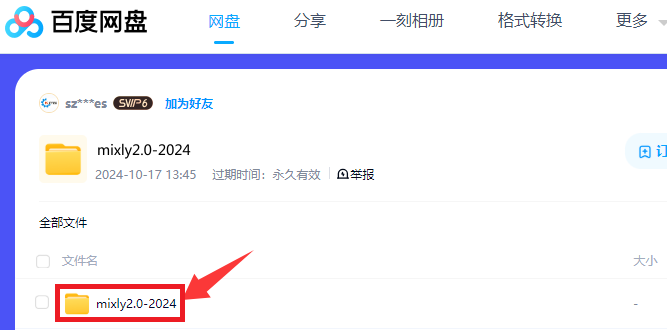

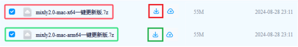

.. |image4| image:: ./media/img-20250618100926.png

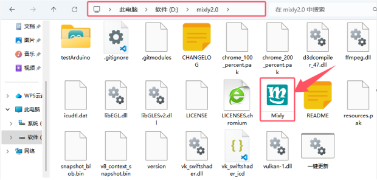
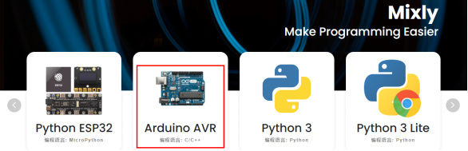
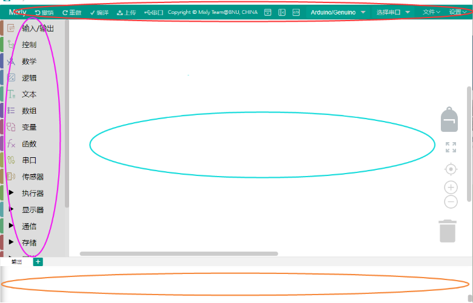
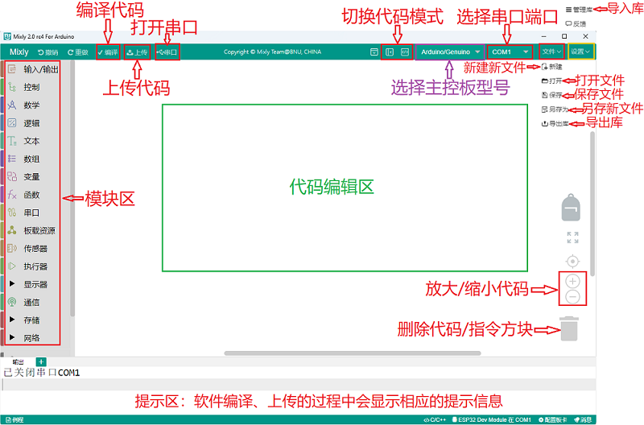
.. |image11| image:: ./media/img-20250618102450.png
.. |image12| image:: ./media/img-20250618102424.png
.. |image13| image:: ./media/img-20250618102434.png

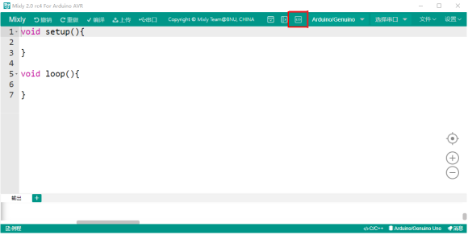

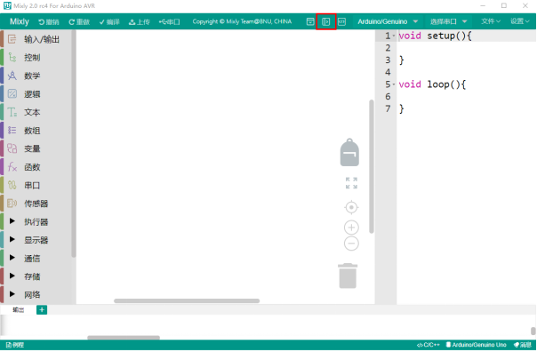
.. |image18| image:: media/8592daf26b7bac846eefb23f46986300.png
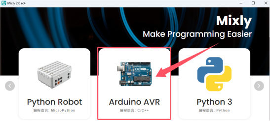
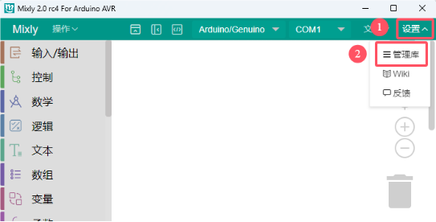
.. |image21| image:: ./media/img-20250618103354.png
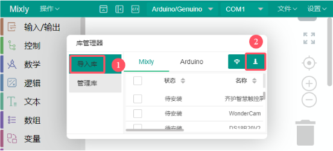
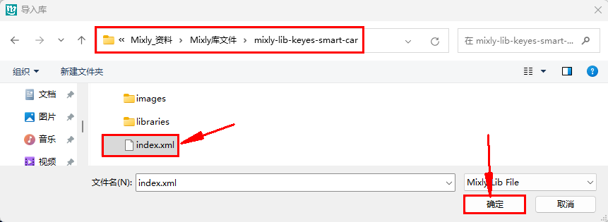
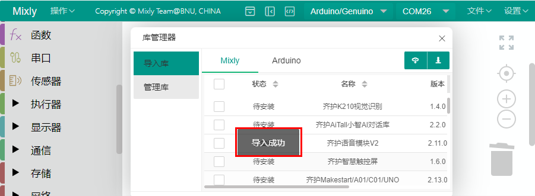
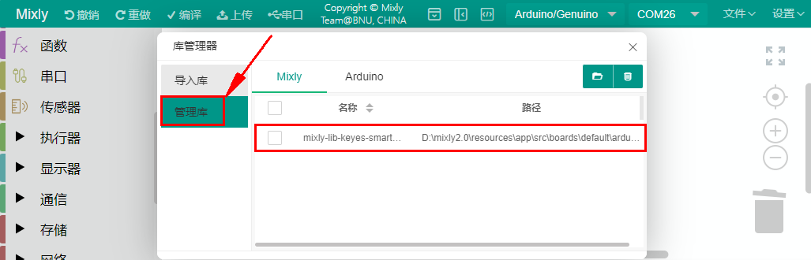
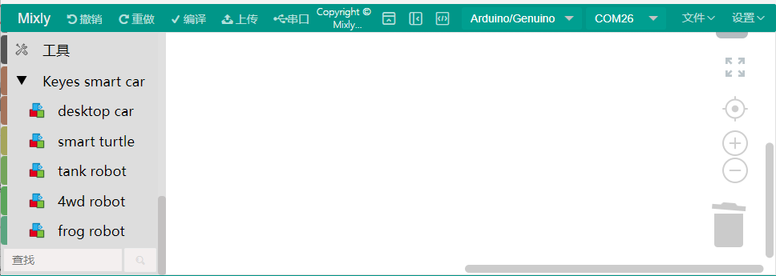
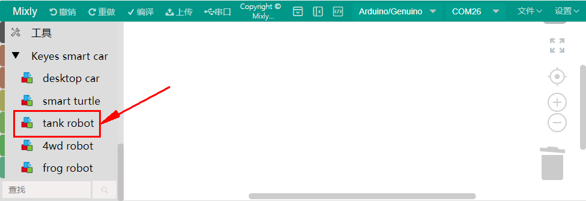
.. |image28| image:: media/eb4e6d393edafbda78ae4cb3b58a961e.png
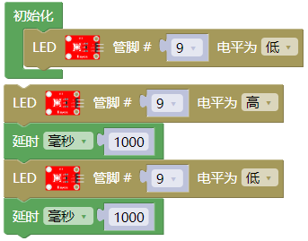
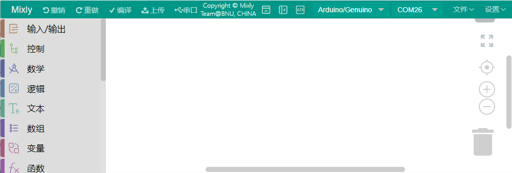
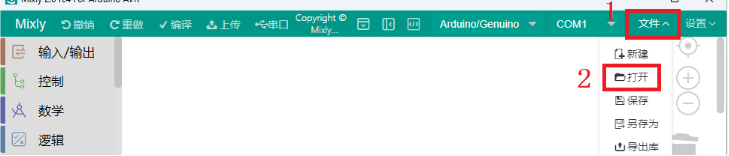
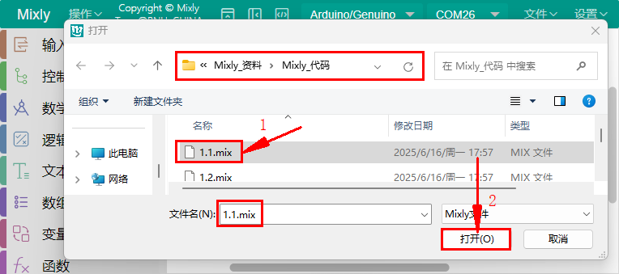
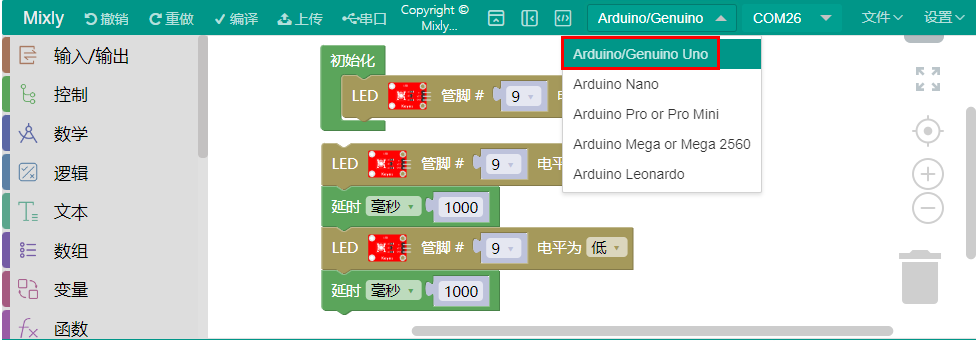
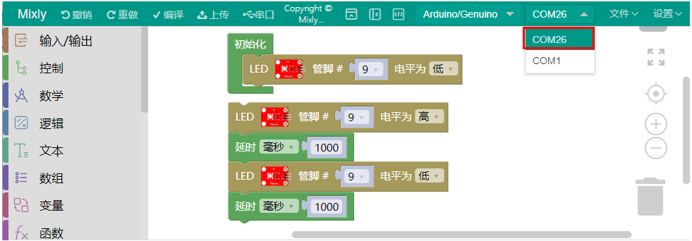
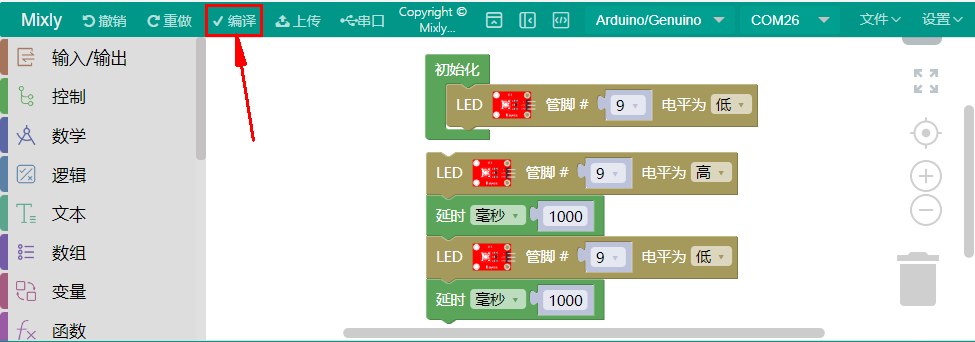

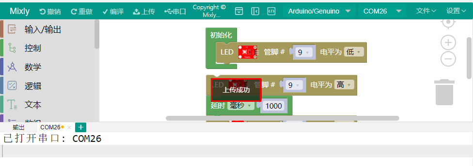
.. |image39| image:: media/ae80c4ac2d601bf0e96ccb25ed872dcb.jpg
.. |image40| image:: media/85b2076096371fd9ca03671602b1e5ce.png
.. |image41| image:: media/31734302247e9a18efc688056a9c1019.png
.. |image42| image:: media/67417bd98f12bffd0352f76063e5abbd.png
.. |image43| image:: media/3dca1bdd1d1420c1d12b16cbf52fee00.png
.. |image44| image:: media/31fb938502d3d519813c391569d6a3f3.png
.. |image45| image:: media/2adb48888136bedc4d6b37d47a47b292.jpg
.. |image46| image:: media/07752ebfc8e8af62f1b86c4a725ea284.jpg
.. |image47| image:: media/c5bf59a8e5cdded95c02334369ab6fdd.png
.. |image48| image:: media/67417bd98f12bffd0352f76063e5abbd.png
.. |image49| image:: media/3dca1bdd1d1420c1d12b16cbf52fee00.png
.. |image50| image:: media/31fb938502d3d519813c391569d6a3f3.png
.. |image51| image:: media/2adb48888136bedc4d6b37d47a47b292.jpg
.. |image52| image:: media/07752ebfc8e8af62f1b86c4a725ea284.jpg
.. |image53| image:: media/c5bf59a8e5cdded95c02334369ab6fdd.png
.. |image54| image:: media/67417bd98f12bffd0352f76063e5abbd.png
.. |image55| image:: media/3dca1bdd1d1420c1d12b16cbf52fee00.png
.. |image56| image:: media/31fb938502d3d519813c391569d6a3f3.png
.. |image57| image:: media/2adb48888136bedc4d6b37d47a47b292.jpg
.. |image58| image:: media/07752ebfc8e8af62f1b86c4a725ea284.jpg
.. |image59| image:: media/c5bf59a8e5cdded95c02334369ab6fdd.png
.. |image60| image:: media/eb4e6d393edafbda78ae4cb3b58a961e.png
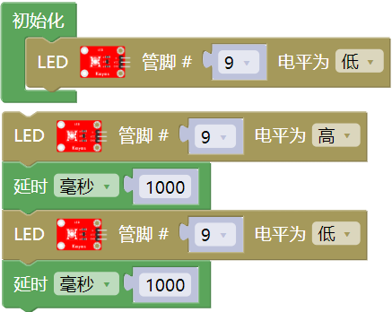
.. |image62| image:: ./media/img-20250618110944.png
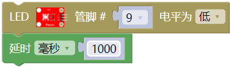
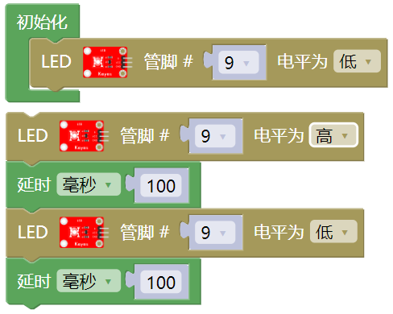
.. |image65| image:: media/a6dbf9a1d18d8849437f013dcaf2d4a6.png
.. |image66| image:: media/67417bd98f12bffd0352f76063e5abbd.png
.. |image67| image:: media/3dca1bdd1d1420c1d12b16cbf52fee00.png
.. |image68| image:: media/31fb938502d3d519813c391569d6a3f3.png
.. |image69| image:: media/2adb48888136bedc4d6b37d47a47b292.jpg
.. |image70| image:: media/07752ebfc8e8af62f1b86c4a725ea284.jpg
.. |image71| image:: media/c5bf59a8e5cdded95c02334369ab6fdd.png
.. |image72| image:: media/67417bd98f12bffd0352f76063e5abbd.png
.. |image73| image:: media/3dca1bdd1d1420c1d12b16cbf52fee00.png
.. |image74| image:: media/31fb938502d3d519813c391569d6a3f3.png
.. |image75| image:: media/2adb48888136bedc4d6b37d47a47b292.jpg
.. |image76| image:: media/07752ebfc8e8af62f1b86c4a725ea284.jpg
.. |image77| image:: media/c5bf59a8e5cdded95c02334369ab6fdd.png
.. |image78| image:: media/67417bd98f12bffd0352f76063e5abbd.png
.. |image79| image:: media/3dca1bdd1d1420c1d12b16cbf52fee00.png
.. |image80| image:: media/31fb938502d3d519813c391569d6a3f3.png
.. |image81| image:: media/2adb48888136bedc4d6b37d47a47b292.jpg
.. |image82| image:: media/07752ebfc8e8af62f1b86c4a725ea284.jpg
.. |image83| image:: media/c5bf59a8e5cdded95c02334369ab6fdd.png
.. |image84| image:: media/eb4e6d393edafbda78ae4cb3b58a961e.png
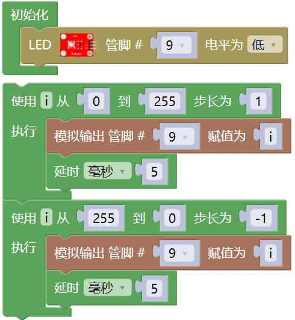
.. |image86| image:: media/553f3d1b6ca04e1aa0479841dd075fa2.png
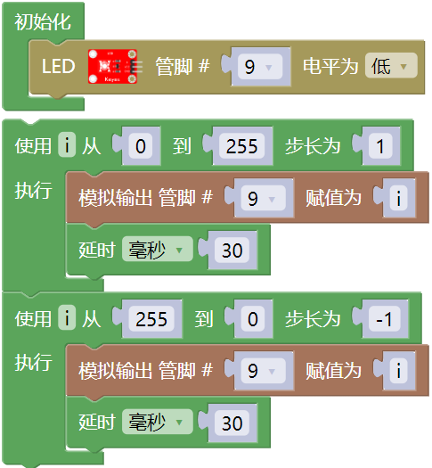
.. |image88| image:: media/f9c66a79affc1091bbcf4bffdc165d45.png
.. |image89| image:: media/67417bd98f12bffd0352f76063e5abbd.png
.. |image90| image:: media/3dca1bdd1d1420c1d12b16cbf52fee00.png
.. |image91| image:: media/31fb938502d3d519813c391569d6a3f3.png

.. |image94| image:: media/07752ebfc8e8af62f1b86c4a725ea284.jpg
.. |image95| image:: media/2adb48888136bedc4d6b37d47a47b292.jpg
.. |image96| image:: media/c5bf59a8e5cdded95c02334369ab6fdd.png
.. |image97| image:: media/67417bd98f12bffd0352f76063e5abbd.png
.. |image98| image:: media/3dca1bdd1d1420c1d12b16cbf52fee00.png
.. |image99| image:: media/31fb938502d3d519813c391569d6a3f3.png

.. |image102| image:: media/07752ebfc8e8af62f1b86c4a725ea284.jpg
.. |image103| image:: media/2adb48888136bedc4d6b37d47a47b292.jpg
.. |image104| image:: media/c5bf59a8e5cdded95c02334369ab6fdd.png
.. |image105| image:: media/67417bd98f12bffd0352f76063e5abbd.png
.. |image106| image:: media/3dca1bdd1d1420c1d12b16cbf52fee00.png
.. |image107| image:: media/31fb938502d3d519813c391569d6a3f3.png

.. |image110| image:: media/07752ebfc8e8af62f1b86c4a725ea284.jpg
.. |image111| image:: media/2adb48888136bedc4d6b37d47a47b292.jpg
.. |image112| image:: media/c5bf59a8e5cdded95c02334369ab6fdd.png
.. |image113| image:: media/699ddc22f84ee584287e5f3d9f35e035.png
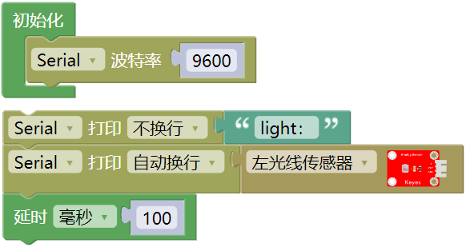

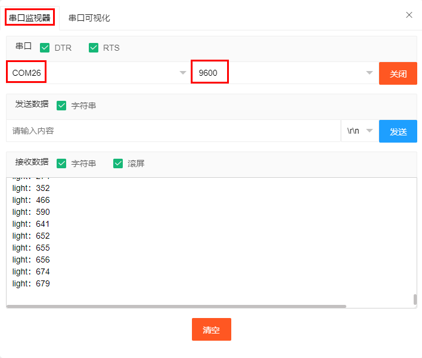
.. |image117| image:: media/9bd3c21cc318d3a8f16febf3c3543c61.png
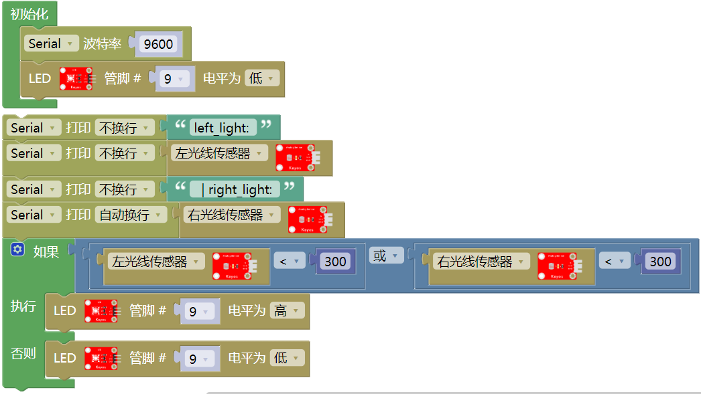
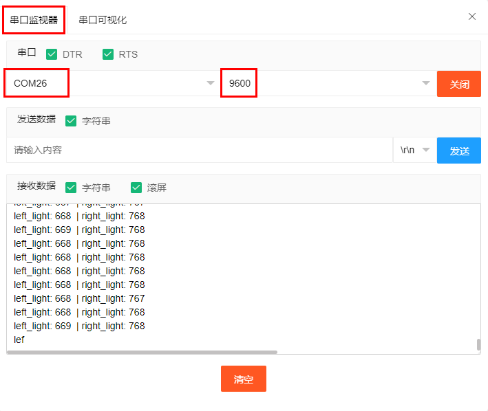

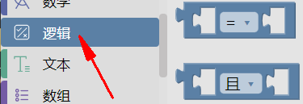
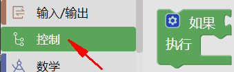

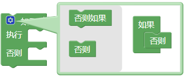

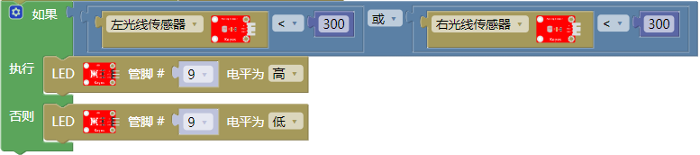
.. |image128| image:: media/ebfc39b179ba70727ddf81ce6817deb5.png
.. |image129| image:: media/69be958142b773acdae33eeef12afed7.png
.. |image130| image:: media/5f3471aed2a4350556b9f7cd0b3284c5.png
.. |image131| image:: media/ebadad234cf7e43ee799e66bb6c67b27.png
.. |image132| image:: media/67417bd98f12bffd0352f76063e5abbd.png
.. |image133| image:: media/3dca1bdd1d1420c1d12b16cbf52fee00.png
.. |image134| image:: media/2afd42eb9da6d4a1efa4755458ab2a42.png
.. |image135| image:: media/2adb48888136bedc4d6b37d47a47b292.jpg
.. |image136| image:: media/c5bf59a8e5cdded95c02334369ab6fdd.png
.. |image137| image:: media/ac4131d8e8f6b1e87d34cce8d3571cb3.png
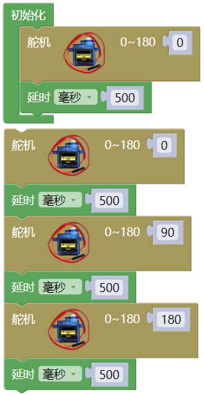
.. |image139| image:: media/2a0b40b983f1aead31d43e1662c4257e.png
.. |image140| image:: media/9e771e017c2d1924a4e9bcf402b652f1.png
.. |image141| image:: media/67417bd98f12bffd0352f76063e5abbd.png
.. |image142| image:: media/3dca1bdd1d1420c1d12b16cbf52fee00.png
.. |image143| image:: media/31fb938502d3d519813c391569d6a3f3.png
.. |image144| image:: media/393e74e8219e2ae066a43f5f19835ea0.png
.. |image145| image:: media/146f0fc8a39a7d767675ff130236d967.png
.. |image146| image:: media/07752ebfc8e8af62f1b86c4a725ea284.jpg
.. |image147| image:: media/2adb48888136bedc4d6b37d47a47b292.jpg
.. |image148| image:: media/c5bf59a8e5cdded95c02334369ab6fdd.png
.. |image149| image:: media/67417bd98f12bffd0352f76063e5abbd.png
.. |image150| image:: media/3dca1bdd1d1420c1d12b16cbf52fee00.png
.. |image151| image:: media/31fb938502d3d519813c391569d6a3f3.png
.. |image152| image:: media/393e74e8219e2ae066a43f5f19835ea0.png
.. |image153| image:: media/146f0fc8a39a7d767675ff130236d967.png
.. |image154| image:: media/07752ebfc8e8af62f1b86c4a725ea284.jpg
.. |image155| image:: media/2adb48888136bedc4d6b37d47a47b292.jpg
.. |image156| image:: media/c5bf59a8e5cdded95c02334369ab6fdd.png
.. |image157| image:: media/67417bd98f12bffd0352f76063e5abbd.png
.. |image158| image:: media/3dca1bdd1d1420c1d12b16cbf52fee00.png
.. |image159| image:: media/31fb938502d3d519813c391569d6a3f3.png
.. |image160| image:: media/393e74e8219e2ae066a43f5f19835ea0.png
.. |image161| image:: media/146f0fc8a39a7d767675ff130236d967.png
.. |image162| image:: media/07752ebfc8e8af62f1b86c4a725ea284.jpg
.. |image163| image:: media/2adb48888136bedc4d6b37d47a47b292.jpg
.. |image164| image:: media/c5bf59a8e5cdded95c02334369ab6fdd.png
.. |image165| image:: media/7d2dccb20acaf9b17c53063421a5faa0.png
.. |image166| image:: media/6637578e3d2c6f902ee32931532a83ca.png
.. |image167| image:: media/82e3d601ebcc5903b9bca322f5e5a4f4.png
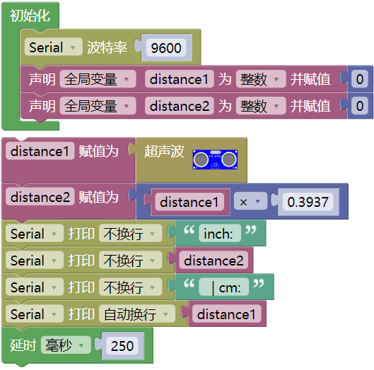

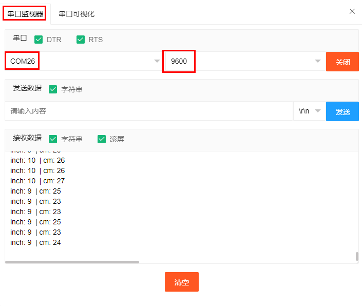
.. |image171| image:: media/d7cdc56d4c509c7f81bdc47d3ec6f4b5.png
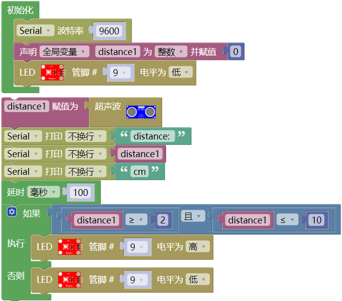

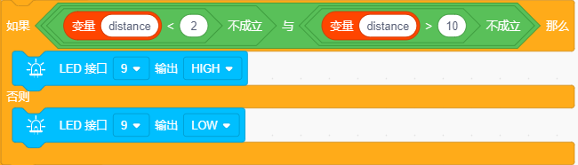
.. |image175| image:: media/425d132d1cefa3c9f575214f83668a8b.jpeg
.. |image176| image:: media/7091d9c01d85306fc81b6324fa7b68f4.png
.. |image177| image:: media/9dcb924eb37101aa05b6f21d317fbc3b.png
.. |image178| image:: media/17b787d350e8882a03f0c31eeee3c9f2.png
.. |image179| image:: media/67417bd98f12bffd0352f76063e5abbd.png
.. |image180| image:: media/3dca1bdd1d1420c1d12b16cbf52fee00.png
.. |image181| image:: media/31fb938502d3d519813c391569d6a3f3.png
.. |image182| image:: media/66d07761485afcf3205a64d86b17f082.png
.. |image183| image:: media/d60ce0046d88f529b628e85d1210778d.png
.. |image184| image:: media/2adb48888136bedc4d6b37d47a47b292.jpg
.. |image185| image:: media/07752ebfc8e8af62f1b86c4a725ea284.jpg
.. |image186| image:: media/61437329d2cd93dc1815e829f639cca6.png
.. |image187| image:: media/c5bf59a8e5cdded95c02334369ab6fdd.png
.. |image188| image:: media/67417bd98f12bffd0352f76063e5abbd.png
.. |image189| image:: media/3dca1bdd1d1420c1d12b16cbf52fee00.png
.. |image190| image:: media/31fb938502d3d519813c391569d6a3f3.png
.. |image191| image:: media/66d07761485afcf3205a64d86b17f082.png
.. |image192| image:: media/d60ce0046d88f529b628e85d1210778d.png
.. |image193| image:: media/2adb48888136bedc4d6b37d47a47b292.jpg
.. |image194| image:: media/07752ebfc8e8af62f1b86c4a725ea284.jpg
.. |image195| image:: media/61437329d2cd93dc1815e829f639cca6.png
.. |image196| image:: media/c5bf59a8e5cdded95c02334369ab6fdd.png
.. |image197| image:: media/67417bd98f12bffd0352f76063e5abbd.png
.. |image198| image:: media/3dca1bdd1d1420c1d12b16cbf52fee00.png
.. |image199| image:: media/31fb938502d3d519813c391569d6a3f3.png
.. |image200| image:: media/66d07761485afcf3205a64d86b17f082.png
.. |image201| image:: media/d60ce0046d88f529b628e85d1210778d.png
.. |image202| image:: media/2adb48888136bedc4d6b37d47a47b292.jpg
.. |image203| image:: media/07752ebfc8e8af62f1b86c4a725ea284.jpg
.. |image204| image:: media/61437329d2cd93dc1815e829f639cca6.png
.. |image205| image:: media/c5bf59a8e5cdded95c02334369ab6fdd.png
.. |image206| image:: media/04d50472225547d18c96649f981eb2e1.png
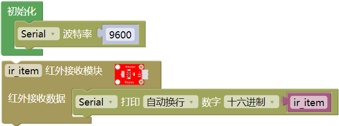

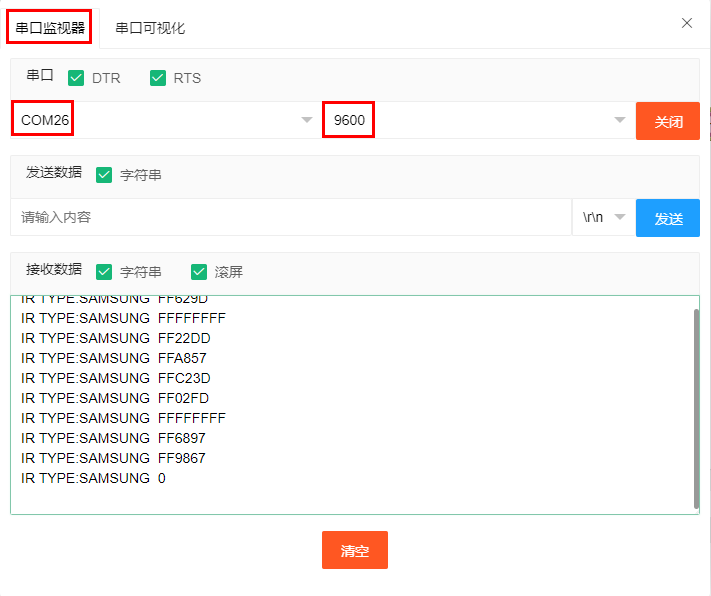
.. |image210| image:: media/e7946515345fdf65e1b3d58893f9a207.png
.. |image211| image:: media/3e1b8f89ced30ab39050a9693b615f8f.png
.. |image212| image:: ./media/img-20250619133106.png
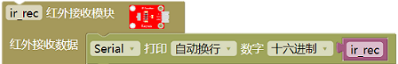
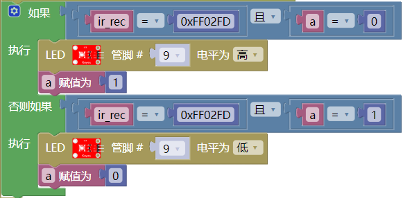
.. |image215| image:: media/3920253c86188ac64cf9b82c0df6c941.png
.. |image216| image:: media/27e47e630140eb72f69dad02549438b4.png
.. |image217| image:: media/67417bd98f12bffd0352f76063e5abbd.png
.. |image218| image:: media/3dca1bdd1d1420c1d12b16cbf52fee00.png
.. |image219| image:: media/31fb938502d3d519813c391569d6a3f3.png
.. |image220| image:: media/27e47e630140eb72f69dad02549438b4.png
.. |image221| image:: media/07752ebfc8e8af62f1b86c4a725ea284.jpg
.. |image222| image:: media/2adb48888136bedc4d6b37d47a47b292.jpg
.. |image223| image:: media/c5bf59a8e5cdded95c02334369ab6fdd.png
.. |image224| image:: media/67417bd98f12bffd0352f76063e5abbd.png
.. |image225| image:: media/3dca1bdd1d1420c1d12b16cbf52fee00.png
.. |image226| image:: media/31fb938502d3d519813c391569d6a3f3.png
.. |image227| image:: media/27e47e630140eb72f69dad02549438b4.png
.. |image228| image:: media/07752ebfc8e8af62f1b86c4a725ea284.jpg
.. |image229| image:: media/2adb48888136bedc4d6b37d47a47b292.jpg
.. |image230| image:: media/c5bf59a8e5cdded95c02334369ab6fdd.png
.. |image231| image:: media/67417bd98f12bffd0352f76063e5abbd.png
.. |image232| image:: media/3dca1bdd1d1420c1d12b16cbf52fee00.png
.. |image233| image:: media/31fb938502d3d519813c391569d6a3f3.png
.. |image234| image:: media/27e47e630140eb72f69dad02549438b4.png
.. |image235| image:: media/07752ebfc8e8af62f1b86c4a725ea284.jpg
.. |image236| image:: media/2adb48888136bedc4d6b37d47a47b292.jpg
.. |image237| image:: media/c5bf59a8e5cdded95c02334369ab6fdd.png
.. |image238| image:: media/ecc2c737f353cf9d7c69f391c6e1d452.png
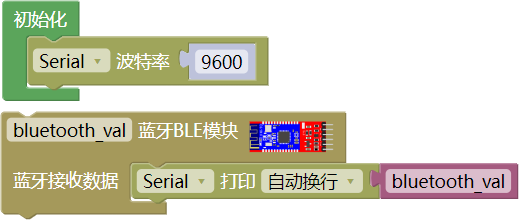
.. |image240| image:: media/e920dec9583352e3505ef6662868ec1a.png
.. |image241| image:: media/9df8897348d5a2fbd8f03ac59bb6dbfc.png
.. |image242| image:: media/ed8437dc27ef31eda631a1c3e479d9c4.jpg
.. |image243| image:: media/36b1f3e7cfca7e69178124d46abfa609.png
.. |image244| image:: media/bb404d78305d03db3a7f177559be1054.jpg
.. |image245| image:: media/ae8341f73f85054eaf73eca78172af0a.jpg
.. |image246| image:: media/af6836387c7ddd16faa20396439cf0dd.png
.. |image247| image:: media/6ca6b22d85030f744a22a61abb70c261.png
.. |image248| image:: media/3c0249b480b0453172eb46c29d44078a.png
.. |image249| image:: media/5e92657dcaeaebeccbe0ef212daf04ec.png
.. |image250| image:: media/94f5d814eb43dc21ebb341134e4e3ef4.png
.. |image251| image:: media/53cf64282791382b0dbdd7d9059bf99d.jpg

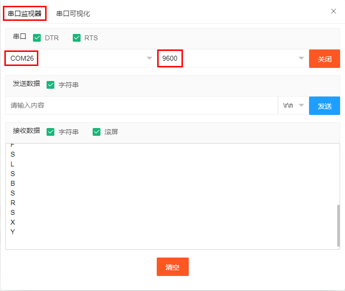
.. |image254| image:: media/2ea70aea70f675bf3683c6b8d849f2c7.png
.. |image255| image:: media/a7e7871c480130fd7b3bfa7c27046993.png
.. |image256| image:: ./media/img-20250618134635.png

.. |image258| image:: media/2ea70aea70f675bf3683c6b8d849f2c7.png
.. |image259| image:: ./media/img-20250618134559.png
.. |image260| image:: media/991bfe4ef7264a6b83455ac668ecc10b.png
.. |image261| image:: media/7fc06405e02b8a7a50bce7750e12f55e.png
.. |image262| image:: media/3672f4baeb83269d24bbcf1786336a04.jpg
.. |image263| image:: media/67417bd98f12bffd0352f76063e5abbd.png
.. |image264| image:: media/3dca1bdd1d1420c1d12b16cbf52fee00.png
.. |image265| image:: media/95fc0e331a378087a353e364535c5cc4.png
.. |image266| image:: media/2adb48888136bedc4d6b37d47a47b292.jpg
.. |image267| image:: media/c5bf59a8e5cdded95c02334369ab6fdd.png
.. |image268| image:: media/67417bd98f12bffd0352f76063e5abbd.png
.. |image269| image:: media/3dca1bdd1d1420c1d12b16cbf52fee00.png
.. |image270| image:: media/95fc0e331a378087a353e364535c5cc4.png
.. |image271| image:: media/2adb48888136bedc4d6b37d47a47b292.jpg
.. |image272| image:: media/c5bf59a8e5cdded95c02334369ab6fdd.png
.. |image273| image:: media/67417bd98f12bffd0352f76063e5abbd.png
.. |image274| image:: media/3dca1bdd1d1420c1d12b16cbf52fee00.png
.. |image275| image:: media/95fc0e331a378087a353e364535c5cc4.png
.. |image276| image:: media/2adb48888136bedc4d6b37d47a47b292.jpg
.. |image277| image:: media/c5bf59a8e5cdded95c02334369ab6fdd.png
.. |image278| image:: media/12c2057590087cd5c8bb7a46bc1369bb.png

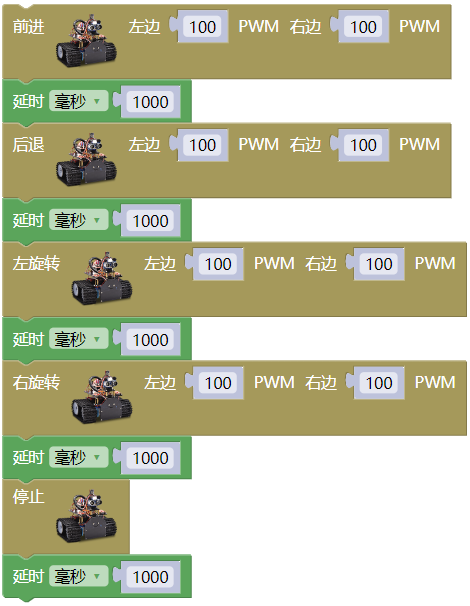
.. |image281| image:: media/97ff08495c4301a9ff3e7a7714bf7b00.jpg
.. |image282| image:: media/67417bd98f12bffd0352f76063e5abbd.png
.. |image283| image:: media/3dca1bdd1d1420c1d12b16cbf52fee00.png
.. |image284| image:: media/fb15bec6d599561591f38dad7124fef1.png
.. |image285| image:: media/2adb48888136bedc4d6b37d47a47b292.jpg
.. |image286| image:: media/c5bf59a8e5cdded95c02334369ab6fdd.png
.. |image287| image:: media/97ff08495c4301a9ff3e7a7714bf7b001.jpg
.. |image288| image:: media/67417bd98f12bffd0352f76063e5abbd.png
.. |image289| image:: media/3dca1bdd1d1420c1d12b16cbf52fee00.png
.. |image290| image:: media/fb15bec6d599561591f38dad7124fef1.png
.. |image291| image:: media/2adb48888136bedc4d6b37d47a47b292.jpg
.. |image292| image:: media/c5bf59a8e5cdded95c02334369ab6fdd.png
.. |image293| image:: media/97ff08495c4301a9ff3e7a7714bf7b001.jpg
.. |image294| image:: media/67417bd98f12bffd0352f76063e5abbd.png
.. |image295| image:: media/3dca1bdd1d1420c1d12b16cbf52fee00.png
.. |image296| image:: media/fb15bec6d599561591f38dad7124fef1.png
.. |image297| image:: media/2adb48888136bedc4d6b37d47a47b292.jpg
.. |image298| image:: media/c5bf59a8e5cdded95c02334369ab6fdd.png
.. |image299| image:: media/97ff08495c4301a9ff3e7a7714bf7b001.jpg
.. |image300| image:: media/8acfd52a64b8ebce33fad4fe207d5ea2.png
.. |image301| image:: media/2f63c317b84c809c96550cc1e204664e.png
.. |image302| image:: media/94c238ce64374fdababbfd3dc1738eec.png
.. |image303| image:: media/9acaaab02c25385cf3dda86947424f15.png
.. |image304| image:: media/dcd8dbbdfbb5ce9c25e3269a7eb89364.png
.. |image305| image:: ./media/img-20250606190937.png
.. |image306| image:: media/c7e1f4b0440706c0cdb7e745ac29844a.png
.. |image307| image:: media/c8281eddce26ce57970d5f152aabe2a4.png
.. |image308| image:: media/692d9479a8801057b02c0b3f26861a15.png
.. |image309| image:: media/a1c97576e9772caf16f3947709a62a37.png
.. |image310| image:: media/655611122bc3f5fd2ee8e5176c3847ca.png
.. |image311| image:: media/87dbff178a12ce43c6c6f40877483de5.png
.. |image312| image:: media/07834404e360fb5a561cab18d039e04d.png
.. |image313| image:: media/fa3de1661e05dccdbbd105a9a183b85d.png
.. |image314| image:: media/b8373eb149df42e9b559824a8f1ccb82.png
.. |image315| image:: media/d24b1b5674a1ac003349621db4224f81.png
.. |image316| image:: media/05779d4455696252a12c0df7e184465b.png
.. |image317| image:: media/a18329dc5ddfc4d9099b80f62f59d2ae.png
.. |image318| image:: media/d3aa71456797375083d34feeffe11d66.png
.. |image319| image:: media/823d583aa49c16cd33939ba207e6b460.png
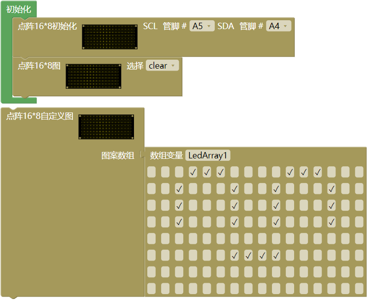
.. |image321| image:: media/301446808bab83e2ff62ecc31e607b29.png
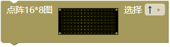
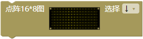
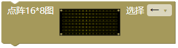
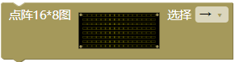

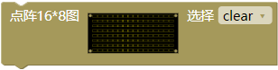
.. |image328| image:: media/7ee39310d35f29fad61e3a211e55e98d.png
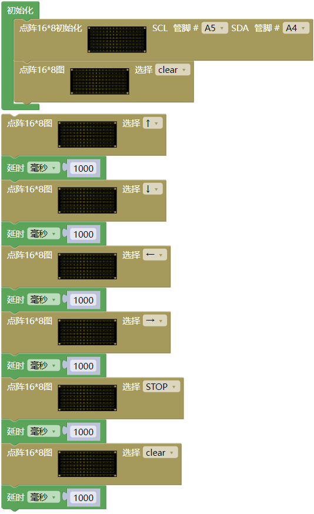
.. |image330| image:: media/8873cdc42e08e892ec3f9f10196e3912.png
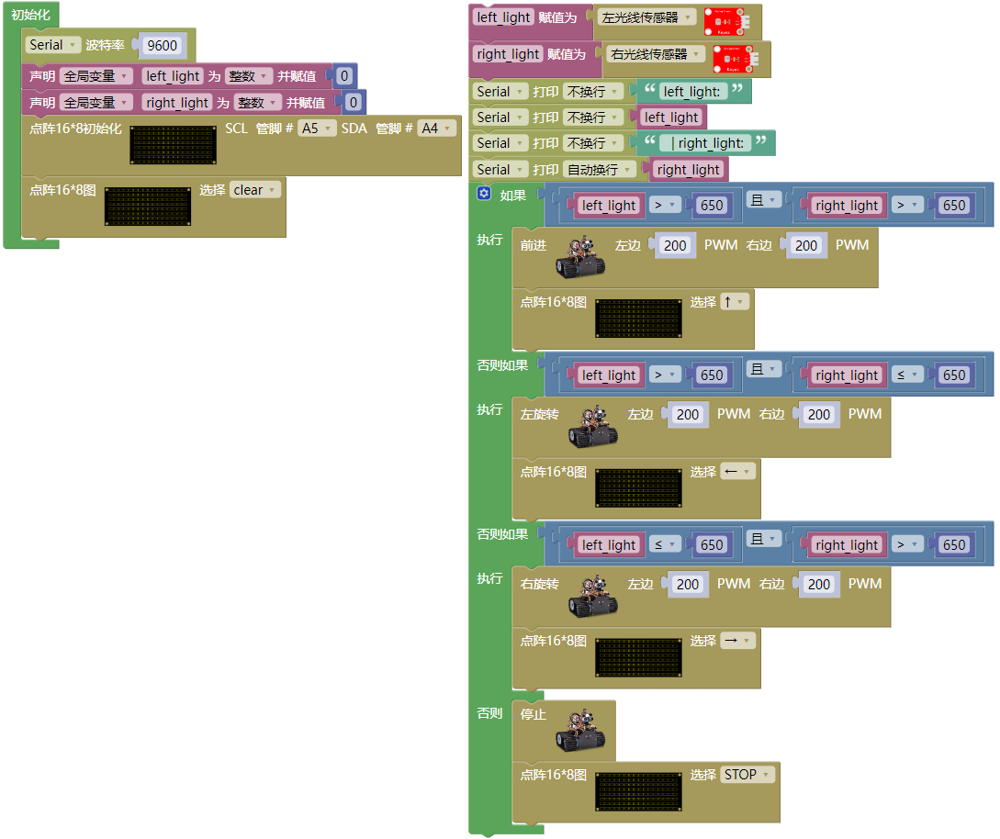
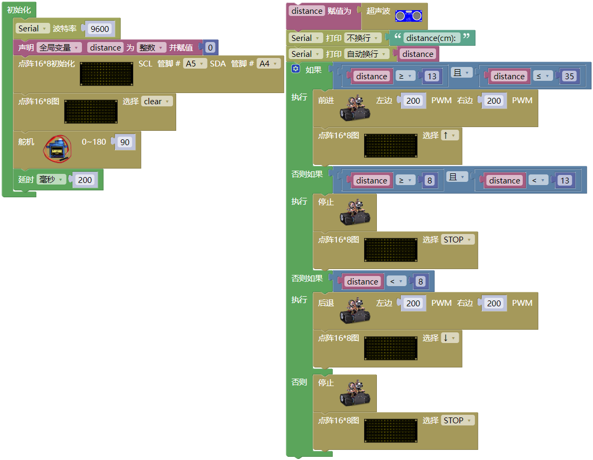
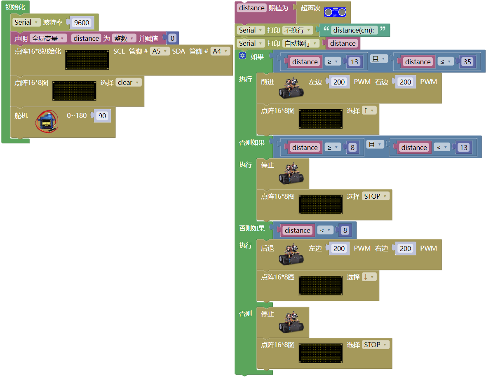
.. |image334| image:: media/868c19b84dc030077e9a0b1e98e68c47.png
.. |image335| image:: media/b11dc5ffa6cccebc6088e5d557d76daf.png
.. |image336| image:: media/ae8110034aacb083151cfd882ee599ba.png
.. |image337| image:: media/bce9cba2c6d2465fbcce570ad4210eba.png
.. |image338| image:: media/ad907a618af86f30d52986bbbd57ba76.png
.. |image339| image:: media/9716a4ed61a4064d2f47a7b73eccaf87.png
.. |image340| image:: media/40626a911cd980880f4c472ad10ab467.png
.. |image341| image:: ./media/img-20250618150311.png

.. |image343| image:: media/1233714e0234b6245cedbc3eff07864d.png
.. |image344| image:: media/35b811ab85a240ba2eabeffd8379b337.png
.. |image345| image:: media/38f4b9a388eb3633c4b0f5c04545c130.png
.. |image346| image:: media/720164d43dbe50d388f5887eafec078b.png
.. |image347| image:: media/dd17f04276c6ec578ce69bdd6b709ab0.png
.. |image348| image:: media/5f178f0b7c951228333fdc5ed4917ed2.png
.. |image349| image:: media/e311a61ee103c36b8c79121db9de6fb2.png
.. |image350| image:: media/cd86ca672f19353b4ce9a1720895c2c2.png
.. |image351| image:: media/1cde47833aec02a65075b02c136d3d4a.png
.. |image352| image:: media/aabdabfe88c7ab40944f1b59f2b902c6.png
.. |image353| image:: media/cd86ca672f19353b4ce9a1720895c2c2.png
.. |image354| image:: media/23183b80cb7a19fa78cc085299430ff7.png
.. |image355| image:: media/cd86ca672f19353b4ce9a1720895c2c2.png
.. |image356| image:: media/418535b9bdcc25b1fb706b90205869b2.png
.. |image357| image:: media/cd86ca672f19353b4ce9a1720895c2c2.png
.. |image358| image:: media/1233714e0234b6245cedbc3eff07864d.png
.. |image359| image:: media/35b811ab85a240ba2eabeffd8379b337.png
.. |image360| image:: media/38f4b9a388eb3633c4b0f5c04545c130.png
.. |image361| image:: media/720164d43dbe50d388f5887eafec078b.png
.. |image362| image:: media/dd17f04276c6ec578ce69bdd6b709ab0.png
.. |image363| image:: media/5f178f0b7c951228333fdc5ed4917ed2.png
.. |image364| image:: media/e311a61ee103c36b8c79121db9de6fb2.png
.. |image365| image:: media/cd86ca672f19353b4ce9a1720895c2c2.png
.. |image366| image:: media/1cde47833aec02a65075b02c136d3d4a.png
.. |image367| image:: media/aabdabfe88c7ab40944f1b59f2b902c6.png
.. |image368| image:: media/cd86ca672f19353b4ce9a1720895c2c2.png
.. |image369| image:: media/23183b80cb7a19fa78cc085299430ff7.png
.. |image370| image:: media/cd86ca672f19353b4ce9a1720895c2c2.png
.. |image371| image:: media/418535b9bdcc25b1fb706b90205869b2.png
.. |image372| image:: media/cd86ca672f19353b4ce9a1720895c2c2.png
.. |image373| image:: media/1233714e0234b6245cedbc3eff07864d.png
.. |image374| image:: media/35b811ab85a240ba2eabeffd8379b337.png
.. |image375| image:: media/38f4b9a388eb3633c4b0f5c04545c130.png
.. |image376| image:: media/720164d43dbe50d388f5887eafec078b.png
.. |image377| image:: media/dd17f04276c6ec578ce69bdd6b709ab0.png
.. |image378| image:: media/5f178f0b7c951228333fdc5ed4917ed2.png
.. |image379| image:: media/e311a61ee103c36b8c79121db9de6fb2.png
.. |image380| image:: media/cd86ca672f19353b4ce9a1720895c2c2.png
.. |image381| image:: media/1cde47833aec02a65075b02c136d3d4a.png
.. |image382| image:: media/aabdabfe88c7ab40944f1b59f2b902c6.png
.. |image383| image:: media/cd86ca672f19353b4ce9a1720895c2c2.png
.. |image384| image:: media/23183b80cb7a19fa78cc085299430ff7.png
.. |image385| image:: media/cd86ca672f19353b4ce9a1720895c2c2.png
.. |image386| image:: media/418535b9bdcc25b1fb706b90205869b2.png
.. |image387| image:: media/cd86ca672f19353b4ce9a1720895c2c2.png
.. |image388| image:: media/c717a7c82b6884f3c6d35cc091bb030d.png
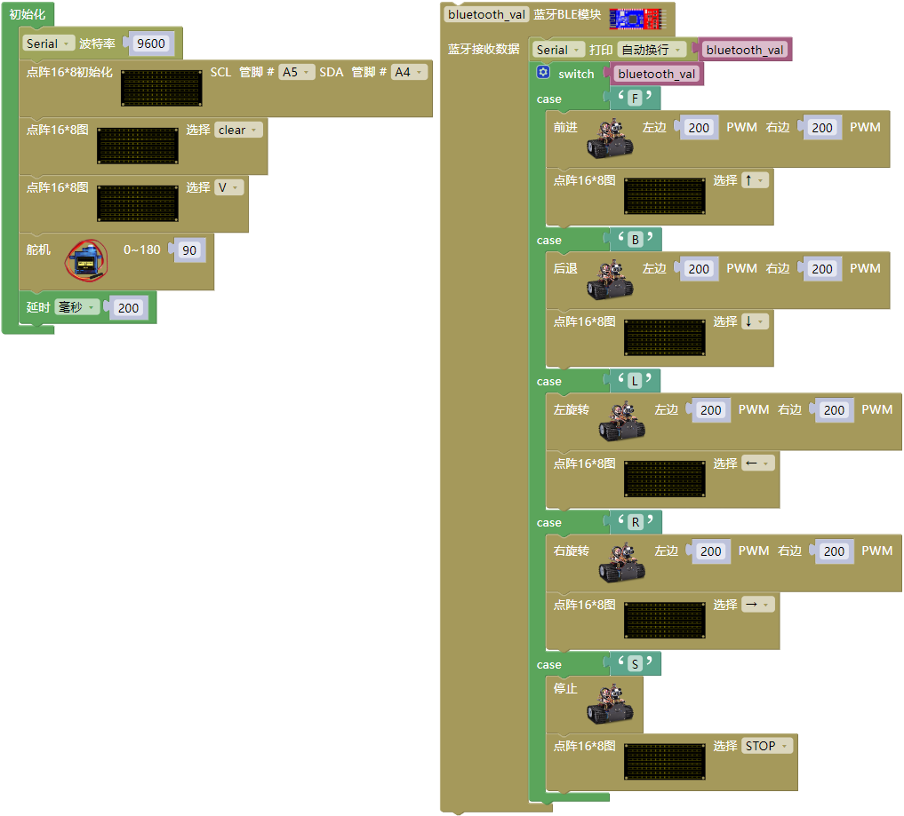
.. |image390| image:: media/76e49e539eb5f8fbf1aea54ba03e0e79.png
.. |image391| image:: media/713609178c543c637958d2fcf8e3afc0.png
.. |image392| image:: media/13af598674f07ebcf419f7dd4597ebee.png
.. |image393| image:: media/293d79f4dd2c50afe64cd16e4ba92415.png
.. |image394| image:: media/deb9a8536638584ad0b012ac485039a0.png
.. |image395| image:: media/caaaee6feda51e5575ba655f324d40c4.png
.. |image396| image:: media/caaaee6feda51e5575ba655f324d40c4.png
.. |image397| image:: media/5db7458e37c2b2966f8a70dc8f6cf658.png
.. |image398| image:: ./media/img-20250619135540.png
.. |image399| image:: media/caaaee6feda51e5575ba655f324d40c4.png
.. |image400| image:: media/caaaee6feda51e5575ba655f324d40c4.png
