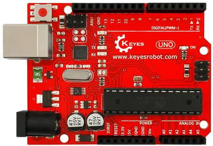
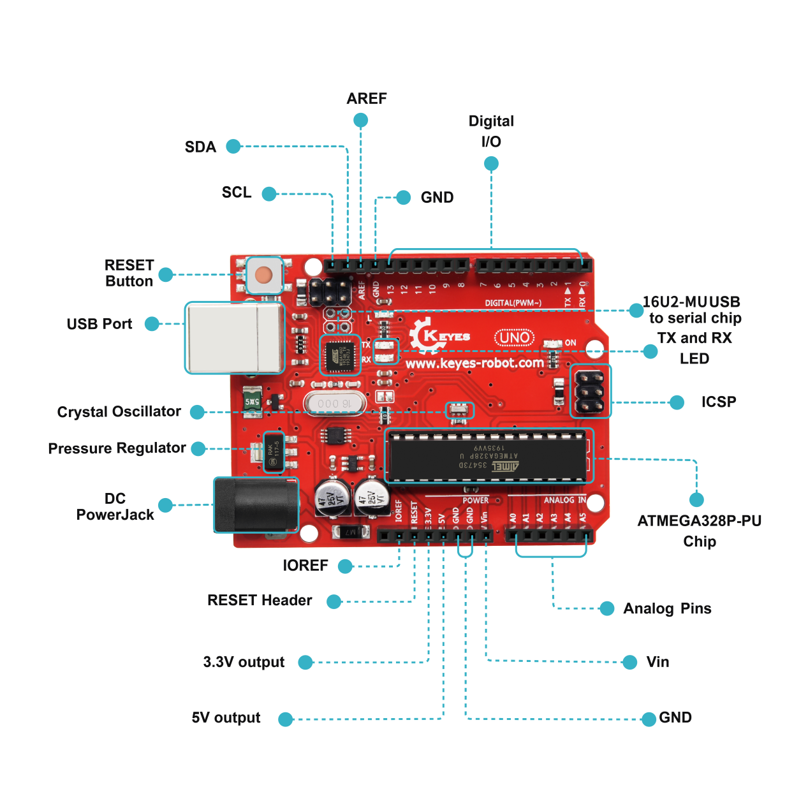
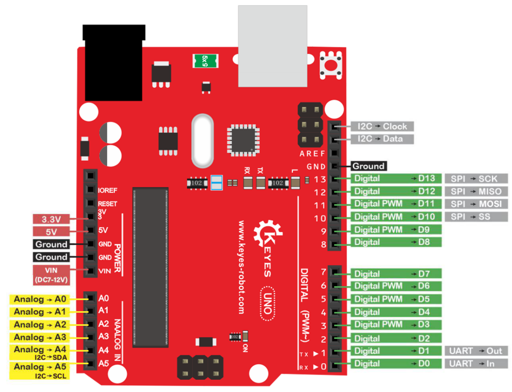
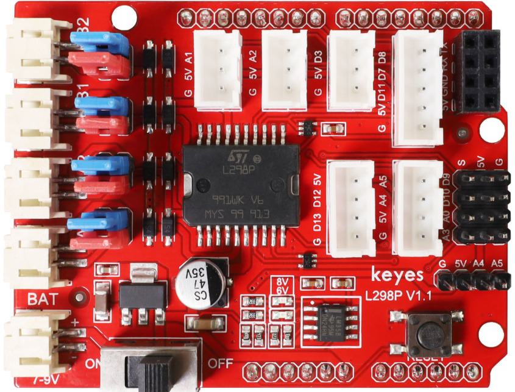
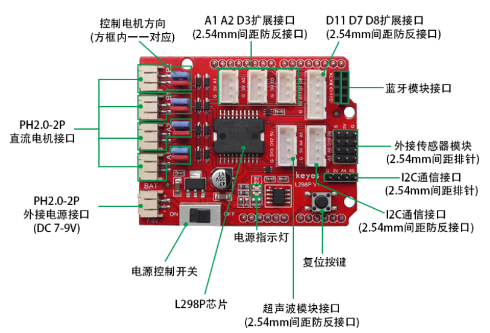

UNO R3开发板与L298P电机驱动扩展板
=================================

UNO R3开发板
------------

在开始所有的项目之前，我们首先要了解下面这片arduino uno
R3开发板，因为这个智能车的核心就是这个开发板。

|image1|

ARDUINO UNO R3
开发板是我们最新推出的一款易用型开源控制器，硬件上与Arduino
UNO相比并没有大的变动。外观上我们将蓝色换成了红色，给你们一种新的体验。硬件上，我们用ATmega16U2代替了8U2，这个更新为是USB接口芯片服务的，理论上它让UNO能模拟USB
HID，比如 MIDI/Joystick/Keyboard。

|image2|

它具有14个数字输入/输出引脚（其中6个可用作PWM输出），6个模拟输入，一个16
MHz石英晶体，一个USB连接，一个电源插孔，2个ICSP接头和一个复位按钮。

|image3|

它包含支持微控制器所需的一切；只需使用USB电缆将其连接到计算机，或使用AC-DC适配器或电池为其供电即可开始使用。

+-----------------------------+---------------------------------------+
| Microcontroller             | ATmega328P-PU                         |
+=============================+=======================================+
| Operating Voltage           | 5V                                    |
+-----------------------------+---------------------------------------+
| Input Voltage (recommended) | DC7-12V                               |
+-----------------------------+---------------------------------------+
| 数字引脚                    | 14 (D0-D13) (其中包含6个PWM输出口)    |
+-----------------------------+---------------------------------------+
| PWM引脚                     | 6 个(D3, D5, D6, D9, D10, D11)        |
+-----------------------------+---------------------------------------+
| 模拟输入引脚                | 6 个(A0-A5)                           |
+-----------------------------+---------------------------------------+
| 每个I / O引脚的直流电流     | 20 mA                                 |
+-----------------------------+---------------------------------------+
| 3.3V引脚的直流电流          | 50 mA                                 |
+-----------------------------+---------------------------------------+
| Flash Memory                | 32 KB (ATmega328P-PU) of which 0.5 KB |
|                             | used by bootloader                    |
+-----------------------------+---------------------------------------+
| SRAM                        | 2 KB (ATmega328P-PU)                  |
+-----------------------------+---------------------------------------+
| EEPROM                      | 1 KB (ATmega328P-PU)                  |
+-----------------------------+---------------------------------------+
| 时钟频率                    | 16 MHz                                |
+-----------------------------+---------------------------------------+
| LED按键                     | D13                                   |
+-----------------------------+---------------------------------------+

L298P 电机驱动扩展板
--------------------

|Img|

1、概述

驱动电机的方法有很多，利用的L29P芯片驱动电机是非常常用的一种方案。
L298P是ST意法半导体公司出品的优秀大功率电机专用驱动芯片，可直接驱动直流电机、二相、四相步进电机，驱动电流达2A，电机输出端采用8只高速肖特基二极管作为保护。我们根据L298P的电路设计了一款扩展板，叠层的设计可直接插接到UNO
R3板上使用，降低了用户使用和驱动电机的技术难度。

当我们将驱动扩展板堆叠在UNO
R3板后，BAT上电后，将拨码开关拨至ON端，外接电源同时给驱动扩展板和UNO
R3板供电。驱动扩展板上电机和电源接口为PH2.0-2P防反接口，防止你电源接反导致电路损坏和电机方向乱接，增加测试难度。

同时，驱动扩展板上自带一个间距为2.54mm的排母接口，也是串口通讯接口，兼容市面上常用的蓝牙模块线序，如HC-06模块、HM-10模块。为方便外接其他传感器/模块，驱动板上还自带3个XH-2.54mm
3P防反接口，2个XH-2.54mm 4P防反接口,1个XH-2.54mm
5P防反接口。扩展板还利用间距为2.54mm的排针扩展了2个数字口接口，2个模拟口接口和1个I2C通讯接口。扩展板上还自带一个复位按键，方便你随时进行复位处理。

扩展板可以连接4个直流电机，默认跳线帽连接方式时，A1和A2，B1和B2接口电机并联，运动规律相同。8个跳线帽可用于控制4个电机接口的转动方向，例如当A1电机接口前方2个跳线帽由横向连接改为纵向连接时，A1电机的转动方向就和原来的转动方向相反。

2、规格参数

DC输入电压：DC7V~9V

逻辑工作电流：最大36mA

电机驱动电流：最大2A

最大功耗：25W(温度＝75℃)

工作温度：0 ~ 50℃

尺寸大小：69x53x26mm

重量：25.5克

3、GPIO示意图

|image4|

6V LED指示灯：当外接电源电压低于6.2V时，LED熄灭；高于6.2V时，LED亮起。

8V LED指示灯：当外接电源低于8V时，LED熄灭；高于8V时，LED亮起。

