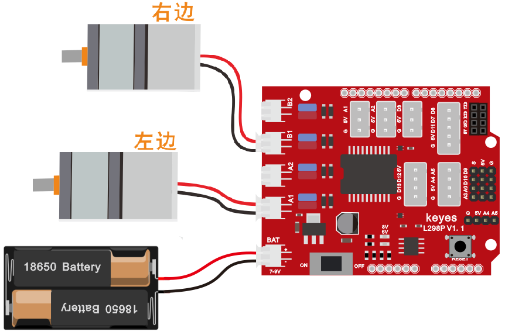

# 1. 迷你坦克机器人介绍

## 1.1 简介

在我们经常可以在网上看到别人利用一些控制板和一些电子元件，自己搭配结构，做出各种外观各种功能的小车。下面我们也要做一款迷你坦克机器人。这款坦克机器人本质上就是一个两驱动的履带车，它的安装有些复杂，我们提供详细的安装文件。这款小车接线非常简单，即使刚接触电子的人都可以搞定。

我们要让机器人听我们的话，就得给机器人下达指令，下指令时说人类的语言没有用，只能编写机器人能听懂的程序语言。

编程不仅对那些未来要当程序员的孩子有用，而且对其他孩子也有很大的作用。编程就是把大问题分割成小问题，然后解决问题的过程，对孩子的逻辑分析能力，创造能力，动手能力，解决问题的能力有极大的提升。

今天给大家推荐一款迷你坦克机器人，这款智能车可以让孩子们轻松学习编程，并且获得有关电子，机械，控制逻辑和计算机科学的实践知识。

他是基于ARDUINO的开源机器人，他的安装和接线十分简单，组件都通过螺钉和铜柱连接，只需要几个简单的步骤就可以组装完成。他提供了十多个编程的课程项目，由简单到复杂，一步一步，学习怎么去编写机器人能”听”懂的语言。

## 1.2 清单

当收到这个机器人套件的时候，首先看到是一个包装精美的外盒，每个配件被安全且有序的装在外盒里面的小盒子里，先来清点一下：

| No  | Product Name                                                            | Quantity | Picture                                                |
|-----|-------------------------------------------------------------------------|----------|--------------------------------------------------------|
| 1   | keyes UNO R3 for arduino 开发板 红色 环保                               | 1        |   |
| 2   | Keyes brick L298P 电机驱动扩展板 V1 红色 环保                           | 1        |   |
| 3   | Keyes Bluetooth-4.0 蓝牙4.0 V2                                          | 1        |   |
| 4   | keyes brick HC-SR04超声波传感器 防反插白色端子                          | 1        |   |
| 5   | keyes brick 红外接收传感器(焊盘孔) 防反插白色端子                       | 1        |   |
| 6   | keyes 8x16 LED灯板 黑色 环保（更新后的资料，KS0357老版本出完后共用）    | 1        |   |
| 7   | keyes brick 光敏电阻传感器(焊盘孔) 防反插白色端子                       | 2        |   |
| 8   | JMP-1 17键86*40*6.5MM黑色 环保                                          | 1        |   |
| 9   | 铝合金拼接板L*W*H=99*27*4MM 阳极氧化 蓝色                               | 4        |  |
| 10  | keyes 草帽LED白发红模块(焊盘孔) 红色 环保                               | 1        |  |
| 11  | 2.54三连pin 母对母 长20cm 环保                                          | 1        |  |
| 12  | 云台支架（黑色）配套 固定孔3MM                                          | 1        |  |
| 13  | 27*27*16MM 圆孔孔径M4 ABS材质 蓝色                                      | 2        |  |
| 14  | L型支架 3*25*31\*33MM 氧化喷砂 黑色 铝                                  | 1        |  |
| 15  | SG90 9G 23*12.2*29mm 蓝色 辉盛 180度 环保                               | 1        |  |
| 16  | KS0428 keyes 迷你履带坦克机器人套件 V2.0 亚克力 T=4mm 黑色透明环保      | 1        |  |
| 17  | 履带式坦克底盘驱动轮 塑料 深灰色 50\*33mm 孔径M4                        | 2        |  |
| 18  | 履带式坦克底盘承重轮 塑料 黑色 50\*35mm 孔径M4                          | 2        |  |
| 19  | 4.5cm\*78cm 100节 黑色 塑料                                             | 0.78     |  |
| 20  | GA25Y310 6V 145 DC6V 150rpm 大钮距金属直流电机+250MM PH2.0mm-2P线材环保 | 2        |  |
| 21  | 铜件 半角 外径10MM 内径5MM L16.7MM                                      | 2        |  |
| 22  | 18650双节15CM露线适用DIY小车+双头PH2.0MM-2P 红黑线(总线长115MM)         | 1        |  |
| 23  | AM/BM 透明蓝 OD:5.0 L=50cm 环保                                         | 1        |  |
| 24  | 内径4mm外径8mm长6mm 铜基合金材质                                        | 2        |  |
| 25  | 法兰轴承F694ZZ4*11*4MM原装电机级                                        | 4        |  |
| 26  | 双通M3\*10MM                                                            | 4        |  |
| 27  | 双通M3\*15MM 镀镍 环保                                                  | 4        |  |
| 28  | 双通M3\*45MM                                                            | 4        |  |
| 29  | M3\*10MM 平头                                                           | 3        |  |
| 30  | M3\*6 内六角 杯头 不锈钢                                                | 22       |  |
| 31  | M3\*8 不锈钢                                                            | 6        |  |
| 32  | M3\*25MM 不锈钢                                                         | 4        |  |
| 33  | M4\*40 内六角 杯头 不锈钢                                               | 4        |  |
| 34  | M4\*50MM 不锈钢                                                         | 2        |  |
| 35  | M4\*12MM 内六角 杯头 不锈钢                                             | 6        |  |
| 36  | M3 镀镍                                                                 | 24       |  |
| 37  | M4 镀镍 自锁                                                            | 2        |  |
| 38  | M2\*10MM 圆头                                                           | 6        |  |
| 39  | M3\*12MM 圆头 螺钉                                                      | 12       |  |
| 40  | M4 镀镍                                                                 | 12       |  |
| 41  | M2 镀镍                                                                 | 10       |  |
| 42  | HX-2.54 3P 双头 26AWG 黑红白 100mm 同向                                 | 3        |  |
| 43  | HX-2.54 4P 双头 26AWG 黑棕白红 200mm 反向                               | 1        |  |
| 44  | HX-2.54 4P 转杜邦线母单 26AWG 黑红白棕 200mm                            | 1        |  |
| 45  | 直径8MM 黑色                                                            | 0.12     |  |
| 46  | 2.0\*40MM 紫黑色 十字螺丝刀                                             | 1        |  |
| 47  | 黑色 3\*100MM                                                           | 6        |  |
| 48  | 3.0\*40MM 红黑色 十字螺丝刀 刀头加粗                                    | 1        |  |
| 49  | L型 M2.5 镀镍                                                           | 1        |  |
| 50  | L型 M3 镀镍                                                             | 1        |  |
| 51  | L型 M1.5 镀镍                                                           | 1        |  |
| 52  | M3\*4MM 合金钢材质/黑色                                                 | 2        |  |
| 53  | M3+M4 小扳手                                                            | 1        |  |

## 1.3 特点

1.功能多多：避障功能，跟随功能，红外遥控，蓝牙控制，追光功能，显示图案等。

2.组装简单：无需焊接电路，只需几个简单的步骤即可组装该机器人。

3.结构坚固：构成车体的部分是PCB材质，电机用是优质的金属电机。

4.扩展性强：配置了电机驱动扩展板，可以扩展其他的传感器和模块。

5.多种控制：红外遥控器控制，手机遥控控制（苹果和安卓手机都可）。

6.学习基础编程：使用Arduino IDE的C语言编程，可以接触底层代码。

## 1.4 参数

电机转速：6v 转速150转/分。 

控制电机选用L298P驱动扩展板，自带电源控制开关。

超声波感应角度：\<15度

超声波探测距离：2cm-400cm

红外遥控距离：10米（实测）

蓝牙遥控距离：50米（实测）

光敏电阻模块，检测坦克机器人两边光照强度，控制坦克机器人。

蓝牙APP控制：支持Android和IOS系统

可接入外部7~12V的电压。并能搭载多款传感器模块，根据您的想象力实现各种功能.

## 1.5 UNO R3开发板

在开始所有的项目之前，我们首先要了解下面这片arduino uno
R3开发板，因为这个智能车的核心就是这个开发板。

ARDUINO UNO R3
开发板是我们最新推出的一款易用型开源控制器，硬件上与Arduino
UNO相比并没有大的变动。外观上我们将蓝色换成了红色，给你们一种新的体验。硬件上，我们用ATmega16U2代替了8U2，这个更新为是USB接口芯片服务的，理论上它让UNO能模拟USB
HID，比如 MIDI/Joystick/Keyboard。

它具有14个数字输入/输出引脚（其中6个可用作PWM输出），6个模拟输入，一个16
MHz石英晶体，一个USB连接，一个电源插孔，2个ICSP接头和一个复位按钮。

它包含支持微控制器所需的一切；只需使用USB电缆将其连接到计算机，或使用AC-DC适配器或电池为其供电即可开始使用。

| Microcontroller             | ATmega328P-PU                                            |
|-----------------------------|----------------------------------------------------------|
| Operating Voltage           | 5V                                                       |
| Input Voltage (recommended) | DC7-12V                                                  |
| 数字引脚                    | 14 (D0-D13) (其中包含6个PWM输出口)                       |
| PWM引脚                     | 6 个(D3, D5, D6, D9, D10, D11)                           |
| 模拟输入引脚                | 6 个(A0-A5)                                              |
| 每个I / O引脚的直流电流     | 20 mA                                                    |
| 3.3V引脚的直流电流          | 50 mA                                                    |
| Flash Memory                | 32 KB (ATmega328P-PU) of which 0.5 KB used by bootloader |
| SRAM                        | 2 KB (ATmega328P-PU)                                     |
| EEPROM                      | 1 KB (ATmega328P-PU)                                     |
| 时钟频率                    | 16 MHz                                                   |
| LED按键                     | D13                                                      |

## 1.6 L298P电机驱动扩展板

1、概述

驱动电机的方法有很多，利用的L29P芯片驱动电机是非常常用的一种方案。
L298P是ST意法半导体公司出品的优秀大功率电机专用驱动芯片，可直接驱动直流电机、二相、四相步进电机，驱动电流达2A，电机输出端采用8只高速肖特基二极管作为保护。我们根据L298P的电路设计了一款扩展板，叠层的设计可直接插接到UNO
R3板上使用，降低了用户使用和驱动电机的技术难度。

当我们将驱动扩展板堆叠在UNO
R3板后，BAT上电后，将拨码开关拨至ON端，外接电源同时给驱动扩展板和UNO
R3板供电。驱动扩展板上电机和电源接口为PH2.0-2P防反接口，防止你电源接反导致电路损坏和电机方向乱接，增加测试难度。

同时，驱动扩展板上自带一个间距为2.54mm的排母接口，也是串口通讯接口，兼容市面上常用的蓝牙模块线序，如HC-06模块、HM-10模块。为方便外接其他传感器/模块，驱动板上还自带3个XH-2.54mm
3P防反接口，2个XH-2.54mm 4P防反接口,1个XH-2.54mm
5P防反接口。扩展板还利用间距为2.54mm的排针扩展了2个数字口接口，2个模拟口接口和1个I2C通讯接口。扩展板上还自带一个复位按键，方便你随时进行复位处理。

扩展板可以连接4个直流电机，默认跳线帽连接方式时，A1和A2，B1和B2接口电机并联，运动规律相同。8个跳线帽可用于控制4个电机接口的转动方向，例如当A1电机接口前方2个跳线帽由横向连接改为纵向连接时，A1电机的转动方向就和原来的转动方向相反。

2、规格参数

DC输入电压：DC7V~9V

逻辑工作电流：最大36mA

电机驱动电流：最大2A

最大功耗：25W(温度＝75℃)

工作温度：0 ~ 50℃

尺寸大小：69x53x26mm

重量：25.5克

3、L298P电机驱动扩展板示意图

<figure>

<figcaption>Img</figcaption>
</figure>

6V LED指示灯：当外接电源电压低于6.2V时，LED熄灭；高于6.2V时，LED亮起。

8V LED指示灯：当外接电源低于8V时，LED熄灭；高于8V时，LED亮起。

4、L298P电机驱动扩展板连接电机图

