迷你坦克机器人介绍
==================

|image1|

简介
----

在我们经常可以在网上看到别人利用一些控制板和一些电子元件，自己搭配结构，做出各种外观各种功能的小车。下面我们也要做一款迷你坦克机器人。这款坦克机器人本质上就是一个两驱动的履带车，它的安装有些复杂，我们提供详细的安装文件。这款小车接线非常简单，即使刚接触电子的人都可以搞定。

我们要让机器人听我们的话，就得给机器人下达指令，下指令时说人类的语言没有用，只能编写机器人能听懂的程序语言。

编程不仅对那些未来要当程序员的孩子有用，而且对其他孩子也有很大的作用。编程就是把大问题分割成小问题，然后解决问题的过程，对孩子的逻辑分析能力，创造能力，动手能力，解决问题的能力有极大的提升。

今天给大家推荐一款迷你坦克机器人，这款智能车可以让孩子们轻松学习编程，并且获得有关电子，机械，控制逻辑和计算机科学的实践知识。

他是基于ARDUINO的开源机器人，他的安装和接线十分简单，组件都通过螺钉和铜柱连接，只需要几个简单的步骤就可以组装完成。他提供了十多个编程的课程项目，由简单到复杂，一步一步，学习怎么去编写机器人能”听”懂的语言。

清单
----

当收到这个机器人套件的时候，首先看到是一个包装精美的外盒，每个配件被安全且有序的装在外盒里面的小盒子里，先来清点一下：

+----+--------------------------------------+----------+------------+
| No | Product Name                         | Quantity | Picture    |
+====+======================================+==========+============+
| 1  | keyes UNO R3 for arduino 开发板 红色 | 1        | |image108| |
|    | 环保                                 |          |            |
+----+--------------------------------------+----------+------------+
| 2  | Keyes brick L298P 电机驱动扩展板 V1  | 1        | |image109| |
|    | 红色 环保                            |          |            |
+----+--------------------------------------+----------+------------+
| 3  | Keyes Bluetooth-4.0 蓝牙4.0 V2       | 1        | |image110| |
+----+--------------------------------------+----------+------------+
| 4  | keyes brick HC-SR04超声波传感器      | 1        | |image111| |
|    | 防反插白色端子                       |          |            |
+----+--------------------------------------+----------+------------+
| 5  | keyes brick 红外接收传感器(焊盘孔)   | 1        | |image112| |
|    | 防反插白色端子                       |          |            |
+----+--------------------------------------+----------+------------+
| 6  | keyes 8x16 LED灯板 黑色              | 1        | |image113| |
|    | 环保（更                             |          |            |
|    | 新后的资料，KS0357老版本出完后共用） |          |            |
+----+--------------------------------------+----------+------------+
| 7  | keyes brick 光敏电阻传感器(焊盘孔)   | 2        | |image114| |
|    | 防反插白色端子                       |          |            |
+----+--------------------------------------+----------+------------+
| 8  | JMP-1 17键86\ *40*\ 6.5MM黑色 环保   | 1        | |image115| |
+----+--------------------------------------+----------+------------+
| 9  | 铝合金拼接板L\ *W*\ H=99\ *27*\ 4MM  | 4        | |image116| |
|    | 阳极氧化 蓝色                        |          |            |
+----+--------------------------------------+----------+------------+
| 10 | keyes 草帽LED白发红模块(焊盘孔) 红色 | 1        | |image117| |
|    | 环保                                 |          |            |
+----+--------------------------------------+----------+------------+
| 11 | 2.54三连pin 母对母 长20cm 环保       | 1        | |image118| |
+----+--------------------------------------+----------+------------+
| 12 | 云台支架（黑色）配套 固定孔3MM       | 1        | |image119| |
+----+--------------------------------------+----------+------------+
| 13 | 27\ *27*\ 16MM 圆孔孔径M4 ABS材质    | 2        | |image120| |
|    | 蓝色                                 |          |            |
+----+--------------------------------------+----------+------------+
| 14 | L型支架 3\ *25*\ 31*33MM 氧化喷砂    | 1        | |image121| |
|    | 黑色 铝                              |          |            |
+----+--------------------------------------+----------+------------+
| 15 | SG90 9G 23\ *12.2*\ 29mm 蓝色 辉盛   | 1        | |image122| |
|    | 180度 环保                           |          |            |
+----+--------------------------------------+----------+------------+
| 16 | KS0428 keyes 迷你履带坦克机器人套件  | 1        | |image123| |
|    | V2.0 亚克力 T=4mm 黑色透明环保       |          |            |
+----+--------------------------------------+----------+------------+
| 17 | 履带式坦克底盘驱动轮 塑料 深灰色     | 2        | |image124| |
|    | 50*33mm 孔径M4                       |          |            |
+----+--------------------------------------+----------+------------+
| 18 | 履带式坦克底盘承重轮 塑料 黑色       | 2        | |image125| |
|    | 50*35mm 孔径M4                       |          |            |
+----+--------------------------------------+----------+------------+
| 19 | 4.5cm*78cm 100节 黑色 塑料           | 0.78     | |image126| |
+----+--------------------------------------+----------+------------+
| 20 | GA25Y310 6V 145 DC6V 150rpm          | 2        | |image127| |
|    | 大钮距金属直流电机+250MM             |          |            |
|    | PH2.0mm-2P线材环保                   |          |            |
+----+--------------------------------------+----------+------------+
| 21 | 铜件 半角 外径10MM 内径5MM L16.7MM   | 2        | |image128| |
+----+--------------------------------------+----------+------------+
| 22 | 18650双                              | 1        | |image129| |
|    | 节15CM露线适用DIY小车+双头PH2.0MM-2P |          |            |
|    | 红黑线(总线长115MM)                  |          |            |
+----+--------------------------------------+----------+------------+
| 23 | AM/BM 透明蓝 OD:5.0 L=50cm 环保      | 1        | |image130| |
+----+--------------------------------------+----------+------------+
| 24 | 内径4mm外径8mm长6mm 铜基合金材质     | 2        | |image131| |
+----+--------------------------------------+----------+------------+
| 25 | 法兰轴承F694ZZ4\ *11*\ 4MM原装电机级 | 4        | |image132| |
+----+--------------------------------------+----------+------------+
| 26 | 双通M3*10MM                          | 4        | |image133| |
+----+--------------------------------------+----------+------------+
| 27 | 双通M3*15MM 镀镍 环保                | 4        | |image134| |
+----+--------------------------------------+----------+------------+
| 28 | 双通M3*45MM                          | 4        | |image135| |
+----+--------------------------------------+----------+------------+
| 29 | M3*10MM 平头                         | 3        | |image136| |
+----+--------------------------------------+----------+------------+
| 30 | M3*6 内六角 杯头 不锈钢              | 22       | |image137| |
+----+--------------------------------------+----------+------------+
| 31 | M3*8 不锈钢                          | 6        | |image138| |
+----+--------------------------------------+----------+------------+
| 32 | M3*25MM 不锈钢                       | 4        | |image139| |
+----+--------------------------------------+----------+------------+
| 33 | M4*40 内六角 杯头 不锈钢             | 4        | |image140| |
+----+--------------------------------------+----------+------------+
| 34 | M4*50MM 不锈钢                       | 2        | |image141| |
+----+--------------------------------------+----------+------------+
| 35 | M4*12MM 内六角 杯头 不锈钢           | 6        | |image142| |
+----+--------------------------------------+----------+------------+
| 36 | M3 镀镍                              | 24       | |image143| |
+----+--------------------------------------+----------+------------+
| 37 | M4 镀镍 自锁                         | 2        | |image144| |
+----+--------------------------------------+----------+------------+
| 38 | M2*10MM 圆头                         | 6        | |image145| |
+----+--------------------------------------+----------+------------+
| 39 | M3*12MM 圆头 螺钉                    | 12       | |image146| |
+----+--------------------------------------+----------+------------+
| 40 | M4 镀镍                              | 12       | |image147| |
+----+--------------------------------------+----------+------------+
| 41 | M2 镀镍                              | 10       | |image148| |
+----+--------------------------------------+----------+------------+
| 42 | HX-2.54 3P 双头 26AWG 黑红白 100mm   | 3        | |image149| |
|    | 同向                                 |          |            |
+----+--------------------------------------+----------+------------+
| 43 | HX-2.54 4P 双头 26AWG 黑棕白红 200mm | 1        | |image150| |
|    | 反向                                 |          |            |
+----+--------------------------------------+----------+------------+
| 44 | HX-2.54 4P 转杜邦线母单 26AWG        | 1        | |image151| |
|    | 黑红白棕 200mm                       |          |            |
+----+--------------------------------------+----------+------------+
| 45 | 直径8MM 黑色                         | 0.12     | |image152| |
+----+--------------------------------------+----------+------------+
| 46 | 2.0*40MM 紫黑色 十字螺丝刀           | 1        | |image153| |
+----+--------------------------------------+----------+------------+
| 47 | 黑色 3*100MM                         | 6        | |image154| |
+----+--------------------------------------+----------+------------+
| 48 | 3.0*40MM 红黑色 十字螺丝刀 刀头加粗  | 1        | |image155| |
+----+--------------------------------------+----------+------------+
| 49 | L型 M2.5 镀镍                        | 1        | |image156| |
+----+--------------------------------------+----------+------------+
| 50 | L型 M3 镀镍                          | 1        | |image157| |
+----+--------------------------------------+----------+------------+
| 51 | L型 M1.5 镀镍                        | 1        | |image158| |
+----+--------------------------------------+----------+------------+
| 52 | M3*4MM 合金钢材质/黑色               | 2        | |image159| |
+----+--------------------------------------+----------+------------+
| 53 | M3+M4 小扳手                         | 1        | |image160| |
+----+--------------------------------------+----------+------------+

特点
----

1.功能多多：避障功能，跟随功能，红外遥控，蓝牙控制，追光功能，显示图案等。

2.组装简单：无需焊接电路，只需几个简单的步骤即可组装该机器人。

3.结构坚固：构成车体的部分是PCB材质，电机用是优质的金属电机。

4.扩展性强：配置了电机驱动扩展板，可以扩展其他的传感器和模块。

5.多种控制：红外遥控器控制，手机遥控控制（苹果和安卓手机都可）。

6.学习基础编程：使用Arduino IDE的C语言编程，可以接触底层代码。

参数
----

电机转速：6v 转速150转/分。 

控制电机选用L298P驱动扩展板，自带电源控制开关。

超声波感应角度：<15度

超声波探测距离：2cm-400cm

红外遥控距离：10米（实测）

蓝牙遥控距离：50米（实测）

光敏电阻模块，检测坦克机器人两边光照强度，控制坦克机器人。

蓝牙APP控制：支持Android和IOS系统

可接入外部7~12V的电压。并能搭载多款传感器模块，根据您的想象力实现各种功能.

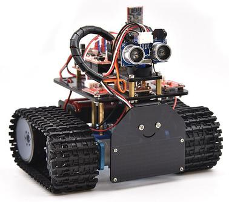
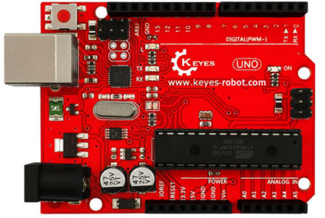
.. |image3| image:: media/21b3c1a5d503d8c6e1369a9e023ea4fc.png
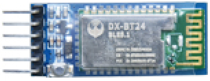
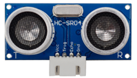
.. |image6| image:: media/cf17457bf97dff9c16d5366f1f81ce66.png
.. |image7| image:: media/af9ff5e890fa3029738f84162cc3f713.png
.. |image8| image:: media/f9c66a79affc1091bbcf4bffdc165d45.png
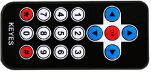

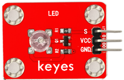
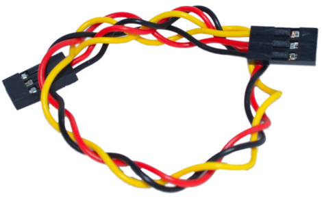
.. |image13| image:: media/4cfdfb2f059177f6b5b391b2fbd2e12e.png
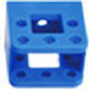
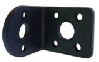
.. |image16| image:: media/ebfc39b179ba70727ddf81ce6817deb5.png
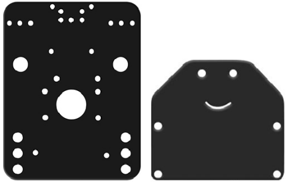
.. |image18| image:: media/bfbcceabd8e665db8da72bb660adac6e.png
.. |image19| image:: media/c4aa629287f5552e6e59c0c0b14ed7d6.png
.. |image20| image:: media/29a7560183332addad2efa32d573126c.png
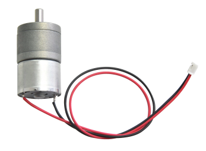
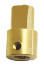
.. |image23| image:: media/6e3811acc998510a026564df63e9e2eb.png
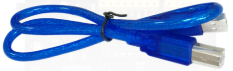
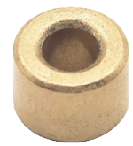
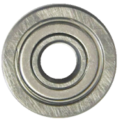
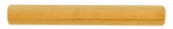

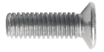
.. |image31| image:: media/b31e43f7d3f5354a1f01a8b80b9bebf4.png
.. |image32| image:: media/0e1d4c8a0bc87729e0294c3fcd1359f5.png
.. |image33| image:: media/dc0265dbe6b292bd64a710c91dee3d16.png
.. |image34| image:: media/a13daacb04050338aa09a4b0c1b0a8f5.png
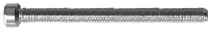
.. |image36| image:: media/f1e721e30334f5ddf87016ad744ec256.png
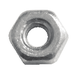
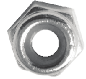
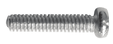
.. |image40| image:: media/7e4e5d1f5a217469fc78b621f1e46cae.png
.. |image41| image:: media/e775cb5b322f268e31c19132a2c64167.png
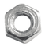
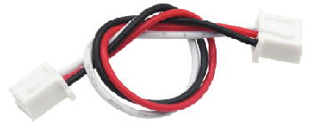
.. |image44| image:: media/23bb9ca98f3fd872f2e03a844e17d5af.png
.. |image45| image:: media/369e33d7386b13a04b4a4d724110fbed.png
.. |image46| image:: media/d0af9726374022a0365f17f712b1773f.png
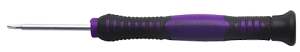
.. |image48| image:: media/03135b4b060fa01991dc322889880157.png
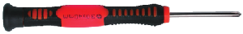

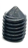

.. |image56| image:: media/21b3c1a5d503d8c6e1369a9e023ea4fc.png

.. |image59| image:: media/cf17457bf97dff9c16d5366f1f81ce66.png
.. |image60| image:: media/af9ff5e890fa3029738f84162cc3f713.png
.. |image61| image:: media/f9c66a79affc1091bbcf4bffdc165d45.png

.. |image66| image:: media/4cfdfb2f059177f6b5b391b2fbd2e12e.png

.. |image69| image:: media/ebfc39b179ba70727ddf81ce6817deb5.png

.. |image71| image:: media/bfbcceabd8e665db8da72bb660adac6e.png
.. |image72| image:: media/c4aa629287f5552e6e59c0c0b14ed7d6.png
.. |image73| image:: media/29a7560183332addad2efa32d573126c.png

.. |image76| image:: media/6e3811acc998510a026564df63e9e2eb.png

.. |image84| image:: media/b31e43f7d3f5354a1f01a8b80b9bebf4.png
.. |image85| image:: media/0e1d4c8a0bc87729e0294c3fcd1359f5.png
.. |image86| image:: media/dc0265dbe6b292bd64a710c91dee3d16.png
.. |image87| image:: media/a13daacb04050338aa09a4b0c1b0a8f5.png

.. |image89| image:: media/f1e721e30334f5ddf87016ad744ec256.png

.. |image93| image:: media/7e4e5d1f5a217469fc78b621f1e46cae.png
.. |image94| image:: media/e775cb5b322f268e31c19132a2c64167.png

.. |image97| image:: media/23bb9ca98f3fd872f2e03a844e17d5af.png
.. |image98| image:: media/369e33d7386b13a04b4a4d724110fbed.png
.. |image99| image:: media/d0af9726374022a0365f17f712b1773f.png

.. |image101| image:: media/03135b4b060fa01991dc322889880157.png

.. |image109| image:: media/21b3c1a5d503d8c6e1369a9e023ea4fc.png

.. |image112| image:: media/cf17457bf97dff9c16d5366f1f81ce66.png
.. |image113| image:: media/af9ff5e890fa3029738f84162cc3f713.png
.. |image114| image:: media/f9c66a79affc1091bbcf4bffdc165d45.png

.. |image119| image:: media/4cfdfb2f059177f6b5b391b2fbd2e12e.png

.. |image122| image:: media/ebfc39b179ba70727ddf81ce6817deb5.png

.. |image124| image:: media/bfbcceabd8e665db8da72bb660adac6e.png
.. |image125| image:: media/c4aa629287f5552e6e59c0c0b14ed7d6.png
.. |image126| image:: media/29a7560183332addad2efa32d573126c.png

.. |image129| image:: media/6e3811acc998510a026564df63e9e2eb.png

.. |image137| image:: media/b31e43f7d3f5354a1f01a8b80b9bebf4.png
.. |image138| image:: media/0e1d4c8a0bc87729e0294c3fcd1359f5.png
.. |image139| image:: media/dc0265dbe6b292bd64a710c91dee3d16.png
.. |image140| image:: media/a13daacb04050338aa09a4b0c1b0a8f5.png

.. |image142| image:: media/f1e721e30334f5ddf87016ad744ec256.png

.. |image146| image:: media/7e4e5d1f5a217469fc78b621f1e46cae.png
.. |image147| image:: media/e775cb5b322f268e31c19132a2c64167.png

.. |image150| image:: media/23bb9ca98f3fd872f2e03a844e17d5af.png
.. |image151| image:: media/369e33d7386b13a04b4a4d724110fbed.png
.. |image152| image:: media/d0af9726374022a0365f17f712b1773f.png

.. |image154| image:: media/03135b4b060fa01991dc322889880157.png

