坦克机器人安装
==============

|Img|

**安装1**

安装所需零件

|image1|

安装

|image2|

完成

|image3|

**安装2**

安装所需零件

|image4|

分步安装1

|image5|

分步安装2

|image6|

分步安装3

|image7|

完成（\ **注意需按以上步骤再做一组**\ ）

|image8|

**安装3**

安装所需零件

|image9|

分步安装1

|image10|

分步安装2

|image11|

分步安装3

|image12|

完成

|image13|

**安装4**

安装所需零件

|image14|

安装

|image15|

完成

|image16|

**安装5**

安装所需零件

|image17|

安装

|image18|

完成

|image19|

**安装6**

安装所需零件

|image20|

安装

|image21|

完成

|image22|

**安装7**

安装所需零件

|image23|

安装

|image24|

完成

|image25|

**安装8**

安装所需零件

|image26|

安装

|image27|

|image28|

|image29|

完成

|image30|

**安装9**

安装所需零件

|image31|

红外接收模块插线

|image32|

安装

|image33|

完成（\ **并且将红外接收模块插线的另一端插入扩展板上G 5V
D3的接线端**\ ）

|image34|

**安装10**

安装所需零件

|image35|

安装

|image36|

完成

|image37|

**安装11**

安装所需零件

|image38|

\ **安装前需要调节舵机角度，我们需要将舵机调整到90度再安装**\ 

====== ====
舵机   主板
====== ====
棕线   G
红线   5V
橙黄线 D10
====== ====

|image39|

|image40|

**方法一：Arduino 代码**

\ **⚠️特别提示:** 在编写代码并上传之前，必须安装Arduino
IDE，请进入链接：\ `Arduino
IDE开发环境设置 <https://www.keyesrobot.cn/projects/KE3050/zh-cn/latest/docs/Arduino%20%E6%95%99%E7%A8%8B/Arduino%20%E6%95%99%E7%A8%8B.html#arduino-ide>`__

.. code:: c

   /*
     舵机初始化角度_代码
     http://www.keyes-robot.com
   */

   #include <Servo.h>
   Servo myservo;  // 创建舵机类实例

   void setup()
   {
     myservo.attach(10);  //舵机接数字口10
     myservo.write(0);  // 转动到0角度
     delay(500); 
     myservo.write(180);  // 转动到180角度
     delay(500); 
     myservo.write(90);  // 转动到90角度
     delay(500); 
   }

   void loop(){

   }

如何得到它？

资料提供了调整窗户舵机的代码，请打开并烧录到主板，如下图所示。在文件夹
**..\\Arduino资料\\窗户上的舵机初始化角度_代码**
，打开文件\ **Servo_Initialization_Angle_Code.ino**\ 。或将上述测试代码复制粘贴到Arduino
IDE中。

|image41|

将上述测试代码上传至主板之后，未发现舵机转动，可以按下主板上的复位键。

**方法二：KidsBlock(Scratch)代码**

\ **⚠️特别提示:** 在编写代码并上传之前，必须安装 KidsBlock
IDE，请进入链接：\ `KidsBlock
IDE开发环境设置 <https://www.keyesrobot.cn/projects/KE3050/zh-cn/latest/docs/Scratch%20%E6%95%99%E7%A8%8B/Scratch%20%E6%95%99%E7%A8%8B.html#kidsblock-ide>`__

|image42|

如何得到它？

资料提供了调整窗户舵机的代码，请打开并烧录到主板，如下图所示。在文件夹
**..\\KidsBlock(Scratch)资料\\舵机初始化角度_代码** ，使用 KidsBlock IDE
打开文件\ **舵机初始化角度_代码.sb3**\ 。或在KidsBlock
IDE中直接拖动代码块编写上述测试代码。

|image43|

上传上述测试代码，未发现舵机转动，可以按下主板上的复位键。

分步安装1

|image44|

分步安装2

|image45|

完成

|image46|

**安装12**

安装所需零件

|image47|

安装

|image48|

完成

|image49|

**插入针盖**

|image50|

|image51|

**接线示意图**

左边光敏接线图

|image52|

右边光敏接线图

|image53|

红外模块接线图

|image54|

超声波模块接线图

|image55|

左侧电机接线图

|image56|

右侧电机接线图

|image57|

舵机接线图

|image58|

LED点阵接线图

|image59|

电源接线图

|image60|

插入蓝牙模块图

|image61|

|image62|

|image63|

完成渲染图

|image64|

电池安装示范

|image65|

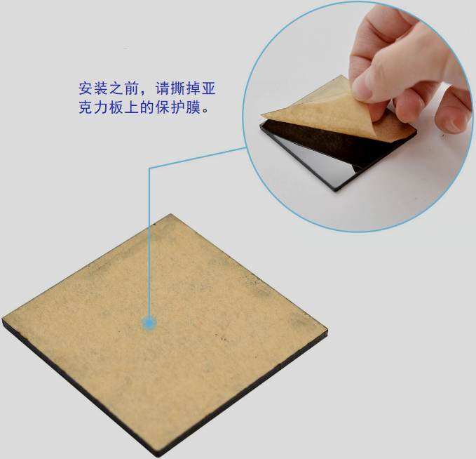
.. |image1| image:: media/cdb679dc45644055a314eba46795bdec.jpg
.. |image2| image:: media/f0e529d6060c5abe2bd847bada85c0d6.jpg
.. |image3| image:: media/624d80600f0f1d349b175d13f9a7e93c.jpg
.. |image4| image:: media/4c8e8f370bce0feb5aee35629a4d8a0c.jpg
.. |image5| image:: media/d5e6109b578022b4db4793f54993a4f0.jpg
.. |image6| image:: media/41ac186094f340e670d5f9d2d8b559f3.jpg
.. |image7| image:: media/a18120307602c4f09ee19d6668f5bf0d.jpg
.. |image8| image:: media/736e455ffde6244f683ec71528aa5552.jpg
.. |image9| image:: media/bcd631b6d5afb56bd1ddd84f250c3e6a.jpg
.. |image10| image:: media/67a037c8bb7e422b7db26477be4d07b1.jpg
.. |image11| image:: media/d6f0bfbe3d74ba1c3a591c3af007f0dd.jpg
.. |image12| image:: media/9913804522c8b518b0f5913f9a86cf96.jpg
.. |image13| image:: media/d6e43e5b922db95ddaa0bf48074aa552.jpg
.. |image14| image:: media/0e27ca1ed17ced54e7d5fe1524738add.jpg
.. |image15| image:: media/a732abf55c78f43aa2952ff808f87686.jpg
.. |image16| image:: media/1324a8e8c8efb1ef36f84b0abe06fed2.jpg
.. |image17| image:: media/79dd782c3e696ac24935c2747fcd8808.jpg
.. |image18| image:: media/7d58a803237c0fe7507a7cdd57afa683.jpg
.. |image19| image:: media/44441d97606aa4a08c0c43aa8c56ad68.jpg
.. |image20| image:: media/ae1d84b7a7ca90b12df39ee2e824dd4a.jpg
.. |image21| image:: media/00f76cb96efd211307d9766eb59424f7.jpg
.. |image22| image:: media/5fe61b12ac94ce08a120d13c9ccfc90c.jpg
.. |image23| image:: media/36f0c4a655f67d12e13d099f6d9c0ae8.jpg
.. |image24| image:: media/8abd5aee7b73c8f61b7497efca1612ec.jpg
.. |image25| image:: media/d62047508e6412ee7971f94f0be218cf.jpg
.. |image26| image:: media/798816a4f1f2d687d9c881c4d326458d.jpg
.. |image27| image:: media/fcc6e4230be8f1b3a373bfaecdc4da53.jpg
.. |image28| image:: media/adfa5ec1c713b030eccce6dda38b7467.jpg
.. |image29| image:: ./media/img-20250610144755.png
.. |image30| image:: ./media/img-20250610144920.png
.. |image31| image:: media/6e3ff4f957cc74ec7e792c925d976dea.jpg
.. |image32| image:: media/8e9557dc8456e27a5363a27c38d78e31.jpeg
.. |image33| image:: media/055d120c2053c2cb131d81690984648d.png
.. |image34| image:: media/7724e701790f3c517c3ef60fb106620a.jpg
.. |image35| image:: media/f52ddfe4bc134b48e0b6789a25ccea60.jpg
.. |image36| image:: media/c8b7c1a9d4036064e7c7020c98177dad.jpg
.. |image37| image:: media/d86ec66d359fdcec40f2653fc472d2a5.jpg
.. |image38| image:: media/ca904444c7e068763cd532517d5d0e01.jpeg
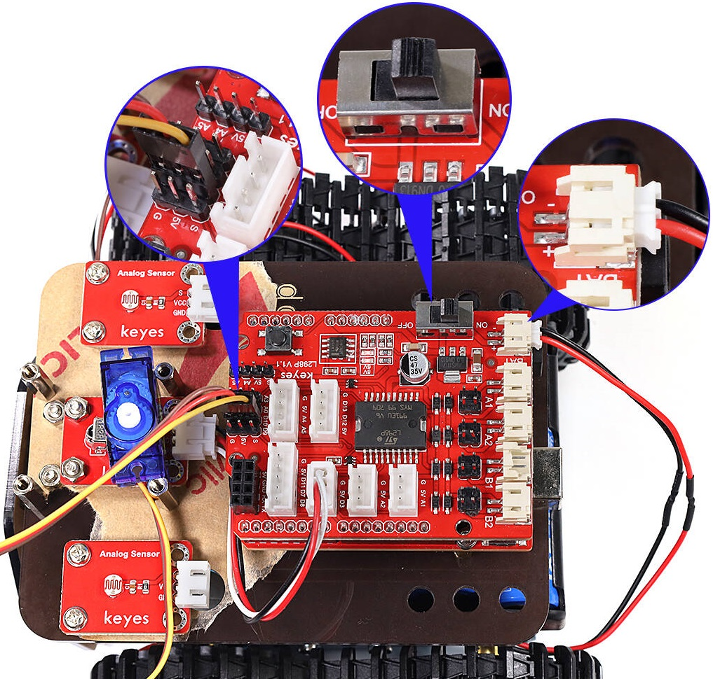
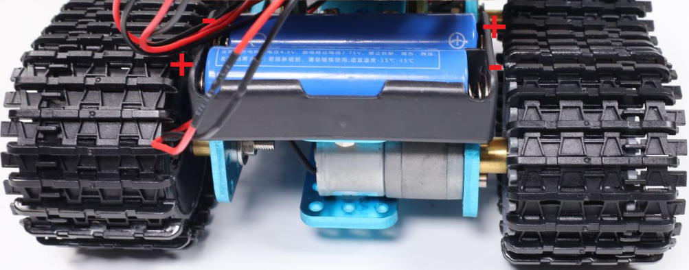
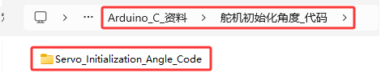
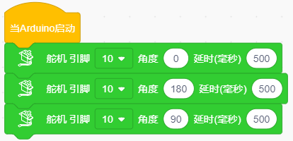
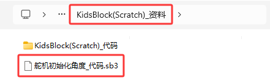
.. |image44| image:: media/580ca696f9a7883b2a7824982f448992.jpg
.. |image45| image:: media/8e6bf9301a4f07f7b2e71c483c703f56.jpg
.. |image46| image:: media/6c55458d368334937ff59b0dd915945e.jpeg
.. |image47| image:: media/c26599005156752570362703f29df031.jpg
.. |image48| image:: media/634c5b4196301261cc77926c0c315b44.jpg
.. |image49| image:: media/e341099eb81bceb9709bba25721f7dbd.jpg
.. |image50| image:: media/7aea00804cba367670e3a7f621f1b729.jpeg
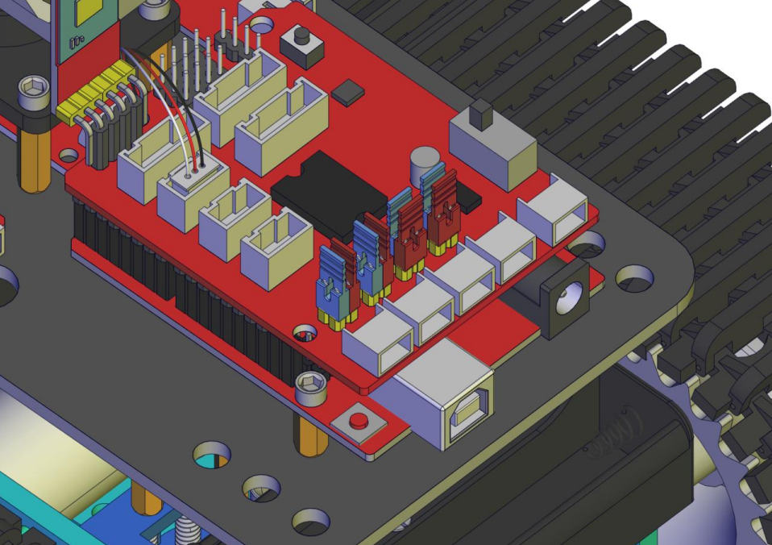
.. |image52| image:: media/e257e931c676ce50d7e5f392dbaff50a.jpeg
.. |image53| image:: media/0e616a583f293370f8fd8cb1644bbcac.jpg
.. |image54| image:: media/1741ef2924b40fb3df8005cf533ed326.jpg
.. |image55| image:: media/66dba600933196ca372171b81cbb1cae.jpeg
.. |image56| image:: media/94ee43a82688af27861dd1f83430f29b.jpg
.. |image57| image:: media/f1ca8541410f483bf0705761bf085190.jpg
.. |image58| image:: media/f35521bf12c8d7c958208a7608c6143a.jpeg
.. |image59| image:: media/4b97dfffd78fee370410a448281e46af.jpeg
.. |image60| image:: media/8439c8a0b226bd0f7f908a51fa5082ee.jpeg
.. |image61| image:: media/fd7822473317d96c0d893daf9f6a4a62.jpg
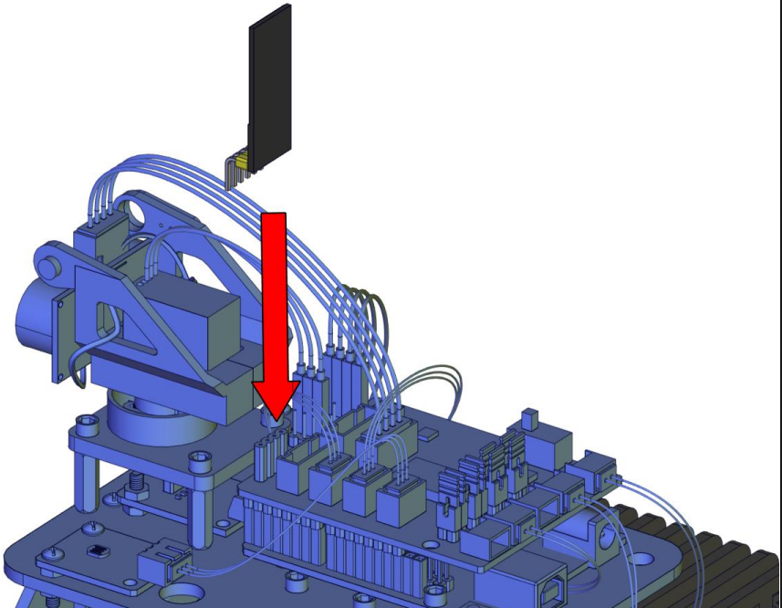
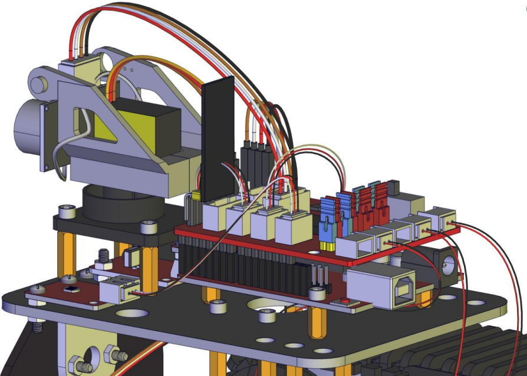
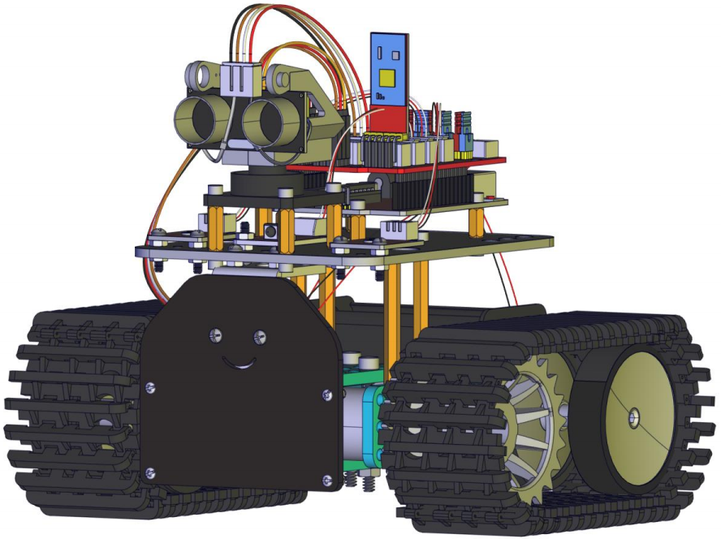
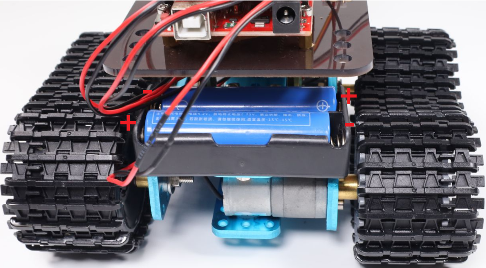
