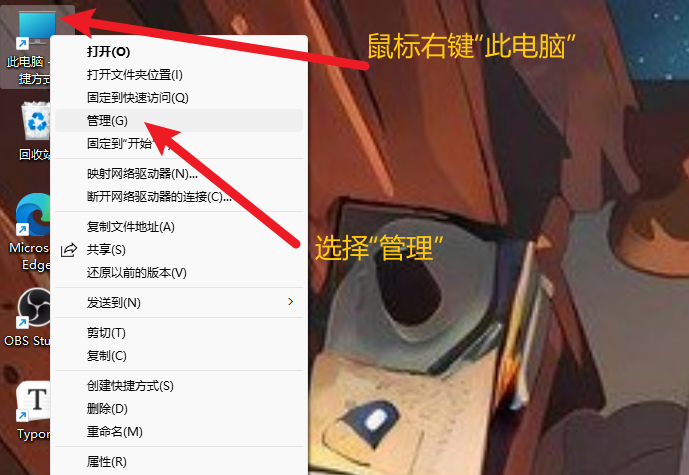
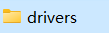
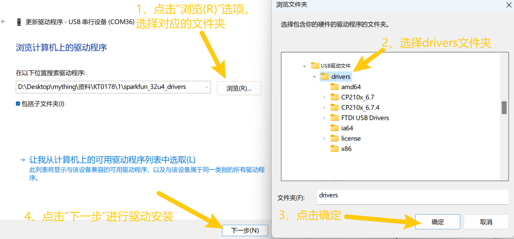

2. 驱动安装
===========

2.1 驱动下载
------------

驱动下载：\ :download:`USB驱动下载 <./USB驱动文件.7z>`

.. _驱动安装-1:

2.2 驱动安装
------------

1、将主板连接到电脑

|image1|

2、打开 “\ **设备管理器**\ ”.

|image2|

3、检查驱动是否已经安装

情况一：驱动安装完成，请跳过驱动教程，进行下一步学习

|image3|

情况二：驱动没有安装，请进行以下教程手动安装驱动

|image4|

（1）、鼠标右击 “**USB串行设备**”，在弹出框中选择
“\ **更新驱动程序（P）**\ ”

|image5|

（2）、点击选择 “\ **浏览我的电脑以查找驱动程序（R）**\ ”.

|image6|

（3）、点击
“\ **浏览（R）**\ ”选项，在弹出的方框中找到Arduino安装路径下的\ |image7|\ ，或者直接选择提供的\ |image8|,点击
“\ **确定**\ ”，完成后点击 “\ **下一步**\ ” 进行驱动安装.

|image9|

（4）、界面显示如下图类似的话语，证明驱动安装成功，点击 “\ **关闭**\ ”.

|image10|

（5）、驱动安装完成后，选择 “\ **端口**\ ”
选项，如图对应端口的名字改变成Arduino Uno，证明驱动安装完成.

|image11|

.. |image1| image:: ./media/KE0171连接电脑.png

.. |image3| image:: ./media/Snipaste_2025-05-30_10-25-37.png
.. |image4| image:: ./media/Snipaste_2025-05-30_11-27-48.png
.. |image5| image:: ./media/Snipaste_2025-05-30_11-31-19.png
.. |image6| image:: ./media/Snipaste_2025-05-30_11-34-54.png

.. |image10| image:: ./media/Snipaste_2025-05-30_11-49-56.png
.. |image11| image:: ./media/Snipaste_2025-05-30_11-52-13.png
